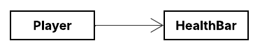
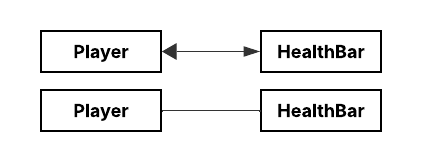

# 🧭 Guía UML para Patrones de Diseño: Flechas y Traducción a Código Java

Los diagramas de clases UML son esenciales para visualizar las estructuras y relaciones entre clases en los patrones de
diseño. Cada flecha o símbolo indica un tipo de relación semántica entre elementos, y cada una tiene su equivalente en
código Java. A continuación, revisamos las más importantes.

**Referencias**

- [**UML Class Diagram Arrows Guide**](https://paulrumyancev.medium.com/uml-class-diagram-arrows-guide-37e4b1bb11e)
- [**UML Cheatsheet | Class Diagram Resource**](https://khalilstemmler.com/articles/uml-cheatsheet/)

---

## 🔗 Asociación

La `asociación` en UML representa una relación estructural entre dos clases, en la cual `una clase conoce a otra` o
tiene una `referencia a ella`.

Se traduce en el código cuando `una clase tiene un campo cuyo tipo es otra clase`.

### 📘 Asociación Unidireccional

El siguiente diagrama muestra la relación de `Asociación Unidireccional`, donde `Player` puede llamar a las
propiedades y/o métodos de `HealthBar` pero no al revés.



### 💻 Código Java equivalente

````java
public class Player {

    private HealthBar healthBar;  // Asociación pura: solo referencia, no propiedad

    public Player(HealthBar healthBar) {
        this.healthBar = healthBar;  // Inyectado desde afuera
    }

    public void onHealthChanged(float health) {
        this.healthBar.setHealth(health);
    }

    public void update() {
        this.healthBar.display();
    }
}
````

````java
public class HealthBar {
    private float health;

    public void setHealth(float health) {
        this.health = health;
    }

    public void display() {
        System.out.println("Health: " + health);
    }
}
````

🧪 Uso externo (clase de prueba)

````java
public class Game {
    public static void main(String[] args) {
        HealthBar healthBar = new HealthBar();       // Se crea fuera de Player
        Player player = new Player(healthBar);       // Se inyecta al constructor

        player.onHealthChanged(85.5f);
        player.update();                             // Imprime: Health: 85.5
    }
}
````

### 📌 Análisis: ¿Por qué es asociación pura?

- `Player` no crea el `HealthBar` → lo recibe ya creado.
- `Player` simplemente lo conoce y usa.
- No hay control del ciclo de vida: `HealthBar` puede seguir existiendo después de eliminar `Player`, o puede ser
  compartido por otro objeto.
- Es una `relación débil`, `no de propiedad`.

### 🔄 Asociación Bidireccional

Otra variante de esta asociación es la `Asociación bidireccional`. Una `asociación bidireccional` es aquella en la que
dos clases se conocen mutuamente. Cada clase mantiene una `referencia explícita` a la otra, lo que permite la
`comunicación en ambos sentidos`.

UML lo representa con una `línea continua sin flechas` o con `flechas en ambos extremos` si se quiere destacar la
direccionalidad.



### 💻 Código Java equivalente

Simplemente agregando una referencia en ambas clases:

````java
public class Player {
    private HealthBar healthBar;
}

public class HealthBar {
    private Player player;
}
````

Pero además de eso, hay que establecer la referencia en ambos lados, lo cual debes manejar cuidadosamente para evitar
inconsistencias:

````java
public class Main {
    public static void main(String[] args) {
        Player player = new Player();
        HealthBar healthBar = new HealthBar();

        player.setHealthBar(healthBar);
        healthBar.setPlayer(player);
    }
}
````

### 📌 Análisis

- La `asociación bidireccional` es válida y útil en ciertos contextos, especialmente cuando la lógica del dominio lo
  exige.
- Sin embargo, es mejor evitarla por defecto, a menos que haya una necesidad clara.
- En la mayoría de casos, una `asociación unidireccional` bien definida o incluso una `dependencia temporal` (como
  veremos más adelante) será más flexible y mantenible.

### 📝 Nota previa sobre Asociación, Composición y Agregación

La `asociación` es la relación más general entre clases: `una clase conoce o utiliza a otra`.

Tanto la `composición` como la `agregación` `son formas especializadas de asociación`, con una semántica más precisa
respecto
al ciclo de vida y el nivel de dependencia entre los objetos involucrados.

- La `agregación` indica una relación de `tiene un`, pero `sin propiedad fuerte`.
- La `composición`, en cambio, representa una relación de `propiedad total`, donde la clase contenedora posee y gestiona
  completamente a la otra.

Estas variantes `se usan dependiendo del nivel de acoplamiento` que deseas expresar entre tus entidades.
Por tanto, en un diagrama UML, puedes optar por una u otra según el detalle y la intención semántica de la relación.

