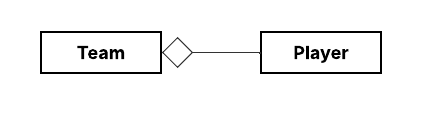
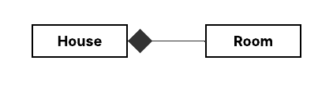
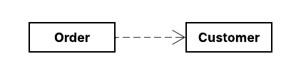

# 🧭 Guía UML para Patrones de Diseño: Flechas y Traducción a Código Java

Los diagramas de clases UML son esenciales para visualizar las estructuras y relaciones entre clases en los patrones de
diseño. Cada flecha o símbolo indica un tipo de relación semántica entre elementos, y cada una tiene su equivalente en
código Java. A continuación, revisamos las más importantes.

**Referencias**

- [**UML Class Diagram Arrows Guide**](https://paulrumyancev.medium.com/uml-class-diagram-arrows-guide-37e4b1bb11e)
- [**UML Cheatsheet | Class Diagram Resource**](https://khalilstemmler.com/articles/uml-cheatsheet/)

---

## 🔗 Asociación

La `asociación` en UML representa una relación estructural entre dos clases, en la cual `una clase conoce a otra` o
tiene una `referencia a ella`.

Se traduce en el código cuando `una clase tiene un campo cuyo tipo es otra clase`.

### 📘 Asociación Unidireccional

El siguiente diagrama muestra la relación de `Asociación Unidireccional`, donde `Player` puede llamar a las
propiedades y/o métodos de `HealthBar` pero no al revés.


### 💻 Código Java equivalente

````java
public class Player {

    private HealthBar healthBar;  // Asociación pura: solo referencia, no propiedad

    public Player(HealthBar healthBar) {
        this.healthBar = healthBar;  // Inyectado desde afuera
    }

    public void onHealthChanged(float health) {
        this.healthBar.setHealth(health);
    }

    public void update() {
        this.healthBar.display();
    }
}
````

````java
public class HealthBar {
    private float health;

    public void setHealth(float health) {
        this.health = health;
    }

    public void display() {
        System.out.println("Health: " + health);
    }
}
````

🧪 Uso externo

````java
public class Game {
    public static void main(String[] args) {
        HealthBar healthBar = new HealthBar();       // Se crea fuera de Player
        Player player = new Player(healthBar);       // Se inyecta al constructor

        player.onHealthChanged(85.5f);
        player.update();                             // Imprime: Health: 85.5
    }
}
````

### 📌 Análisis: ¿Por qué es asociación pura?

- `Player` no crea el `HealthBar` → lo recibe ya creado.
- `Player` simplemente lo conoce y usa.
- No hay control del ciclo de vida: `HealthBar` puede seguir existiendo después de eliminar `Player`, o puede ser
  compartido por otro objeto.
- Es una `relación débil`, `no de propiedad`.

### 🔄 Asociación Bidireccional

Otra variante de esta asociación es la `Asociación bidireccional`. Una `asociación bidireccional` es aquella en la que
dos clases se conocen mutuamente. Cada clase mantiene una `referencia explícita` a la otra, lo que permite la
`comunicación en ambos sentidos`.

UML lo representa con una `línea continua sin flechas` o con `flechas en ambos extremos` si se quiere destacar la
direccionalidad.


### 💻 Código Java equivalente

Simplemente agregando una referencia en ambas clases:

````java
public class Player {
    private HealthBar healthBar;
}

public class HealthBar {
    private Player player;
}
````

Pero además de eso, hay que establecer la referencia en ambos lados, lo cual debes manejar cuidadosamente para evitar
inconsistencias:

````java
public class Main {
    public static void main(String[] args) {
        Player player = new Player();
        HealthBar healthBar = new HealthBar();

        player.setHealthBar(healthBar);
        healthBar.setPlayer(player);
    }
}
````

### 📌 Análisis

- La `asociación bidireccional` es válida y útil en ciertos contextos, especialmente cuando la lógica del dominio lo
  exige.
- Sin embargo, es mejor evitarla por defecto, a menos que haya una necesidad clara.
- En la mayoría de casos, una `asociación unidireccional` bien definida o incluso una `dependencia temporal` (como
  veremos más adelante) será más flexible y mantenible.

### 📝 Nota previa sobre Asociación, Composición y Agregación

La `asociación` es la relación más general entre clases: `una clase conoce o utiliza a otra`.

Tanto la `composición` como la `agregación` `son formas especializadas de asociación`, con una semántica más precisa
respecto
al ciclo de vida y el nivel de dependencia entre los objetos involucrados.

- La `agregación` indica una relación de `tiene un`, pero `sin propiedad fuerte`.
- La `composición`, en cambio, representa una relación de `propiedad total`, donde la clase contenedora posee y gestiona
  completamente a la otra.

Estas variantes `se usan dependiendo del nivel de acoplamiento` que deseas expresar entre tus entidades.
Por tanto, en un diagrama UML, puedes optar por una u otra según el detalle y la intención semántica de la relación.

## 🔗 Agregación

La `agregación` `es un tipo especializado de asociación` que representa una `relación de contención débil`. Indica que
una clase `"tiene"` o `"está compuesta por"` `una o varias instancias` de otra clase,
`pero sin ser dueña del ciclo de vida` de esas instancias.

### 📘 Notación UML

En una relación de agregación, los lados se denominan `todo` (contenedor) y `parte` (contenido).
La `parte` puede existir independientemente del `todo`.



- El `rombo blanco (◇)` indica agregación y siempre apunta hacia el `todo`.
- La relación conecta al contenedor (`todo`) con los elementos contenidos (`parte`).
- Se sigue usando una línea continua como en la asociación, pero con el rombo en el extremo del contenedor.

### 🧠 ¿Cómo se diferencia de una asociación simple?

- En una asociación simple, una clase solo conoce a otra.
- En una agregación, una clase contiene a otra, pero no la controla totalmente.
- El objeto agregado puede existir independientemente del contenedor.

### 💻 Código Java equivalente

````java
import java.util.List;

public class Team {
    private List<Player> players;  // Agregación: Team contiene Player, pero no los crea ni destruye

    public Team(List<Player> players) {
        this.players = players;
    }

    public void printTeam() {
        for (Player p : players) {
            System.out.println(p.getName());
        }
    }
}
````

````java
public class Player {
    private String name;

    public Player(String name) {
        this.name = name;
    }

    public String getName() {
        return name;
    }
}
````

🧪 Uso externo

````java
public class Game {
    public static void main(String[] args) {
        Player p1 = new Player("Luis");
        Player p2 = new Player("Ana");

        List<Player> roster = List.of(p1, p2);  // Los jugadores existen antes del equipo

        Team team = new Team(roster);
        team.printTeam();                       // Imprime: Luis, Ana
    }
}
````

### 📌 Análisis

- El `Team` tiene a los `Player`, pero no los crea ni destruye.
- Los `Player` pueden existir antes, fuera o incluso después del `Team`.
- La relación entre `Team` y `Player` es de tipo `"tiene un grupo de"`, sin propiedad fuerte.
- Si destruyes el `Team`, los `Player` no se ven afectados.

> ❗`Recuerda`: la agregación no depende de cuántos elementos haya, sino del ciclo de vida y la responsabilidad sobre el
> objeto contenido.
>
> Es decir, lo que define una agregación no es si el objeto contenedor tiene uno o varios elementos, sino si las
> "partes" pueden existir de forma independiente del "todo".
>
> La clase que actúa como contenedora conoce y utiliza al objeto contenido, pero no lo posee ni controla su existencia.
> En otras palabras, el objeto contenido no muere cuando el contenedor desaparece, y puede ser compartido o utilizado
> por otras clases.
>
> La agregación expresa una relación de tipo “tiene un” o “está formado por”, pero sin implicar propiedad exclusiva ni
> responsabilidad total sobre sus componentes.

---

## 🎯 Diferencia entre Asociación Pura y Agregación: ¿Qué las distingue realmente?

En Java, tanto una `asociación pura` como una `agregación` pueden representarse de forma muy similar en código:

````java
public class A {
    private B b;

    public A(B b) {
        this.b = b;
    }
}
````

Pero lo que determina si esa relación es una `asociación simple` o una `agregación` no es la forma del código,
sino la intención semántica del modelo de dominio.

### 📘 Entonces, ¿qué las diferencia?

| Criterio                           | Asociación Pura                        | Agregación (◇)                   |
|------------------------------------|----------------------------------------|----------------------------------|
| ¿A conoce a B?                     | ✅ Sí                                   | ✅ Sí                             |
| ¿A contiene a B como parte lógica? | ❌ No                                   | ✅ Sí                             |
| ¿B depende estructuralmente de A?  | ❌ No                                   | ❌ No                             |
| ¿Quién controla el ciclo de vida?  | Externo o neutro                       | Externo o neutro (≠ composición) |
| ¿Código típico en Java?            | Se inyecta la dependencia desde afuera | También se inyecta desde afuera  |
| ¿Ejemplo típico?                   | `Player` usa `HealthBar`               | `Team` contiene `Player`         |

### 🧠 Nota importante

Aunque el código fuente puede ser idéntico, el tipo de relación UML depende del significado en el dominio.

- Si una clase simplemente usa a otra → asociación pura.
- Si una clase representa una parte estructural del todo → agregación.

Aunque en código Java una `asociación pura` y una `agregación` pueden verse iguales (por ejemplo, al inyectar una clase
por constructor), lo que las diferencia es la intención del modelo: si la clase contenida representa una
`"parte del todo"`, hablamos de `agregación`. Si solo es una `relación de uso o conocimiento`, se trata de
`asociación pura`.

La `composición`, en cambio, `suele implicar que el objeto "parte" se crea y gestiona dentro del contenedor`, por lo
que su representación en código es distinta y `no aplica en este caso comparativo`.

---

## 🔗 Composición

La `composición` es un tipo de `asociación más fuerte` que la agregación. Representa una `relación de propiedad total`,
donde el objeto `"todo"` es el dueño absoluto del objeto `"parte"`.

- Si el objeto `"todo"` se destruye, la `"parte"` también desaparece.
- El objeto contenido `no puede existir sin el contenedor`.
- Se considera una `relación de ciclo de vida compartido`.

### 📘 Notación UML



- El rombo negro (◆) indica composición.
- La flecha va del contenedor (`todo`) a la `parte`.
- Se representa con una línea continua con el rombo negro en el extremo del contenedor.

### 💻 Código Java equivalente

🧱 Parte 1: La clase contenida (Room)

````java
public class Room {
    private String name;

    public Room(String name) {
        this.name = name;
    }

    public void describe() {
        System.out.println("Room: " + name);
    }
}
````

🏠 Parte 2: El contenedor (House)

````java
import java.util.ArrayList;
import java.util.List;

public class House {
    private List<Room> rooms = new ArrayList<>(); // Composición: House crea y gestiona Rooms

    public House() {
        this.rooms.add(new Room("Living Room"));
        this.rooms.add(new Room("Kitchen"));
        this.rooms.add(new Room("Bedroom"));
    }

    public void showRooms() {
        for (Room room : rooms) {
            room.describe();
        }
    }
}
````

🧪 Uso externo

````java
public class City {
    public static void main(String[] args) {
        House house = new House();
        house.showRooms();
    }
}
````

### ✅ ¿Por qué es una composición?

- House crea internamente las instancias de Room.
- Los Room no se comparten con otros objetos externos.
- No se pueden reutilizar ni inyectar desde fuera.
- Si se elimina House, sus Room también desaparecen automáticamente.

### 📌 Recordatorio importante

- Composición no depende de listas o cantidades.
- Lo importante es que el objeto contenido:
    - Se crea dentro del contenedor
    - Su ciclo de vida está completamente ligado
    - No se comparte con otros

## 🔗 Dependencia

Una `dependencia` representa una relación `temporal` y `débil` entre dos clases: una clase usa a otra para realizar
cierta tarea, pero no la posee ni la contiene.

- La clase A `depende` de la clase B si `invoca sus métodos`, `crea instancias temporales` o la `recibe como parámetro`.
- La dependencia puede ocurrir en:
    - Un método,
    - Un constructor,
    - O incluso en una sola línea de código.

### 📘 Notación UML



- Se representa con una línea discontinua con una flecha (`- - - - >`)
- Apunta de la clase que usa a la clase que es utilizada.

### 💻 Código Java equivalente

````java
public class Customer {
    public void placeOrder() {
        System.out.println("Order placed.");
    }
}
````

````java
public class Order {
    public void processOrder() {
        Customer customer = new Customer(); // ← Dependencia: uso temporal
        customer.placeOrder();
    }
}
````

> 💡 `Nota`: Declarar una clase dentro de un método (como `new Customer()` en `processOrder()`) es una forma común de
> `dependencia local`: la clase que depende la utiliza solo en ese contexto puntual, sin mantener ninguna relación
> duradera.


🧪 Uso externo

````java
public class Main {
    public static void main(String[] args) {
        Order order = new Order();
        order.processOrder();
    }
}
````

### ✅ ¿Por qué es una dependencia?

- `Order` no tiene una referencia de clase a `Customer` como atributo.
- `Customer` es usado de manera puntual, solo en el contexto del método `processOrder()`.
- La relación es temporal, débil y acotada al contexto de uso.

### 🔄 Otras formas comunes de dependencia

📌 Por parámetro

````java
public void register(Customer customer) {
    customer.placeOrder();
}
````

📌 Por retorno de método

````java
public Customer getCustomer() {
    return new Customer();
}
````

### 🧠 Características clave

| Aspecto               | Dependencia                                               |
|-----------------------|-----------------------------------------------------------|
| Tipo de relación      | “Usa-a” (uso temporal, no propiedad)                      |
| Control de ciclo      | ✅ Controla `temporalmente` la instancia durante el método |
| Persistencia          | ❌ No persiste después del método                          |
| Representación UML    | Línea discontinua con flecha `- - - >`                    |
| Frecuencia de uso     | Muy alta (en servicios, controladores, etc.)              |
| Nivel de acoplamiento | Bajo                                                      |

En una relación de dependencia, la clase puede crear y usar una instancia de otra clase, pero
`esa instancia solo vive dentro del alcance del método`. Por eso decimos que hay un
`control temporal del ciclo de vida`, pero `no un control estructural` como ocurre en composición o incluso en
agregación.

### 🔸 Dependencia hacia métodos estáticos

Una clase también puede depender de otra **sin crear una instancia**, utilizando sus
**métodos estáticos o constantes**. Este tipo de dependencia sigue considerándose válida en UML, ya que existe un
vínculo funcional entre ambas clases.

Aunque no se cree un objeto de tipo `B`, la clase `A` sigue dependiendo funcionalmente de `B` para cumplir una tarea.
Esto significa que si por alguna razón `B` cambia (por ejemplo, cambia la firma del método estático), `A` se ve
afectada.

Y ese es justamente el criterio de UML para decir que hay dependencia:

> 💡 "Una clase depende de otra si un cambio en la segunda podría afectar a la primera."

````java
public class Validator {
    public static boolean isEmailValid(String email) {
        return email != null && email.contains("@");
    }
}
````

````java
public class UserService {
    public void register(String email) {
        if (!Validator.isEmailValid(email)) {
            throw new IllegalArgumentException("Invalid email");
        }
        // continúa...
    }
}
````

- ✅ Aquí `UserService` depende de `Validator`, aunque no cree una instancia.
- Sigue siendo una dependencia (`- - - >`).
- La dependencia no requiere instancia; puede ser:
    - por invocación estática,
    - por uso como `parámetro` o `retorno`,
    - o por uso local con `new`.

> 💡 `Nota`: Incluso si una clase no mantiene una instancia de otra, el simple hecho de usar sus métodos estáticos o
> constantes también representa una `relación de dependencia`.
>
> Esto se debe a que existe un `acoplamiento funcional`: un cambio en la clase utilizada afectaría al funcionamiento de
> la clase dependiente.
