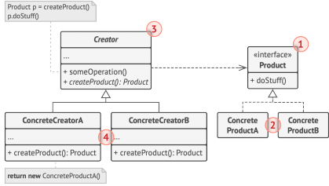
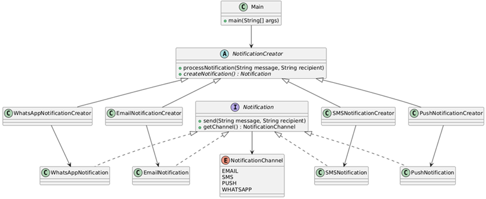
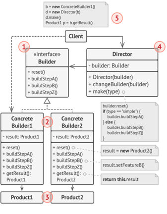

# Patrones creacionales

Los patrones creacionales de GoF son un tipo de `patrones de diseño de software` que se centran en la
`creación de objetos`. Su propósito principal es desacoplar la forma en que los objetos se crean de la forma en que se
usan. Esto significa que proporcionan mecanismos para crear objetos de una manera que es flexible, eficiente y
controlada, sin necesidad de especificar la clase exacta de objeto que se va a crear.

Estos patrones te permiten:

- `Abstraer la lógica de instanciación`: Te dan la flexibilidad de crear objetos sin usar directamente el operador
  `new`. Esto es útil cuando el proceso de creación es complejo, involucra varias etapas o depende de la configuración
  del sistema.


- `Encapsular la creación de objetos`: Ocultan los detalles de cómo se crean los objetos, lo que facilita el cambio de
  la implementación de la creación sin afectar el código cliente.


- `Promover la flexibilidad y la reutilización`: Al desacoplar el código que usa los objetos de la lógica de creación,
  puedes cambiar fácilmente el tipo de objeto que se crea, adaptándolo a diferentes contextos o requisitos.

En resumen, los patrones creacionales son soluciones elegantes para problemas de creación de objetos, promoviendo un
diseño de software más robusto, modular y fácil de mantener.

📌 Ejemplos clásicos: `Singleton`, `Factory Method`, `Builder`, etc.

---

## Factory Method

El `Factory Method` define una interfaz para crear objetos, pero permite que las subclases decidan qué clase instanciar.
En otras palabras, delega la creación de objetos a las subclases.

### Características del Factory Method

✅ Ventajas:

- `Elimina acoplamiento`: El código cliente no conoce las clases concretas
- `Principio Abierto/Cerrado`: Fácil agregar nuevos productos sin modificar código existente
- `Single Responsibility`: Cada factory se encarga de crear un tipo específico
- `Polimorfismo`: Usa herencia y polimorfismo para la creación

❌ Desventajas:

- `Complejidad`: Introduce más clases al sistema
- `Jerarquía`: Requiere crear subclases para cada tipo de producto

### 🎯 Cuándo usar Factory Method:

- Cuando no sabes de antemano qué tipos exactos de objetos necesitarás
- Cuando quieres proporcionar a los usuarios una forma de extender componentes internos
- Cuando quieres reutilizar objetos existentes en lugar de crear nuevos
- Cuando el proceso de construcción de objetos es complejo

### 💼 Ejemplos del mundo real:

- `GUI Frameworks`: Crear botones específicos según el OS (Windows, Mac, Linux)
- `Conectores de BD`: Crear conexiones según el tipo (MySQL, PostgreSQL, Oracle)
- `Procesadores de archivos`: Crear parsers según extensión (.csv, .json, .xml)
- `Sistemas de logging`: Crear loggers según destino (file, console, database)
- `Notificaciones`: Crear notificadores según canal (email, SMS, push) ← Nuestro caso

### 📐 Representación UML del patrón Factory Method



1. El `Product` declara la interfaz, que es común a todos los objetos que puede producir la clase creadora y sus
   subclases.

2. Los `Concrete Products` son distintas implementaciones de la interfaz `Product`.
3. La clase `Creator` declara el método de fábrica `(Factory Method)` que devuelve nuevos objetos de `Product`. Es
   importante que el tipo de retorno de este método coincida con la interfaz `Product`.
   > Puedes declarar el patrón `Factory Method` como abstracto para forzar a todas las subclases a implementar sus
   > propias versiones del método. Como alternativa, el método de fábrica base puede devolver algún tipo de producto
   > por defecto.
   >
   > Observa que, a pesar de su nombre, la creación de producto no es la principal responsabilidad de la clase
   > `Creator`. Normalmente, esta clase cuenta con alguna lógica de negocios central relacionada con los productos. El
   > patrón `Factory Method` ayuda a desacoplar esta lógica de las clases concretas de producto.


4. Los `Concrete Creators` sobreescriben el `Factory Method` base, de modo que devuelva un tipo diferente de `Product`.
   > Observa que el método de fábrica no tiene que crear nuevas instancias todo el tiempo. También puede devolver
   > objetos existentes de una memoría caché, una agrupación de objetos, u otra fuente.

### 🎯 Ejemplo 01: Sistema de Notificaciones Multi-canal usando Factory Method

Este ejemplo implementa un sistema de notificaciones empresarial que puede enviar mensajes a través de múltiples canales
de comunicación (`Email`, `SMS`, `Push Notifications`, `WhatsApp`).

#### `Problemática`

Una aplicación de e-commerce necesita notificar a sus usuarios sobre diferentes eventos del negocio (confirmación de
pedidos, cambios de estado, promociones, alertas de seguridad) utilizando distintos medios según las preferencias del
usuario, la urgencia del mensaje y el tipo de evento.

#### `Solución con Factory Method`

En lugar de que el código cliente conozca y decida qué tipo específico de notificación crear, se utiliza el patrón
Factory Method para delegar esta responsabilidad a clases especializadas. Cada ConcreteCreator sabe exactamente cómo
configurar y crear su tipo específico de notificación (configuraciones SMTP para email, APIs de terceros para SMS,
tokens para push notifications, etc.).

#### `Beneficio`

El sistema puede fácilmente incorporar nuevos canales de notificación (Telegram, Discord, Slack) sin modificar el código
cliente existente, y cada factory se encarga de los detalles técnicos específicos de su canal, manteniendo el código
limpio y desacoplado.

#### `Escenario real`

Similar a lo que implementan plataformas como Amazon, Netflix, o cualquier banco que necesita comunicarse con usuarios a
través de múltiples canales de forma consistente y escalable.

El siguiente diagrama de clases muestra la implementación de nuestro patrón `Factory Method`.



### 🚀 Product del Factory Method

En el patrón `Factory Method`, el `Product` define la interfaz o clase abstracta que describe las operaciones que los
objetos creados por la fábrica deben implementar. Todas las implementaciones concretas del producto seguirán este
contrato.

En nuestro caso:

````java
public interface Notification {
    void send(String message, String recipient);

    NotificationChannel getChannel();
}
````

- `Notification` es la interfaz que representa el `Product` en el patrón `Factory Method`. Define el contrato común que
  todas las implementaciones concretas de notificaciones deben cumplir:
    - `send(String message, String recipient)`: método para enviar el mensaje a un destinatario.
    - `getChannel()`: método para identificar el canal de la notificación mediante `NotificationChannel`.
- Este diseño permite que el código cliente interactúe con cualquier tipo de notificación sin conocer su implementación
  concreta.

````java
public enum NotificationChannel {
    EMAIL,
    SMS,
    PUSH,
    WHATSAPP
}
````

- `NotificationChannel` es un enumerador que define los distintos canales de notificación que el sistema soporta.
  En el contexto del patrón `Factory Method`, este `enum` actúa como criterio para que la fábrica determine qué tipo de
  producto (notificación concreta) debe crear.
- Esto evita el uso de cadenas de texto y garantiza seguridad de tipo.

### 🚀 Concrete Products del Factory Method

Los `Concrete Products` son las implementaciones concretas de la interfaz o clase abstracta `Product`, en nuestro caso
implementaciones concretas del `Notification`.

Cada uno define:

- Cómo se comporta el producto en su caso específico.
- Cómo implementa las operaciones definidas por el `Product`.
- Sus propiedades específicas necesarias para funcionar.

En este caso, cada `ConcreteProduct` representa un tipo de notificación (`EmailNotification`, `PushNotification`,
`SMSNotification`, `WhatsAppNotification`), todos implementando la interfaz `Notification`.

````java

@Slf4j
@RequiredArgsConstructor
public class EmailNotification implements Notification {

    private final String smtpServer;
    private final int port;
    private final String username;

    @Override
    public void send(String message, String recipient) {
        log.info("=== Email Notification ===");
        log.info("SMTP Server: {}:{}", this.smtpServer, this.port);
        log.info("From: {}", this.username);
        log.info("To: {}", recipient);
        log.info("Message: {}", message);
        log.info("Email sent successfully!");
    }

    @Override
    public NotificationChannel getChannel() {
        return NotificationChannel.EMAIL;
    }
}
````

`EmailNotification` es un `Concrete Product` que implementa la interfaz `Notification` para el canal `EMAIL`.

Sus particularidades son:

- `Atributos propios`: `smtpServer`, `port`, `username` necesarios para configurar el envío de correos electrónicos.
- `Implementación de send`: contiene la lógica para enviar un email (en este ejemplo se simula mediante logs).
- `Implementación de getChannel`: devuelve el valor `NotificationChannel.EMAIL` para identificar el canal que
  representa.

Relación con el patrón:

- La fábrica se encargará de instanciar este producto cuando se solicite una notificación de tipo `EMAIL`.
- El cliente no necesita saber cómo se configura o envía el correo, solo que puede invocar `send(...)`.

A continuación se muestra el código de los demás `concret products`.

````java

@Slf4j
@RequiredArgsConstructor
public class PushNotification implements Notification {

    private final String firebaseKey;
    private final String appId;

    @Override
    public void send(String message, String recipient) {
        log.info("=== Push Notification ===");
        log.info("Firebase Key: {}", this.firebaseKey.substring(0, 10) + "...");
        log.info("APP ID: {}", this.appId);
        log.info("Device Token: {}", recipient);
        log.info("Message: {}", message);
        log.info("Push notification sent successfully!");
    }

    @Override
    public NotificationChannel getChannel() {
        return NotificationChannel.PUSH;
    }
}
````

````java

@Slf4j
@RequiredArgsConstructor
public class SMSNotification implements Notification {

    private final String apiKey;
    private final String provider;

    @Override
    public void send(String message, String recipient) {
        log.info("=== SMS Notification ===");
        log.info("Provider: {}", this.provider);
        log.info("API Key: {}", this.apiKey.substring(0, 8) + "...");
        log.info("To: {}", recipient);
        log.info("Message: {}", message);
        log.info("SMS sent successfully!");
    }

    @Override
    public NotificationChannel getChannel() {
        return NotificationChannel.SMS;
    }
}
````

````java

@Slf4j
@RequiredArgsConstructor
public class WhatsAppNotification implements Notification {

    private final String businessApiKey;
    private final String phoneNumberId;

    @Override
    public void send(String message, String recipient) {
        log.info("=== WhatsApp Notification ===");
        log.info("Business API KEY: {}", this.businessApiKey.substring(0, 12) + "...");
        log.info("Phone Number ID: {}", this.phoneNumberId);
        log.info("To: {}", recipient);
        log.info("Message: {}", message);
        log.info("WhatsApp message sent successfully!");
    }

    @Override
    public NotificationChannel getChannel() {
        return NotificationChannel.WHATSAPP;
    }
}
````

### 🚀 Creator del Factory Method

La clase abstracta `NotificationCreator` es la clase `Creator` dentro del patrón `Factory Method`.

Su rol es definir el `método fábrica` abstracto (`createNotification()`), que será implementado por las subclases para
instanciar el `Concrete Product` correspondiente.

````java

@Slf4j
public abstract class NotificationCreator {

    public void processNotification(String message, String recipient) {
        // Usar el factory method para crear la notificación apropiada
        Notification notification = this.createNotification();

        // Lógica de negocio adicional antes del envío
        log.info("Procesando {} notification...", notification.getChannel());

        // Validaciones generales (lógica de negocio común)
        if (Objects.isNull(message) || message.isBlank()) {
            log.error("El mensaje no puede estar vacío");
            return;
        }

        if (Objects.isNull(recipient) || recipient.isBlank()) {
            log.error("El destinatario no puede estar vacío");
            return;
        }

        // Enviar la notificación usando polimorfismo
        notification.send(message, recipient);

        // Lógica de negocio después del envío (logging, métricas, etc)
        log.info("Logged: {} notificación enviado a {}", notification.getChannel(), recipient);
    }

    // Factory Method - debe ser implementado por las subclases
    public abstract Notification createNotification();
}
````

Además, en este ejemplo:

- Incluye el método `processNotification(...)` que encapsula un flujo común de negocio:
    1. Crea la notificación a través del método fábrica.
    2. Aplica validaciones generales (mensaje y destinatario no vacíos).
    3. Envía la notificación mediante `polimorfismo`.
    4. Ejecuta tareas posteriores (`logging`, `métricas`).

- De esta forma, `la lógica de creación queda delegada a las subclases`, pero la lógica de uso y validaciones comunes
  se mantiene centralizada en el `Creator`.

Beneficio en el patrón:

- Separa el `“qué hacer”` (flujo común en `processNotification(...)`) de el `“con qué hacerlo”`
  (implementación de `createNotification()` en subclases).
- Permite añadir nuevos canales de notificación sin modificar el `Creator`, solo creando nuevas subclases.

### 🚀 Concrete Creator del Factory Method

Los `Concrete Creators` son las subclases que implementan el `método fábrica` definido en el `Creator`. Su función
principal es:

- Decidir `qué producto concreto` se va a crear.
- Encapsular la lógica de instanciación del producto.
- Devolver un objeto que implementa la interfaz o clase abstracta `Product`, en nuestro caso retornará una
  implementación de la interfaz `Notification`.

Beneficios:

- El código cliente no conoce ni depende de las clases concretas de los productos.
- Facilita la extensión: para agregar un nuevo producto, solo se crea un nuevo `Concrete Creator`.

````java
public class EmailNotificationCreator extends NotificationCreator {
    @Override
    public Notification createNotification() {
        return new EmailNotification("smtp.company.com", 587, "notifications@company.com");
    }
}
````

`EmailNotificationCreator` es un `Concrete Creator` que implementa el método `createNotification()` para instanciar un
`EmailNotification` preconfigurado con:

- Servidor SMTP (smtp.company.com)
- Puerto (587)
- Dirección remitente (notifications@company.com)

Relación con el patrón:

- Esta clase sabe exactamente qué tipo de producto crear (`EmailNotification`) y con qué parámetros configurarlo.
- El cliente no necesita saber cómo se crea o qué datos requiere el producto: solo llama a `processNotification()`
  en el `Creator` y recibe el comportamiento adecuado.

A continuación se muestras los demás `Concrete Creators`.

````java
public class PushNotificationCreator extends NotificationCreator {
    @Override
    public Notification createNotification() {
        return new PushNotification("firebase_server_key_def456", "com.company.app");
    }
}
````

````java
public class SMSNotificationCreator extends NotificationCreator {
    @Override
    public Notification createNotification() {
        return new SMSNotification("twilio_api_key_abc123xyz", "Twilio");
    }
}
````

````java
public class WhatsAppNotificationCreator extends NotificationCreator {
    @Override
    public Notification createNotification() {
        return new WhatsAppNotification("whatsapp_business_key_ghi789", "943854789");
    }
}
````

### 🚀 Uso del Patrón Factory Method

En el `Factory Method`, el `Cliente` no crea directamente los productos, sino que trabaja con el `Creator`
(o `Concrete Creator`) y, a través de él, obtiene el `Product` correcto sin conocer su clase concreta.

En el patrón `Factory Method`, el `Cliente` es la pieza que:

1. Elige qué `ConcreteCreator` utilizar según el contexto o requerimiento.
2. Invoca el flujo de negocio del `Creator` (en este caso `processNotification(...)`), que internamente usa el
   `factory method` para crear el `Product` adecuado.
3. Consume el producto sin conocer su implementación concreta.

En este ejemplo:

- La clase `Main` actúa como `Cliente`.
- Para cada escenario:
    - Instancia un `ConcreteCreator` específico (`EmailNotificationCreator`, `SMSNotificationCreator`, etc.).
    - Llama a `processNotification`, delegando en el `Creator` la validación, la creación del producto y el envío.
- Gracias al patrón, el `Cliente` nunca llama directamente a `new EmailNotification(...)` ni a ninguna otra
  implementación de `Notification`. Toda la creación queda encapsulada en los `ConcreteCreator`.

Beneficio en este punto:

- Si mañana se agrega un nuevo canal de notificación (por ejemplo, `Telegram`), no es necesario modificar el código de
  `Main` para saber cómo se crea o configura; solo instanciar el nuevo `Creator`.
- Esto asegura bajo acoplamiento y mayor facilidad de mantenimiento.

````java

@Slf4j
public class Main {

    private static final String SEPARATOR = "================================================================";

    public static void main(String[] args) {
        log.info("FACTORY METHOD PATTERN - Sistema de Notificaciones Multi-canal");
        log.info(SEPARATOR);

        // Escenario 01: Confirmación de Pedido (Email)
        log.info("Escenario 01: Confirmación de Pedido");
        NotificationCreator emailCreator = new EmailNotificationCreator();
        emailCreator.processNotification(
                "Su pedido #415 ha sido confirmado. Total: S/ 1500.00",
                "cliente@example.com");


        // Escenario 02: Alerta urgente (SMS)
        log.info(SEPARATOR);
        log.info("Escenario 02: Alerta de seguridad");
        NotificationCreator smsCreator = new SMSNotificationCreator();
        smsCreator.processNotification(
                "Código de verificación: 123456. Válido por 5 minutos.",
                "+51946741485");


        // Escenario 03: Promoción (Push)
        log.info(SEPARATOR);
        log.info("Escenario 03: Notificación Push - Promoción");
        NotificationCreator pushCreator = new PushNotificationCreator();
        pushCreator.processNotification(
                "¡50% OFF en todos los productos! Aprovecha ahora.",
                "device_token_abc123xyz789");


        // Escenario 04: Soporte personalizado (WhatsApp)
        log.info(SEPARATOR);
        log.info("Escenario 04: Soporte WhatsApp");
        NotificationCreator whatsAppCreator = new WhatsAppNotificationCreator();
        whatsAppCreator.processNotification(
                "Hola! Su consulta ha sido recibida. Un agente le responderá pronto.",
                "+51987458778");
    }
}
````

### 🧪 Ejecución y validación del patrón

Verificar que el cliente (`Main`) pueda enviar notificaciones por distintos canales sin conocer los detalles de
creación de cada implementación concreta.

````bash
factorymethod.notification.Main -- FACTORY METHOD PATTERN - Sistema de Notificaciones Multi-canal
factorymethod.notification.Main -- ================================================================
factorymethod.notification.Main -- Escenario 01: Confirmación de Pedido
factorymethod.notification.factory.NotificationCreator -- Procesando EMAIL notification...
factorymethod.notification.model.EmailNotification -- === Email Notification ===
factorymethod.notification.model.EmailNotification -- SMTP Server: smtp.company.com:587
factorymethod.notification.model.EmailNotification -- From: notifications@company.com
factorymethod.notification.model.EmailNotification -- To: cliente@example.com
factorymethod.notification.model.EmailNotification -- Message: Su pedido #415 ha sido confirmado. Total: S/ 1500.00
factorymethod.notification.model.EmailNotification -- Email sent successfully!
factorymethod.notification.factory.NotificationCreator -- Logged: EMAIL notificación enviado a cliente@example.com
factorymethod.notification.Main -- ================================================================
factorymethod.notification.Main -- Escenario 02: Alerta de seguridad
factorymethod.notification.factory.NotificationCreator -- Procesando SMS notification...
factorymethod.notification.model.SMSNotification -- === SMS Notification ===
factorymethod.notification.model.SMSNotification -- Provider: Twilio
factorymethod.notification.model.SMSNotification -- API Key: twilio_a...
factorymethod.notification.model.SMSNotification -- To: +51946741485
factorymethod.notification.model.SMSNotification -- Message: Código de verificación: 123456. Válido por 5 minutos.
factorymethod.notification.model.SMSNotification -- SMS sent successfully!
factorymethod.notification.factory.NotificationCreator -- Logged: SMS notificación enviado a +51946741485
factorymethod.notification.Main -- ================================================================
factorymethod.notification.Main -- Escenario 03: Notificación Push - Promoción
factorymethod.notification.factory.NotificationCreator -- Procesando PUSH notification...
factorymethod.notification.model.PushNotification -- === Push Notification ===
factorymethod.notification.model.PushNotification -- Firebase Key: firebase_s...
factorymethod.notification.model.PushNotification -- APP ID: com.company.app
factorymethod.notification.model.PushNotification -- Device Token: device_token_abc123xyz789
factorymethod.notification.model.PushNotification -- Message: ¡50% OFF en todos los productos! Aprovecha ahora.
factorymethod.notification.model.PushNotification -- Push notification sent successfully!
factorymethod.notification.factory.NotificationCreator -- Logged: PUSH notificación enviado a device_token_abc123xyz789
factorymethod.notification.Main -- ================================================================
factorymethod.notification.Main -- Escenario 04: Soporte WhatsApp
factorymethod.notification.factory.NotificationCreator -- Procesando WHATSAPP notification...
factorymethod.notification.model.WhatsAppNotification -- === WhatsApp Notification ===
factorymethod.notification.model.WhatsAppNotification -- Business API KEY: whatsapp_bus...
factorymethod.notification.model.WhatsAppNotification -- Phone Number ID: 943854789
factorymethod.notification.model.WhatsAppNotification -- To: +51987458778
factorymethod.notification.model.WhatsAppNotification -- Message: Hola! Su consulta ha sido recibida. Un agente le responderá pronto.
factorymethod.notification.model.WhatsAppNotification -- WhatsApp message sent successfully!
factorymethod.notification.factory.NotificationCreator -- Logged: WHATSAPP notificación enviado a +51987458778
````

La ejecución confirma que:

- El patrón `Factory Method` se implementó correctamente.
- Cada escenario de notificación funciona de manera independiente.
- Se logra flexibilidad y extensibilidad, cumpliendo los objetivos del patrón.

---

## Builder

El patrón `Builder` es un patrón de diseño creacional que permite `construir objetos complejos paso a paso`, de manera
que el mismo proceso de construcción pueda crear diferentes representaciones. Este patrón es especialmente útil cuando:

- Un objeto requiere muchos parámetros para su construcción.
- Algunos parámetros son opcionales.
- El proceso de construcción debe ser independiente de las partes que componen el objeto.
- Se necesita crear diferentes representaciones del mismo objeto.

### 🧩 Problema que resuelve

- `Constructor telescópico`: Múltiples constructores con diferentes combinaciones de parámetros.
- `Objetos inconsistentes`: Construcción en múltiples pasos donde el objeto puede quedar en estado inválido.
- `Código poco legible`: Difícil entender qué parámetro corresponde a qué atributo.
- `Parámetros opcionales`: Manejo complejo de parámetros opcionales.

Ejemplo del problema

````java
// Constructor telescópico - difícil de mantener y entender
User user = new User("John", "Doe", "john@email.com", "123456789",
                "123 Main St", "New York", "NY", "10001",
                true, false, "Manager", "IT");
// ¿Qué representa cada parámetro?
//
// Algunos valores como "john@email.com" sugieren claramente que se trata de un correo electrónico.
// Pero otros, como "10001", ¿a qué atributo corresponden? ¿Es un código postal, un ID, un número interno?
// La relación entre valores y atributos no es evidente, lo que dificulta la lectura y el mantenimiento.
// Si el orden cambia accidentalmente, el código puede seguir compilando pero comportarse de forma incorrecta.
````

### Características del Patrón

- `Construcción paso a paso`: Permite crear objetos complejos de forma incremental, asignando atributos de manera
  controlada.
- `Compatibilidad con inmutabilidad`: El producto final `puede ser inmutable` si el diseño lo requiere, pero no es
  obligatorio. Por ejemplo, en entidades JPA se necesita mutabilidad.
- `Flexibilidad`: Diferentes builders pueden construir distintas representaciones del mismo tipo de objeto, adaptándose
  a distintos contextos.
- `Legibilidad`: Facilita una API fluida y expresiva, evitando constructores telescópicos y mejorando la comprensión
  del código.
- `Validación`: Permite validar el estado del objeto antes de construirlo, centralizando reglas de negocio o
  consistencia.

> 💡 `Nota`: La inmutabilidad es una práctica recomendada en objetos que no deben cambiar su estado una vez creados,
> como DTOs o configuraciones. Sin embargo, en frameworks como Spring Boot, las entidades suelen requerir mutabilidad
> para funcionar correctamente con JPA.

### 📐 Representación UML del patrón Builder Clásico (GoF)



1. La interfaz `Builder` declara pasos de construcción de producto que todos los tipos de objetos constructores tienen
   en común.
2. Los `Concrete Builders` ofrecen distintas implementaciones de los pasos de construcción. Los `Concrete Builders`
   pueden crear productos que no siguen la interfaz común.
3. El `Product` es el objeto complejo que se está construyendo.
4. La clase `Director` define el orden en el que se invocarán los pasos de construcción.
5. El `Client` usa el `Director` y el `Builder` para construir el objeto.

### Variantes del Patrón

1. `Builder Clásico (GoF)`
    - Usa `Director` para coordinar la construcción.
    - Interfaz `Builder` separada.
    - Múltiples `ConcreteBuilders` posibles.


2. `Fluent Builder (Moderno)`
    - Más común en el mundo real.
    - API fluida con encadenamiento de métodos.
    - Sin `Director` explícito.
    - Patrón `Method Chaining` integrado.
    ````java
    // Ejemplo Fluent Builder
    User user = User.builder()
            .firstName("John")
            .lastName("Doe")
            .email("john@email.com")
            .phone("123456789")
            .address("123 Main St")
            .city("New York")
            .build();
    ````
