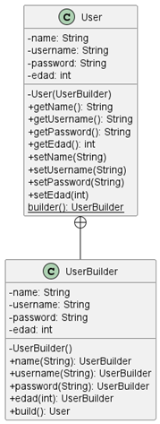
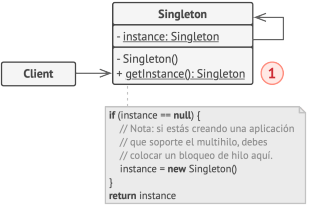

# Patrones creacionales

Los patrones creacionales de GoF son un tipo de `patrones de diseño de software` que se centran en la
`creación de objetos`. Su propósito principal es desacoplar la forma en que los objetos se crean de la forma en que se
usan. Esto significa que proporcionan mecanismos para crear objetos de una manera que es flexible, eficiente y
controlada, sin necesidad de especificar la clase exacta de objeto que se va a crear.

Estos patrones te permiten:

- `Abstraer la lógica de instanciación`: Te dan la flexibilidad de crear objetos sin usar directamente el operador
  `new`. Esto es útil cuando el proceso de creación es complejo, involucra varias etapas o depende de la configuración
  del sistema.


- `Encapsular la creación de objetos`: Ocultan los detalles de cómo se crean los objetos, lo que facilita el cambio de
  la implementación de la creación sin afectar el código cliente.


- `Promover la flexibilidad y la reutilización`: Al desacoplar el código que usa los objetos de la lógica de creación,
  puedes cambiar fácilmente el tipo de objeto que se crea, adaptándolo a diferentes contextos o requisitos.

En resumen, los patrones creacionales son soluciones elegantes para problemas de creación de objetos, promoviendo un
diseño de software más robusto, modular y fácil de mantener.

📌 Ejemplos clásicos: `Singleton`, `Factory Method`, `Builder`, etc.

---

## Factory Method

El `Factory Method` define una interfaz para crear objetos, pero permite que las subclases decidan qué clase instanciar.
En otras palabras, delega la creación de objetos a las subclases.

### Características del Factory Method

✅ Ventajas:

- `Elimina acoplamiento`: El código cliente no conoce las clases concretas
- `Principio Abierto/Cerrado`: Fácil agregar nuevos productos sin modificar código existente
- `Single Responsibility`: Cada factory se encarga de crear un tipo específico
- `Polimorfismo`: Usa herencia y polimorfismo para la creación

❌ Desventajas:

- `Complejidad`: Introduce más clases al sistema
- `Jerarquía`: Requiere crear subclases para cada tipo de producto

### 🎯 Cuándo usar Factory Method:

- Cuando no sabes de antemano qué tipos exactos de objetos necesitarás
- Cuando quieres proporcionar a los usuarios una forma de extender componentes internos
- Cuando quieres reutilizar objetos existentes en lugar de crear nuevos
- Cuando el proceso de construcción de objetos es complejo

### 💼 Ejemplos del mundo real:

- `GUI Frameworks`: Crear botones específicos según el OS (Windows, Mac, Linux)
- `Conectores de BD`: Crear conexiones según el tipo (MySQL, PostgreSQL, Oracle)
- `Procesadores de archivos`: Crear parsers según extensión (.csv, .json, .xml)
- `Sistemas de logging`: Crear loggers según destino (file, console, database)
- `Notificaciones`: Crear notificadores según canal (email, SMS, push) ← Nuestro caso

### 📐 Representación UML del patrón Factory Method


1. El `Product` declara la interfaz, que es común a todos los objetos que puede producir la clase creadora y sus
   subclases.

2. Los `Concrete Products` son distintas implementaciones de la interfaz `Product`.
3. La clase `Creator` declara el método de fábrica `(Factory Method)` que devuelve nuevos objetos de `Product`. Es
   importante que el tipo de retorno de este método coincida con la interfaz `Product`.
   > Puedes declarar el patrón `Factory Method` como abstracto para forzar a todas las subclases a implementar sus
   > propias versiones del método. Como alternativa, el método de fábrica base puede devolver algún tipo de producto
   > por defecto.
   >
   > Observa que, a pesar de su nombre, la creación de producto no es la principal responsabilidad de la clase
   > `Creator`. Normalmente, esta clase cuenta con alguna lógica de negocios central relacionada con los productos. El
   > patrón `Factory Method` ayuda a desacoplar esta lógica de las clases concretas de producto.


4. Los `Concrete Creators` sobreescriben el `Factory Method` base, de modo que devuelva un tipo diferente de `Product`.
   > Observa que el método de fábrica no tiene que crear nuevas instancias todo el tiempo. También puede devolver
   > objetos existentes de una memoría caché, una agrupación de objetos, u otra fuente.

### 🎯 Ejemplo 01: Sistema de Notificaciones Multi-canal usando Factory Method

Este ejemplo implementa un sistema de notificaciones empresarial que puede enviar mensajes a través de múltiples canales
de comunicación (`Email`, `SMS`, `Push Notifications`, `WhatsApp`).

#### `Problemática`

Una aplicación de e-commerce necesita notificar a sus usuarios sobre diferentes eventos del negocio (confirmación de
pedidos, cambios de estado, promociones, alertas de seguridad) utilizando distintos medios según las preferencias del
usuario, la urgencia del mensaje y el tipo de evento.

#### `Solución con Factory Method`

En lugar de que el código cliente conozca y decida qué tipo específico de notificación crear, se utiliza el patrón
Factory Method para delegar esta responsabilidad a clases especializadas. Cada ConcreteCreator sabe exactamente cómo
configurar y crear su tipo específico de notificación (configuraciones SMTP para email, APIs de terceros para SMS,
tokens para push notifications, etc.).

#### `Beneficio`

El sistema puede fácilmente incorporar nuevos canales de notificación (Telegram, Discord, Slack) sin modificar el código
cliente existente, y cada factory se encarga de los detalles técnicos específicos de su canal, manteniendo el código
limpio y desacoplado.

#### `Escenario real`

Similar a lo que implementan plataformas como Amazon, Netflix, o cualquier banco que necesita comunicarse con usuarios a
través de múltiples canales de forma consistente y escalable.

El siguiente diagrama de clases muestra la implementación de nuestro patrón `Factory Method`.


### 🚀 Product del Factory Method

En el patrón `Factory Method`, el `Product` define la interfaz o clase abstracta que describe las operaciones que los
objetos creados por la fábrica deben implementar. Todas las implementaciones concretas del producto seguirán este
contrato.

En nuestro caso:

````java
public interface Notification {
    void send(String message, String recipient);

    NotificationChannel getChannel();
}
````

- `Notification` es la interfaz que representa el `Product` en el patrón `Factory Method`. Define el contrato común que
  todas las implementaciones concretas de notificaciones deben cumplir:
    - `send(String message, String recipient)`: método para enviar el mensaje a un destinatario.
    - `getChannel()`: método para identificar el canal de la notificación mediante `NotificationChannel`.
- Este diseño permite que el código cliente interactúe con cualquier tipo de notificación sin conocer su implementación
  concreta.

````java
public enum NotificationChannel {
    EMAIL,
    SMS,
    PUSH,
    WHATSAPP
}
````

- `NotificationChannel` es un enumerador que define los distintos canales de notificación que el sistema soporta.
  En el contexto del patrón `Factory Method`, este `enum` actúa como criterio para que la fábrica determine qué tipo de
  producto (notificación concreta) debe crear.
- Esto evita el uso de cadenas de texto y garantiza seguridad de tipo.

### 🚀 Concrete Products del Factory Method

Los `Concrete Products` son las implementaciones concretas de la interfaz o clase abstracta `Product`, en nuestro caso
implementaciones concretas del `Notification`.

Cada uno define:

- Cómo se comporta el producto en su caso específico.
- Cómo implementa las operaciones definidas por el `Product`.
- Sus propiedades específicas necesarias para funcionar.

En este caso, cada `ConcreteProduct` representa un tipo de notificación (`EmailNotification`, `PushNotification`,
`SMSNotification`, `WhatsAppNotification`), todos implementando la interfaz `Notification`.

````java

@Slf4j
@RequiredArgsConstructor
public class EmailNotification implements Notification {

    private final String smtpServer;
    private final int port;
    private final String username;

    @Override
    public void send(String message, String recipient) {
        log.info("=== Email Notification ===");
        log.info("SMTP Server: {}:{}", this.smtpServer, this.port);
        log.info("From: {}", this.username);
        log.info("To: {}", recipient);
        log.info("Message: {}", message);
        log.info("Email sent successfully!");
    }

    @Override
    public NotificationChannel getChannel() {
        return NotificationChannel.EMAIL;
    }
}
````

`EmailNotification` es un `Concrete Product` que implementa la interfaz `Notification` para el canal `EMAIL`.

Sus particularidades son:

- `Atributos propios`: `smtpServer`, `port`, `username` necesarios para configurar el envío de correos electrónicos.
- `Implementación de send`: contiene la lógica para enviar un email (en este ejemplo se simula mediante logs).
- `Implementación de getChannel`: devuelve el valor `NotificationChannel.EMAIL` para identificar el canal que
  representa.

Relación con el patrón:

- La fábrica se encargará de instanciar este producto cuando se solicite una notificación de tipo `EMAIL`.
- El cliente no necesita saber cómo se configura o envía el correo, solo que puede invocar `send(...)`.

A continuación se muestra el código de los demás `concret products`.

````java

@Slf4j
@RequiredArgsConstructor
public class PushNotification implements Notification {

    private final String firebaseKey;
    private final String appId;

    @Override
    public void send(String message, String recipient) {
        log.info("=== Push Notification ===");
        log.info("Firebase Key: {}", this.firebaseKey.substring(0, 10) + "...");
        log.info("APP ID: {}", this.appId);
        log.info("Device Token: {}", recipient);
        log.info("Message: {}", message);
        log.info("Push notification sent successfully!");
    }

    @Override
    public NotificationChannel getChannel() {
        return NotificationChannel.PUSH;
    }
}
````

````java

@Slf4j
@RequiredArgsConstructor
public class SMSNotification implements Notification {

    private final String apiKey;
    private final String provider;

    @Override
    public void send(String message, String recipient) {
        log.info("=== SMS Notification ===");
        log.info("Provider: {}", this.provider);
        log.info("API Key: {}", this.apiKey.substring(0, 8) + "...");
        log.info("To: {}", recipient);
        log.info("Message: {}", message);
        log.info("SMS sent successfully!");
    }

    @Override
    public NotificationChannel getChannel() {
        return NotificationChannel.SMS;
    }
}
````

````java

@Slf4j
@RequiredArgsConstructor
public class WhatsAppNotification implements Notification {

    private final String businessApiKey;
    private final String phoneNumberId;

    @Override
    public void send(String message, String recipient) {
        log.info("=== WhatsApp Notification ===");
        log.info("Business API KEY: {}", this.businessApiKey.substring(0, 12) + "...");
        log.info("Phone Number ID: {}", this.phoneNumberId);
        log.info("To: {}", recipient);
        log.info("Message: {}", message);
        log.info("WhatsApp message sent successfully!");
    }

    @Override
    public NotificationChannel getChannel() {
        return NotificationChannel.WHATSAPP;
    }
}
````

### 🚀 Creator del Factory Method

La clase abstracta `NotificationCreator` es la clase `Creator` dentro del patrón `Factory Method`.

Su rol es definir el `método fábrica` abstracto (`createNotification()`), que será implementado por las subclases para
instanciar el `Concrete Product` correspondiente.

````java

@Slf4j
public abstract class NotificationCreator {

    public void processNotification(String message, String recipient) {
        // Usar el factory method para crear la notificación apropiada
        Notification notification = this.createNotification();

        // Lógica de negocio adicional antes del envío
        log.info("Procesando {} notification...", notification.getChannel());

        // Validaciones generales (lógica de negocio común)
        if (Objects.isNull(message) || message.isBlank()) {
            log.error("El mensaje no puede estar vacío");
            return;
        }

        if (Objects.isNull(recipient) || recipient.isBlank()) {
            log.error("El destinatario no puede estar vacío");
            return;
        }

        // Enviar la notificación usando polimorfismo
        notification.send(message, recipient);

        // Lógica de negocio después del envío (logging, métricas, etc)
        log.info("Logged: {} notificación enviado a {}", notification.getChannel(), recipient);
    }

    // Factory Method - debe ser implementado por las subclases
    public abstract Notification createNotification();
}
````

Además, en este ejemplo:

- Incluye el método `processNotification(...)` que encapsula un flujo común de negocio:
    1. Crea la notificación a través del método fábrica.
    2. Aplica validaciones generales (mensaje y destinatario no vacíos).
    3. Envía la notificación mediante `polimorfismo`.
    4. Ejecuta tareas posteriores (`logging`, `métricas`).

- De esta forma, `la lógica de creación queda delegada a las subclases`, pero la lógica de uso y validaciones comunes
  se mantiene centralizada en el `Creator`.

Beneficio en el patrón:

- Separa el `“qué hacer”` (flujo común en `processNotification(...)`) de el `“con qué hacerlo”`
  (implementación de `createNotification()` en subclases).
- Permite añadir nuevos canales de notificación sin modificar el `Creator`, solo creando nuevas subclases.

### 🚀 Concrete Creator del Factory Method

Los `Concrete Creators` son las subclases que implementan el `método fábrica` definido en el `Creator`. Su función
principal es:

- Decidir `qué producto concreto` se va a crear.
- Encapsular la lógica de instanciación del producto.
- Devolver un objeto que implementa la interfaz o clase abstracta `Product`, en nuestro caso retornará una
  implementación de la interfaz `Notification`.

Beneficios:

- El código cliente no conoce ni depende de las clases concretas de los productos.
- Facilita la extensión: para agregar un nuevo producto, solo se crea un nuevo `Concrete Creator`.

````java
public class EmailNotificationCreator extends NotificationCreator {
    @Override
    public Notification createNotification() {
        return new EmailNotification("smtp.company.com", 587, "notifications@company.com");
    }
}
````

`EmailNotificationCreator` es un `Concrete Creator` que implementa el método `createNotification()` para instanciar un
`EmailNotification` preconfigurado con:

- Servidor SMTP (smtp.company.com)
- Puerto (587)
- Dirección remitente (notifications@company.com)

Relación con el patrón:

- Esta clase sabe exactamente qué tipo de producto crear (`EmailNotification`) y con qué parámetros configurarlo.
- El cliente no necesita saber cómo se crea o qué datos requiere el producto: solo llama a `processNotification()`
  en el `Creator` y recibe el comportamiento adecuado.

A continuación se muestras los demás `Concrete Creators`.

````java
public class PushNotificationCreator extends NotificationCreator {
    @Override
    public Notification createNotification() {
        return new PushNotification("firebase_server_key_def456", "com.company.app");
    }
}
````

````java
public class SMSNotificationCreator extends NotificationCreator {
    @Override
    public Notification createNotification() {
        return new SMSNotification("twilio_api_key_abc123xyz", "Twilio");
    }
}
````

````java
public class WhatsAppNotificationCreator extends NotificationCreator {
    @Override
    public Notification createNotification() {
        return new WhatsAppNotification("whatsapp_business_key_ghi789", "943854789");
    }
}
````

### 🚀 Uso del Patrón Factory Method

En el `Factory Method`, el `Cliente` no crea directamente los productos, sino que trabaja con el `Creator`
(o `Concrete Creator`) y, a través de él, obtiene el `Product` correcto sin conocer su clase concreta.

En el patrón `Factory Method`, el `Cliente` es la pieza que:

1. Elige qué `ConcreteCreator` utilizar según el contexto o requerimiento.
2. Invoca el flujo de negocio del `Creator` (en este caso `processNotification(...)`), que internamente usa el
   `factory method` para crear el `Product` adecuado.
3. Consume el producto sin conocer su implementación concreta.

En este ejemplo:

- La clase `Main` actúa como `Cliente`.
- Para cada escenario:
    - Instancia un `ConcreteCreator` específico (`EmailNotificationCreator`, `SMSNotificationCreator`, etc.).
    - Llama a `processNotification`, delegando en el `Creator` la validación, la creación del producto y el envío.
- Gracias al patrón, el `Cliente` nunca llama directamente a `new EmailNotification(...)` ni a ninguna otra
  implementación de `Notification`. Toda la creación queda encapsulada en los `ConcreteCreator`.

Beneficio en este punto:

- Si mañana se agrega un nuevo canal de notificación (por ejemplo, `Telegram`), no es necesario modificar el código de
  `Main` para saber cómo se crea o configura; solo instanciar el nuevo `Creator`.
- Esto asegura bajo acoplamiento y mayor facilidad de mantenimiento.

````java

@Slf4j
public class Main {

    private static final String SEPARATOR = "================================================================";

    public static void main(String[] args) {
        log.info("FACTORY METHOD PATTERN - Sistema de Notificaciones Multi-canal");
        log.info(SEPARATOR);

        // Escenario 01: Confirmación de Pedido (Email)
        log.info("Escenario 01: Confirmación de Pedido");
        NotificationCreator emailCreator = new EmailNotificationCreator();
        emailCreator.processNotification(
                "Su pedido #415 ha sido confirmado. Total: S/ 1500.00",
                "cliente@example.com");


        // Escenario 02: Alerta urgente (SMS)
        log.info(SEPARATOR);
        log.info("Escenario 02: Alerta de seguridad");
        NotificationCreator smsCreator = new SMSNotificationCreator();
        smsCreator.processNotification(
                "Código de verificación: 123456. Válido por 5 minutos.",
                "+51946741485");


        // Escenario 03: Promoción (Push)
        log.info(SEPARATOR);
        log.info("Escenario 03: Notificación Push - Promoción");
        NotificationCreator pushCreator = new PushNotificationCreator();
        pushCreator.processNotification(
                "¡50% OFF en todos los productos! Aprovecha ahora.",
                "device_token_abc123xyz789");


        // Escenario 04: Soporte personalizado (WhatsApp)
        log.info(SEPARATOR);
        log.info("Escenario 04: Soporte WhatsApp");
        NotificationCreator whatsAppCreator = new WhatsAppNotificationCreator();
        whatsAppCreator.processNotification(
                "Hola! Su consulta ha sido recibida. Un agente le responderá pronto.",
                "+51987458778");
    }
}
````

### 🧪 Ejecución y validación del patrón

Verificar que el cliente (`Main`) pueda enviar notificaciones por distintos canales sin conocer los detalles de
creación de cada implementación concreta.

````bash
factorymethod.notification.Main -- FACTORY METHOD PATTERN - Sistema de Notificaciones Multi-canal
factorymethod.notification.Main -- ================================================================
factorymethod.notification.Main -- Escenario 01: Confirmación de Pedido
factorymethod.notification.factory.NotificationCreator -- Procesando EMAIL notification...
factorymethod.notification.model.EmailNotification -- === Email Notification ===
factorymethod.notification.model.EmailNotification -- SMTP Server: smtp.company.com:587
factorymethod.notification.model.EmailNotification -- From: notifications@company.com
factorymethod.notification.model.EmailNotification -- To: cliente@example.com
factorymethod.notification.model.EmailNotification -- Message: Su pedido #415 ha sido confirmado. Total: S/ 1500.00
factorymethod.notification.model.EmailNotification -- Email sent successfully!
factorymethod.notification.factory.NotificationCreator -- Logged: EMAIL notificación enviado a cliente@example.com
factorymethod.notification.Main -- ================================================================
factorymethod.notification.Main -- Escenario 02: Alerta de seguridad
factorymethod.notification.factory.NotificationCreator -- Procesando SMS notification...
factorymethod.notification.model.SMSNotification -- === SMS Notification ===
factorymethod.notification.model.SMSNotification -- Provider: Twilio
factorymethod.notification.model.SMSNotification -- API Key: twilio_a...
factorymethod.notification.model.SMSNotification -- To: +51946741485
factorymethod.notification.model.SMSNotification -- Message: Código de verificación: 123456. Válido por 5 minutos.
factorymethod.notification.model.SMSNotification -- SMS sent successfully!
factorymethod.notification.factory.NotificationCreator -- Logged: SMS notificación enviado a +51946741485
factorymethod.notification.Main -- ================================================================
factorymethod.notification.Main -- Escenario 03: Notificación Push - Promoción
factorymethod.notification.factory.NotificationCreator -- Procesando PUSH notification...
factorymethod.notification.model.PushNotification -- === Push Notification ===
factorymethod.notification.model.PushNotification -- Firebase Key: firebase_s...
factorymethod.notification.model.PushNotification -- APP ID: com.company.app
factorymethod.notification.model.PushNotification -- Device Token: device_token_abc123xyz789
factorymethod.notification.model.PushNotification -- Message: ¡50% OFF en todos los productos! Aprovecha ahora.
factorymethod.notification.model.PushNotification -- Push notification sent successfully!
factorymethod.notification.factory.NotificationCreator -- Logged: PUSH notificación enviado a device_token_abc123xyz789
factorymethod.notification.Main -- ================================================================
factorymethod.notification.Main -- Escenario 04: Soporte WhatsApp
factorymethod.notification.factory.NotificationCreator -- Procesando WHATSAPP notification...
factorymethod.notification.model.WhatsAppNotification -- === WhatsApp Notification ===
factorymethod.notification.model.WhatsAppNotification -- Business API KEY: whatsapp_bus...
factorymethod.notification.model.WhatsAppNotification -- Phone Number ID: 943854789
factorymethod.notification.model.WhatsAppNotification -- To: +51987458778
factorymethod.notification.model.WhatsAppNotification -- Message: Hola! Su consulta ha sido recibida. Un agente le responderá pronto.
factorymethod.notification.model.WhatsAppNotification -- WhatsApp message sent successfully!
factorymethod.notification.factory.NotificationCreator -- Logged: WHATSAPP notificación enviado a +51987458778
````

La ejecución confirma que:

- El patrón `Factory Method` se implementó correctamente.
- Cada escenario de notificación funciona de manera independiente.
- Se logra flexibilidad y extensibilidad, cumpliendo los objetivos del patrón.

---

## Builder

El patrón `Builder` es un patrón de diseño creacional que permite `construir objetos complejos paso a paso`, de manera
que el mismo proceso de construcción pueda crear diferentes representaciones. Este patrón es especialmente útil cuando:

- Un objeto requiere muchos parámetros para su construcción.
- Algunos parámetros son opcionales.
- El proceso de construcción debe ser independiente de las partes que componen el objeto.
- Se necesita crear diferentes representaciones del mismo objeto.

### 🧩 Problema que resuelve

- `Constructor telescópico`: Múltiples constructores con diferentes combinaciones de parámetros.
- `Objetos inconsistentes`: Construcción en múltiples pasos donde el objeto puede quedar en estado inválido.
- `Código poco legible`: Difícil entender qué parámetro corresponde a qué atributo.
- `Parámetros opcionales`: Manejo complejo de parámetros opcionales.

Ejemplo del problema

````java
// Constructor telescópico - difícil de mantener y entender
User user = new User("John", "Doe", "john@email.com", "123456789",
                "123 Main St", "New York", "NY", "10001",
                true, false, "Manager", "IT");
// ¿Qué representa cada parámetro?
//
// Algunos valores como "john@email.com" sugieren claramente que se trata de un correo electrónico.
// Pero otros, como "10001", ¿a qué atributo corresponden? ¿Es un código postal, un ID, un número interno?
// La relación entre valores y atributos no es evidente, lo que dificulta la lectura y el mantenimiento.
// Si el orden cambia accidentalmente, el código puede seguir compilando pero comportarse de forma incorrecta.
````

### Características del Patrón

- `Construcción paso a paso`: Permite crear objetos complejos de forma incremental, asignando atributos de manera
  controlada.
- `Compatibilidad con inmutabilidad`: El producto final `puede ser inmutable` si el diseño lo requiere, pero no es
  obligatorio. Por ejemplo, en entidades JPA se necesita mutabilidad.
- `Flexibilidad`: Diferentes builders pueden construir distintas representaciones del mismo tipo de objeto, adaptándose
  a distintos contextos.
- `Legibilidad`: Facilita una API fluida y expresiva, evitando constructores telescópicos y mejorando la comprensión
  del código.
- `Validación`: Permite validar el estado del objeto antes de construirlo, centralizando reglas de negocio o
  consistencia.

> 💡 `Nota`: La inmutabilidad es una práctica recomendada en objetos que no deben cambiar su estado una vez creados,
> como DTOs o configuraciones. Sin embargo, en frameworks como Spring Boot, las entidades suelen requerir mutabilidad
> para funcionar correctamente con JPA.

### 📐 Representación UML del patrón Builder Clásico (GoF)


1. La interfaz `Builder` declara pasos de construcción de producto que todos los tipos de objetos constructores tienen
   en común.
2. Los `Concrete Builders` ofrecen distintas implementaciones de los pasos de construcción. Los `Concrete Builders`
   pueden crear productos que no siguen la interfaz común.
3. El `Product` es el objeto complejo que se está construyendo.
4. La clase `Director` define el orden en el que se invocarán los pasos de construcción.
5. El `Client` usa el `Director` y el `Builder` para construir el objeto.

### Variantes del Patrón

1. `Builder Clásico (GoF)`
    - Usa `Director` para coordinar la construcción.
    - Interfaz `Builder` separada.
    - Múltiples `ConcreteBuilders` posibles.


2. `Fluent Builder (Moderno)`
    - Más común en el mundo real.
    - API fluida con encadenamiento de métodos.
    - Sin `Director` explícito.
    - Patrón `Method Chaining` integrado.
    ````java
    // Ejemplo Fluent Builder
    User user = User.builder()
                    .name("Nophy")
                    .username("dog")
                    .password("12345")
                    .edad(4)
                    .build();
    ````

### 📐 Diagrama UML del patrón Builder (Moderno)



### Ejemplo 01: Builder GoF clásico - Sistema de reportes

En una empresa se generan reportes de ventas que contienen información estructurada como título, tabla de datos y
totales. Aunque el contenido es el mismo, la forma de presentación varía según el formato requerido por el usuario
final: `PDF`, `Excel` o `HTML`.

Este escenario es ideal para aplicar el patrón `Builder clásico`, ya que permite separar el proceso de construcción del
reporte (que es fijo) de su representación final (que varía). Así, se puede reutilizar la lógica de construcción
mientras se encapsulan las diferencias de formato en distintos builders concretos.

### 🧩 Clase: Report – Producto

Representa el objeto complejo que se construye paso a paso mediante el `patrón Builder`. En este caso, encapsula la
estructura de un reporte de ventas, compuesto por tres secciones principales: encabezado, contenido y pie de página.

#### 🛠️ Responsabilidad

Define los atributos del reporte y provee métodos para establecerlos (`setHeader`, `setContent`, `setFooter`) y
obtenerlos (`getHeader`, etc.). No contiene lógica de construcción ni formato, lo que permite que distintos builders
lo configuren según el tipo de salida (PDF, Excel, HTML).

````java
public class Report {

    private String header;
    private String content;
    private String footer;

    public String getHeader() {
        return header;
    }

    public void setHeader(String header) {
        this.header = header;
    }

    public String getContent() {
        return content;
    }

    public void setContent(String content) {
        this.content = content;
    }

    public String getFooter() {
        return footer;
    }

    public void setFooter(String footer) {
        this.footer = footer;
    }

    @Override
    public String toString() {
        final StringBuilder sb = new StringBuilder("Report{");
        sb.append("header='").append(header).append('\'');
        sb.append(", content='").append(content).append('\'');
        sb.append(", footer='").append(footer).append('\'');
        sb.append('}');
        return sb.toString();
    }
}
````

📚 Observaciones

- El método `toString()` facilita la visualización del estado del objeto, útil para pruebas o depuración.
- La clase es agnóstica al formato de salida, lo que permite reutilizarla en múltiples representaciones sin modificar su
  estructura

### 🧩 Interfaz: ReportBuilder – Builder

Define la estructura abstracta del proceso de construcción del objeto complejo `Report`. Cada método representa un paso
específico en la creación del reporte, permitiendo que distintas implementaciones generen representaciones diferentes
(PDF, Excel, HTML) sin alterar el proceso general.

#### 🛠️ Responsabilidad

Establece los métodos que deben implementar los builders concretos para construir cada parte del reporte:

- `buildHeader(String title)`: configura el encabezado del reporte.
- `buildContent(String data)`: define el cuerpo principal con los datos.
- `buildFooter(String author)`: agrega el pie de página con información adicional.
- `getResult()`: retorna el objeto Report completamente construido.

````java
public interface ReportBuilder {
    void buildHeader(String title);

    void buildContent(String data);

    void buildFooter(String author);

    Report getResult();
}
````

#### 📚 Observaciones

- Esta interfaz permite aplicar el principio de `abstracción` y `polimorfismo`, facilitando la extensión del sistema
  con nuevos formatos sin modificar el código existente.
- El método `getResult()` actúa como punto final del proceso de construcción, entregando el producto terminado.

### 🧩 Clase: PDFReportBuilder – Builder Concreto

Implementa la interfaz `ReportBuilder`, definiendo cómo construir cada parte del objeto `Report` específicamente para
el formato PDF. Cada método aplica un estilo o prefijo propio del formato, manteniendo la lógica encapsulada y
reutilizable.

#### 🛠️ Responsabilidad

Encargado de construir un reporte en formato PDF, aplicando convenciones visuales propias del medio (encabezados
delimitados, contenido con prefijos, pie con autor). Internamente, mantiene una instancia de `Report` que va
configurando paso a paso.

````java
public class PDFReportBuilder implements ReportBuilder {

    private final Report report = new Report();

    @Override
    public void buildHeader(String title) {
        this.report.setHeader("=== PDF HEADER: " + title + " ===");
    }

    @Override
    public void buildContent(String data) {
        this.report.setContent("PDF Content: " + data);
    }

    @Override
    public void buildFooter(String author) {
        this.report.setFooter("PDF Footer - Author: " + author);
    }

    @Override
    public Report getResult() {
        return this.report;
    }
}
````

📚 Observaciones

- Cada método aplica un formato específico al contenido, simulando cómo se vería en un archivo PDF.
- La instancia `report` se mantiene como estado interno del builder, siguiendo el patrón clásico.
- El método `getResult()` devuelve el producto final, listo para ser utilizado por el `Director` o directamente por el
  cliente.

### 🧩 Clase: ExcelReportBuilder – Builder Concreto

Implementa la interfaz `ReportBuilder` para construir un objeto `Report` con formato específico para hojas de cálculo
Excel. Cada método aplica convenciones propias del medio, como etiquetas o prefijos que simulan la estructura de
una hoja.

#### 🛠️ Responsabilidad

Encapsula la lógica de construcción de reportes orientados a Excel, manteniendo la coherencia con el proceso definido
por el patrón Builder clásico. Permite reutilizar el flujo de construcción mientras adapta la representación final al
formato requerido.

````java

public class ExcelReportBuilder implements ReportBuilder {

    private final Report report = new Report();

    @Override
    public void buildHeader(String title) {
        this.report.setHeader("[Excel sheet: " + title + "]");
    }

    @Override
    public void buildContent(String data) {
        this.report.setContent("Excel Rows: " + data);
    }

    @Override
    public void buildFooter(String author) {
        this.report.setFooter("Excel Footer - " + author);
    }

    @Override
    public Report getResult() {
        return this.report;
    }
}
````

### 🧩 Clase: ReportDirector – Director

Encapsula el proceso de construcción del objeto complejo `Report`, delegando los pasos específicos al builder
proporcionado. El director no conoce los detalles de implementación del builder, solo invoca los pasos en un orden
definido.

#### 🛠️ Responsabilidad

- Coordina la construcción del reporte invocando los métodos del builder en secuencia.
- Permite cambiar dinámicamente el builder mediante el método `changeBuilder`, lo que facilita la reutilización del
  flujo de construcción con diferentes representaciones (PDF, Excel, HTML).
- Expone el método `build(...)` como punto de entrada para generar un reporte completo a partir de los datos de entrada.

````java
public class ReportDirector {

    private ReportBuilder builder;

    public ReportDirector(ReportBuilder builder) {
        this.builder = builder;
    }

    public void changeBuilder(ReportBuilder builder) {
        this.builder = builder;
    }

    public Report build(String title, String data, String author) {
        this.builder.buildHeader(title);
        this.builder.buildContent(data);
        this.builder.buildFooter(author);
        return this.builder.getResult();
    }
}
````

📚 Observaciones

- El método `build(...)` define un flujo fijo de construcción, lo que garantiza consistencia en la estructura del
  reporte independientemente del formato.
- La posibilidad de cambiar el builder en tiempo de ejecución permite aplicar el patrón con flexibilidad, sin necesidad
  de instanciar múltiples directores.

### 🚀 Clase: ReportGenerationsService – Cliente

Actúa como `cliente` del patrón Builder, utilizando el `Director` y los `builders concretos` para generar reportes en
distintos formatos. Demuestra cómo el mismo conjunto de datos puede representarse de forma diferente sin alterar el
proceso de construcción.

#### 🛠️ Responsabilidad

- Instancia el builder deseado (`PDFReportBuilder`, `ExcelReportBuilder`).
- Utiliza el `ReportDirector` para construir el reporte con un flujo fijo.
- Cambia dinámicamente el builder para generar otra variante del mismo reporte.
- Muestra el resultado mediante `log.info(...)`, facilitando la verificación del contenido generado.

````java

@Slf4j
public class ReportGenerationsService {
    public static void main(String[] args) {
        ReportBuilder pdfBuilder = new PDFReportBuilder();
        ReportDirector director = new ReportDirector(pdfBuilder);
        Report pdfReport = director.build("Reporte de ventas", "Datos de venta aquí", "Milagros Díaz");
        log.info(pdfReport.toString());

        ReportBuilder excelBuilder = new ExcelReportBuilder();
        director.changeBuilder(excelBuilder);
        Report excelReport = director.build("Reporte de ventas", "Datos de venta aquí", "Milagros Díaz");
        log.info(excelReport.toString());
    }
}
````

📚 Observaciones

- El uso de `@Slf4j` permite una salida limpia y profesional del resultado, ideal para entornos productivos o pruebas.
- La reutilización del `Director` con distintos builders demuestra la flexibilidad del patrón.
- El ejemplo es fácilmente extensible: bastaría con implementar un nuevo builder (por ejemplo, `HtmlReportBuilder`)
  para generar otro formato sin modificar el flujo.

### 🖥️ Ejecución del ejemplo

Al ejecutar la clase `ReportGenerationsService`, se generan dos reportes con el mismo conjunto de datos pero con
formatos distintos: `PDF` y `Excel`. La salida muestra cómo cada builder concreto aplica su propio estilo al encabezado,
contenido y pie del reporte.

````bash
21:08:14.583 [main] INFO ..ReportGenerationsService -- Report{header='=== PDF HEADER: Reporte de ventas ===', content='PDF Content: Datos de venta aquí', footer='PDF Footer - Author: Milagros Díaz'}
21:08:14.588 [main] INFO ..ReportGenerationsService -- Report{header='[Excel sheet: Reporte de ventas]', content='Excel Rows: Datos de venta aquí', footer='Excel Footer - Milagros Díaz'}
````

📚 Observaciones

- Ambos reportes comparten el mismo flujo de construcción (title, data, author), definido por el Director.
- La diferencia en la salida se debe exclusivamente al builder concreto utilizado, lo que valida la separación entre
  construcción y representación.
- El patrón permite agregar nuevos formatos (por ejemplo, HTML) sin modificar el flujo ni la lógica del cliente.

### Ejemplo 02: Builder Moderno (Fluent Builder) – Usuario

En sistemas donde se crean objetos con múltiples atributos opcionales, como el caso de un User, el uso de constructores
tradicionales puede volverse problemático. A medida que se agregan más parámetros, se recurre al constructor
telescópico, que genera múltiples versiones del constructor con distintas combinaciones de argumentos. Esto provoca:

- Código difícil de leer y mantener.
- Ambigüedad en el orden de los parámetros.
- Pérdida de claridad semántica.

Para resolver este problema, se aplica el patrón `Fluent Builder moderno`, que permite construir objetos de forma clara,
encadenando métodos con nombres explícitos y devolviendo el propio builder en cada paso.

### 🧩 Clase: User – Producto con Fluent Builder

Representa el objeto complejo que se desea construir. En este caso, un usuario con múltiples atributos, algunos
opcionales. La clase incluye una implementación moderna del patrón Builder, encapsulada como clase interna estática.

#### 🛠️ Responsabilidad

- Define los atributos del usuario (name, username, password, age).
- Expone un método estático `builder()` que inicia el proceso de construcción.
- Utiliza un constructor privado que recibe el builder como argumento, asegurando que el objeto solo se cree mediante el
  builder.

### 🧩 Clase interna: UserBuilder – Fluent Builder

Encapsula el proceso de construcción del objeto `User`, permitiendo encadenar métodos de forma fluida. Cada método
configura un atributo y retorna el builder, facilitando una sintaxis clara y legible.

#### 🛠️ Responsabilidad

- Provee métodos como `name(...)`, `username(...)`, `password(...)`, `age(...)`, cada uno retornando el builder.
- El método `build()` crea una instancia de `User` con los valores configurados

````java
public class User {

    private String name;
    private String username;
    private String password;
    private int age;

    private User(UserBuilder builder) {
        this.name = builder.name;
        this.username = builder.username;
        this.password = builder.password;
        this.age = builder.age;
    }

    public String getName() {
        return name;
    }

    public void setName(String name) {
        this.name = name;
    }

    public String getUsername() {
        return username;
    }

    public void setUsername(String username) {
        this.username = username;
    }

    public String getPassword() {
        return password;
    }

    public void setPassword(String password) {
        this.password = password;
    }

    public int getAge() {
        return age;
    }

    public void setAge(int age) {
        this.age = age;
    }

    public static UserBuilder builder() {
        return new UserBuilder();
    }

    @Override
    public String toString() {
        final StringBuilder sb = new StringBuilder("User{");
        sb.append("name='").append(name).append('\'');
        sb.append(", username='").append(username).append('\'');
        sb.append(", password='").append(password).append('\'');
        sb.append(", age=").append(age);
        sb.append('}');
        return sb.toString();
    }

    // Clase Builder: Clase anidada o clase interna
    public static class UserBuilder {

        private String name;
        private String username;
        private String password;
        private int age;

        private UserBuilder() {

        }

        public UserBuilder name(String name) {
            this.name = name;
            return this;
        }

        public UserBuilder username(String username) {
            this.username = username;
            return this;
        }

        public UserBuilder password(String password) {
            this.password = password;
            return this;
        }

        public UserBuilder age(int age) {
            this.age = age;
            return this;
        }

        public User build() {
            return new User(this);
        }
    }
}
````

#### 📄 Ejemplo de uso

````java

@Slf4j
public class Client {
    public static void main(String[] args) {
        User user = User.builder()
                .name("Milagros")
                .username("mila")
                .password("123456")
                .age(19)
                .build();
        log.info(user.toString());
    }
}
````

📚 Observaciones

- El patrón `Fluent Builder` mejora la legibilidad y evita el uso de constructores telescópicos.
- La clase interna `UserBuilder` mantiene el encapsulamiento y permite una construcción controlada.
- Este enfoque es especialmente útil cuando hay muchos parámetros opcionales o cuando se desea una API fluida y
  expresiva.

#### 🖥️ Ejecución del ejemplo

Al ejecutar el código, se construye un objeto `User` utilizando el builder fluido. Cada atributo se establece mediante
métodos encadenados, lo que mejora la legibilidad y evita errores comunes del constructor telescópico.

````bash
00:07:43.803 [main] INFO ...Client -- User{name='Milagros', username='mila', password='123456', age=19} 
````

📚 Observaciones

- El objeto se construye correctamente con todos los atributos definidos.
- La sintaxis fluida permite una lectura natural del código, como si se estuviera “describiendo” al usuario.
- Este enfoque es especialmente útil en objetos con muchos campos opcionales, donde la claridad y la flexibilidad son
  clave.

---

## Singleton

Es un patrón de diseño creacional que nos permite asegurarnos de que `una clase` tenga `una única instancia`, a la vez
que proporciona un `punto de acceso global` a dicha instancia.

### Características del Singleton

- `Una sola instancia`: La clase solo puede tener una instancia durante toda la ejecución.
- `Acceso global`: Proporciona un punto de acceso global a esa instancia.
- `Inicialización controlada`: La clase controla cuándo y cómo se crea la instancia.
- `Responsabilidad única`: La clase es responsable de crear y gestionar su propia instancia.
- Suele usarse cuando se necesita un recurso compartido que debe ser único: logger, conexión a base de datos (pool),
  configuración global, cache, etc.

### 📐 Representación UML del patrón Singleton



1. La clase `Singleton` declara el método estático `getInstance()` que devuelve la misma instancia de su propia clase.
   El constructor del Singleton debe ocultarse del código cliente. La llamada al método `getInstance()` debe ser la
   única manera de obtener el objeto de Singleton.

### Tipos de implementación

### 1. Eager Initialization (Inicialización Temprana)

El `Singleton` del tipo `Eager Initialization` es seguro para subprocesos. En la inicialización temprana, se crea una
instancia en el momento de la carga de la clase, por lo que no tendremos ningún problema de seguridad de subprocesos
si elegimos ir con una inicialización temprana.

Si su aplicación siempre crea y usa una instancia de Singleton o los aspectos generales de creación y tiempo de
ejecución de Singleton no son una carga, es posible que desee crear su Singleton con inicialización temprana, así:

````java
public class ConfigManager {
    // Esto se ejecuta cuando la JVM carga la clase ConfigManager por primera vez
    private static final ConfigManager INSTANCE = new ConfigManager();

    private ConfigManager() {
    }

    public static ConfigManager getInstance() {
        return INSTANCE;  // Solo retorna, no verifica ni crea
    }
}
````

#### ¿Por qué es Eager Initialization?

- La instancia (`INSTANCE`) se crea inmediatamente cuando se carga la clase.
- No hay verificación condicional en `getInstance()` - simplemente retorna la instancia ya creada.
- La inicialización ocurre en tiempo de carga de clase (`static final`), no en tiempo de primera llamada.
- No se necesita sincronización manual (`synchronized`, `volatile`, etc.), porque el `classloader` de Java garantiza
  que la inicialización estática es `thread-safe`.

#### Por qué decimos que es `thread-safe`

La `JVM` asegura que la inicialización estática de una clase ocurre de forma atómica y sincronizada en el momento en
que el `classloader` carga la clase en memoria. Por eso, aunque múltiples hilos llamen a `ConfigManager.getInstance()`,
todos ven la misma referencia.

👉 Más adelante, en la prueba con hilos `(Thread.ofPlatform())`, al imprimir `System.identityHashCode(configManager)`
se ve el mismo valor, lo que confirma que efectivamente es la misma instancia en ambos hilos.

#### Cosas a tener en cuenta con Eager Initialization

1. `Simplicidad`: es la forma más sencilla de implementar un Singleton.
2. `Thread-safe por defecto`: no requiere sincronización explícita.
3. `Coste de inicialización`: la instancia se crea aunque nunca se use, lo que puede ser un problema si:
    - La instancia es muy pesada (ej. carga de archivos grandes, conexiones, etc.).
    - La app nunca llega a necesitarla.
4. `Excepciones en inicialización`: si el constructor lanza una excepción, la clase queda en un estado inconsistente y
   puede provocar `ExceptionInInitializerError`.
5. `Riesgos adicionales`:
    - `Reflexión`: con `Constructor#setAccessible(true)` alguien podría crear otra instancia.
    - `Serialización`: sin `readResolve()`, una deserialización podría crear otra instancia.
    - `Clonación`: si alguien implementa `Cloneable`, también podría duplicarse.

#### 📌 Probando Singleton del tipo Eager Initialization

El objetivo de la prueba es comprobar que, incluso cuando múltiples hilos intentan obtener la instancia de
`ConfigManager` en paralelo, todos reciben exactamente el mismo objeto en memoria.

````java

@Slf4j
public class Main {
    public static void main(String[] args) {
        IntStream.range(0, 10).forEach(value -> {
            // 1. Definimos una tarea (Runnable) que obtiene el Singleton y lo imprime
            Runnable task = () -> {
                ConfigManager configManager = ConfigManager.getInstance();
                log.info("Thread-{} -> {}", value, System.identityHashCode(configManager));
            };

            // 2. Lanzamos la tarea en un nuevo hilo de ejecución
            Thread.ofPlatform().start(task);
        });
    }
}
````

#### Explicación paso a paso

1. Creación de varias tareas con `IntStream.range(0, 10)`
    - Generamos 10 números (0 a 9), y para cada uno definimos un bloque de código que se ejecutará en un hilo
      independiente.
2. Uso de `Runnable`
    - `Runnable` es una interfaz funcional de Java que representa una tarea que puede ejecutarse en un hilo.
    - Aquí, la lambda `() -> { ... }` implementa el método `run()` de `Runnable`.
    - Dentro de la tarea:
        - Obtenemos la instancia del `ConfigManager` con `getInstance()`.
        - Usamos `System.identityHashCode()` para imprimir el identificador único basado en la referencia de objeto (no
          en equals() ni hashCode() sobrecargados).
3. Ejecución con `Thread.ofPlatform().start(task)`
    - `Thread.ofPlatform()` es una forma moderna (desde `Java 19`) de crear hilos de `plataforma` tradicionales de la
      `JVM` (los mismos que siempre ha usado `new Thread()`).
    - Con `.start(task)` le pasamos la tarea `Runnable` y se ejecuta en un hilo nuevo.
    - Cada hilo correrá en paralelo e imprimirá el objeto `ConfigManager` que le tocó.
    - 📌 En versiones previas de Java se habría hecho con: `new Thread(task).start();`
    - Pero `Thread.ofPlatform()` es una API más expresiva y compatible con los nuevos modelos de concurrencia en Java.
4. Resultados
    - En el log se imprime la referencia del objeto obtenida por cada hilo. Como todos muestran el mismo número
      (`528207363` en el ejemplo), queda demostrado que:
        - Todos los hilos accedieron a la misma instancia en memoria.
        - `ConfigManager` realmente funciona como `Singleton`.

#### Salida del programa

Resultado: Los 10 hilos ejecutados tienen el mismo `identityHashCode`.

````bash
23:33:18.973 [Thread-6] INFO dev.magadiflo.patterns.plainjava.creational.singleton.implementations.eager.Main -- Thread-6 -> 528207363
23:33:18.973 [Thread-7] INFO dev.magadiflo.patterns.plainjava.creational.singleton.implementations.eager.Main -- Thread-7 -> 528207363
23:33:18.973 [Thread-1] INFO dev.magadiflo.patterns.plainjava.creational.singleton.implementations.eager.Main -- Thread-1 -> 528207363
23:33:18.973 [Thread-2] INFO dev.magadiflo.patterns.plainjava.creational.singleton.implementations.eager.Main -- Thread-2 -> 528207363
23:33:18.973 [Thread-4] INFO dev.magadiflo.patterns.plainjava.creational.singleton.implementations.eager.Main -- Thread-4 -> 528207363
23:33:18.973 [Thread-9] INFO dev.magadiflo.patterns.plainjava.creational.singleton.implementations.eager.Main -- Thread-9 -> 528207363
23:33:18.973 [Thread-8] INFO dev.magadiflo.patterns.plainjava.creational.singleton.implementations.eager.Main -- Thread-8 -> 528207363
23:33:18.973 [Thread-3] INFO dev.magadiflo.patterns.plainjava.creational.singleton.implementations.eager.Main -- Thread-3 -> 528207363
23:33:18.973 [Thread-5] INFO dev.magadiflo.patterns.plainjava.creational.singleton.implementations.eager.Main -- Thread-5 -> 528207363
23:33:18.973 [Thread-0] INFO dev.magadiflo.patterns.plainjava.creational.singleton.implementations.eager.Main -- Thread-0 -> 528207363
````

#### ✅ Conclusión:

La prueba demuestra que el `Singleton` de tipo `Eager Initialization` es `thread-safe` sin necesidad de sincronización
adicional. Esto ocurre porque la instancia se crea en el momento de la carga de la clase `(static final)` y la `JVM`
garantiza la seguridad en esa inicialización.

### 2. Thread-Safe con Bill Pugh (recomendado en Java)

El patrón `Singleton con Bill Pugh` resuelve los problemas que tenían las implementaciones clásicas de inicialización
perezosa (`Lazy Initialization`) en versiones antiguas de Java.

Antes de `Java 5`, el modelo de memoria de la JVM tenía inconsistencias y los enfoques basados en doble verificación
con `synchronized` podían fallar bajo condiciones de mucha concurrencia.

Para solucionarlo, `Bill Pugh` propuso el uso de una `clase interna estática auxiliar`, que aprovecha la semántica
de inicialización diferida de las clases en Java:

- La clase interna no se carga hasta que realmente se usa.
- Cuando se invoca `getInstance()`, la `JVM` carga la clase estática interna y crea la instancia única del `Singleton`
  de forma `thread-safe` y sin necesidad de usar `synchronized`.

Este enfoque combina lo mejor de ambos mundos:

- `Lazy initialization` → la instancia no se crea hasta que se necesita.
- `Thread-safety` → garantizada por la semántica de inicialización de clases en la `JVM`.
- `Eficiencia` → no hay bloqueos ni sincronización explícita.

````java

@Slf4j
public class ConfigService {
    private ConfigService() {
        log.info("Instancia creada");
    }

    public static ConfigService getInstance() {
        return SingletonHelper.INSTANCE;
    }

    // Clase interna estática auxiliar
    // Esta clase NO se carga cuando se carga ConfigService
    // Solo se carga cuando se referencia por primera vez
    private static class SingletonHelper {
        private static final ConfigService INSTANCE = new ConfigService();
    }
}
````

Momento de creación:

- La clase `ConfigService` se carga → `SingletonHelper` NO se carga aún.
- Primera llamada a `getInstance()` → Se carga `SingletonHelper` → Se crea la instancia.
- Posteriores llamadas → Solo retorna la instancia ya creada.

#### Prueba del Singleton con múltiples hilos

````java

@Slf4j
public class Main {
    public static void main(String[] args) {
        IntStream.range(0, 10).forEach(value -> {
            Runnable task = () -> {
                ConfigService configService = ConfigService.getInstance();
                log.info("Thread-{} -> {}", value, System.identityHashCode(configService));
            };
            Thread.ofPlatform().start(task);
        });
    }
}
````

- `IntStream.range(0, 10)` → genera 10 valores para lanzar 10 hilos.
- `Runnable task` → cada hilo obtiene la instancia de `ConfigService` y muestra su referencia en memoria
  (`System.identityHashCode`).
- `Thread.ofPlatform().start(task)` → arranca un hilo de plataforma clásico para ejecutar la tarea.

#### Salida del programa

````bash
00:13:07.437 [Thread-8] INFO dev.magadiflo.patterns.plainjava.creational.singleton.implementations.billpugh.ConfigService -- Instancia creada
00:13:07.442 [Thread-8] INFO dev.magadiflo.patterns.plainjava.creational.singleton.implementations.billpugh.Main -- Thread-8 -> 925731762
00:13:07.442 [Thread-6] INFO dev.magadiflo.patterns.plainjava.creational.singleton.implementations.billpugh.Main -- Thread-6 -> 925731762
00:13:07.442 [Thread-4] INFO dev.magadiflo.patterns.plainjava.creational.singleton.implementations.billpugh.Main -- Thread-4 -> 925731762
00:13:07.442 [Thread-7] INFO dev.magadiflo.patterns.plainjava.creational.singleton.implementations.billpugh.Main -- Thread-7 -> 925731762
00:13:07.442 [Thread-2] INFO dev.magadiflo.patterns.plainjava.creational.singleton.implementations.billpugh.Main -- Thread-2 -> 925731762
00:13:07.442 [Thread-9] INFO dev.magadiflo.patterns.plainjava.creational.singleton.implementations.billpugh.Main -- Thread-9 -> 925731762
00:13:07.442 [Thread-3] INFO dev.magadiflo.patterns.plainjava.creational.singleton.implementations.billpugh.Main -- Thread-3 -> 925731762
00:13:07.442 [Thread-1] INFO dev.magadiflo.patterns.plainjava.creational.singleton.implementations.billpugh.Main -- Thread-1 -> 925731762
00:13:07.442 [Thread-0] INFO dev.magadiflo.patterns.plainjava.creational.singleton.implementations.billpugh.Main -- Thread-0 -> 925731762
00:13:07.442 [Thread-5] INFO dev.magadiflo.patterns.plainjava.creational.singleton.implementations.billpugh.Main -- Thread-5 -> 925731762 
````

- El mensaje `Instancia creada` aparece una sola vez, indicando que la instancia se construyó al primer acceso.
- Todos los hilos imprimen el mismo `identityHashCode`, confirmando que comparten la misma instancia única.

#### ✅ Conclusión

La implementación `Bill Pugh` es `la más recomendada` en `Java puro` porque:

- Es `lazy` (no crea la instancia hasta que se necesita).
- Es `thread-safe` sin necesidad de sincronización.
- Es más eficiente que otras variantes (no tiene penalización de bloqueos).

En proyectos con `Spring Boot`, este patrón suele ser innecesario, ya que el contenedor `IoC` ya gestiona singletons de
forma segura.

### 3. Lazy Initialization (Inicialización Perezosa) - No Thread Safe

La `inicialización perezosa (lazy initialization)` difiere de la `inicialización temprana` porque la instancia del
Singleton no se crea en el momento de la carga de la clase, sino únicamente cuando se solicita por primera vez a
través del método `getInstance()`.

Este enfoque puede ser útil en escenarios donde:

- La creación del objeto es costosa en términos de recursos.
- Existe la posibilidad de que nunca se necesite la instancia durante la ejecución de la aplicación.

Sin embargo, esta implementación `no es segura en entornos multi-hilo`: múltiples threads podrían entrar al método
`getInstance()` simultáneamente, comprobar que `instance == null` y crear varias instancias, rompiendo el principio del
patrón `Singleton`.

#### Implementación básica (no segura en multi-hilo)

````java

@Slf4j
public class DatabaseConnection {
    private static DatabaseConnection instance; //lazy initialization

    private DatabaseConnection() {
        log.info("Instancia creada");
    }

    public static DatabaseConnection getInstance() {
        if (instance == null) {
            instance = new DatabaseConnection();
        }
        return instance;
    }
}
````

#### Prueba en entorno concurrente

En la siguiente prueba utilizamos un `pool de 10 threads` para simular accesos concurrentes al `Singleton`. Cada thread
solicita la instancia y se imprime su `identityHashCode`, que permite verificar si los objetos son realmente el mismo.

Se emplea `ExecutorService` para manejar los hilos y `IntStream` para generar las tareas.

````java

@Slf4j
public class Main {
    public static void main(String[] args) {
        try (ExecutorService executorService = Executors.newFixedThreadPool(10)) {
            IntStream.range(0, 10).forEach(value -> {
                Runnable task = () -> {
                    DatabaseConnection connection = DatabaseConnection.getInstance();
                    log.info("Thread-{} -> {}", value, System.identityHashCode(connection));
                };
                executorService.submit(task);
            });
            executorService.shutdown();
        }
    }
}
````

🔎 Explicación detallada:

- `ExecutorService executorService = Executors.newFixedThreadPool(10);`. Crea un pool de 10 hilos reutilizables. Esto
  significa que el sistema no tiene que estar creando y destruyendo threads constantemente (lo cual es costoso en
  memoria y CPU).


- `IntStream.range(0, 10).forEach(value -> ... )`. Genera una secuencia de números del 0 al 9 (10 iteraciones). En cada
  iteración, se envía una tarea al pool.


- `executorService.submit(task)`. Envía una tarea (un `Runnable`) al pool de threads. El pool se encarga de
  decidir qué hilo ejecutará cada tarea.


- `DatabaseConnection connection = DatabaseConnection.getInstance();`. Aquí cada hilo solicita la instancia del
  Singleton.


- `log.info("Thread-{} -> {}", value, System.identityHashCode(connection));`. Cada hilo imprime su número de
  identificación (del `IntStream`) y el `identityHashCode` de la instancia obtenida.


- `executorService.shutdown();`. Indica que ya no se aceptarán nuevas tareas, pero que las que están pendientes deben
  terminarse. El `try-with-resources` `(try (...) {})` se asegura de que el `ExecutorService` se cierre adecuadamente
  cuando acabe el main.

> 👉 En resumen: este código lanza 10 tareas concurrentes, gestionadas de manera ordenada y eficiente por un pool de
> hilos.

#### Diferencias principales entre `Thread.ofPlatform().start(task)` y `ExecutorService (ThreadPool)`

| Aspecto              | `Thread.ofPlatform().start(task)`                                                     | `ExecutorService (ThreadPool)`                                                                   |
|----------------------|---------------------------------------------------------------------------------------|--------------------------------------------------------------------------------------------------|
| **Gestión de hilos** | Crea un nuevo hilo en cada llamada.                                                   | Usa un conjunto fijo (pool) de hilos reutilizables.                                              |
| **Eficiencia**       | Poco eficiente si necesitas muchos hilos, porque crear/destruir threads es costoso.   | Mucho más eficiente en escenarios de concurrencia intensiva.                                     |
| **Control**          | No hay control sobre cuántos hilos puedes lanzar; podrían ser miles y saturar la JVM. | Puedes limitar la cantidad de hilos (`newFixedThreadPool(10)`), evitando sobrecargar el sistema. |
| **Flexibilidad**     | Simples pruebas o ejecuciones rápidas.                                                | Producción real, procesamiento de tareas concurrentes, servidores, colas de trabajo, etc.        |
| **Apagado ordenado** | No hay mecanismo de shutdown automático.                                              | Puedes cerrar el pool con `shutdown()` o `shutdownNow()`.                                        |

#### Resultado esperado

La salida evidencia el problema de concurrencia:

- Se crean múltiples instancias (se imprime varias veces `"Instancia creada"`).
- Los `identityHashCode` de los objetos son distintos, confirmando que el `Singleton` se ha roto en un entorno
  `multi-hilo`.

````bash
13:51:40.884 [pool-1-thread-4] INFO dev.magadiflo.patterns.plainjava.creational.singleton.implementations.lazy.nothreadsafe.DatabaseConnection -- Instancia creada
13:51:40.884 [pool-1-thread-6] INFO dev.magadiflo.patterns.plainjava.creational.singleton.implementations.lazy.nothreadsafe.DatabaseConnection -- Instancia creada
13:51:40.884 [pool-1-thread-2] INFO dev.magadiflo.patterns.plainjava.creational.singleton.implementations.lazy.nothreadsafe.DatabaseConnection -- Instancia creada
13:51:40.884 [pool-1-thread-10] INFO dev.magadiflo.patterns.plainjava.creational.singleton.implementations.lazy.nothreadsafe.DatabaseConnection -- Instancia creada
13:51:40.884 [pool-1-thread-8] INFO dev.magadiflo.patterns.plainjava.creational.singleton.implementations.lazy.nothreadsafe.DatabaseConnection -- Instancia creada
13:51:40.884 [pool-1-thread-9] INFO dev.magadiflo.patterns.plainjava.creational.singleton.implementations.lazy.nothreadsafe.DatabaseConnection -- Instancia creada
13:51:40.884 [pool-1-thread-3] INFO dev.magadiflo.patterns.plainjava.creational.singleton.implementations.lazy.nothreadsafe.DatabaseConnection -- Instancia creada
13:51:40.884 [pool-1-thread-5] INFO dev.magadiflo.patterns.plainjava.creational.singleton.implementations.lazy.nothreadsafe.DatabaseConnection -- Instancia creada
13:51:40.884 [pool-1-thread-1] INFO dev.magadiflo.patterns.plainjava.creational.singleton.implementations.lazy.nothreadsafe.DatabaseConnection -- Instancia creada
13:51:40.884 [pool-1-thread-7] INFO dev.magadiflo.patterns.plainjava.creational.singleton.implementations.lazy.nothreadsafe.DatabaseConnection -- Instancia creada
13:51:40.888 [pool-1-thread-5] INFO dev.magadiflo.patterns.plainjava.creational.singleton.implementations.lazy.nothreadsafe.Main -- Thread-4 -> 105561592
13:51:40.888 [pool-1-thread-2] INFO dev.magadiflo.patterns.plainjava.creational.singleton.implementations.lazy.nothreadsafe.Main -- Thread-1 -> 378199387
13:51:40.888 [pool-1-thread-4] INFO dev.magadiflo.patterns.plainjava.creational.singleton.implementations.lazy.nothreadsafe.Main -- Thread-3 -> 1330106099
13:51:40.888 [pool-1-thread-9] INFO dev.magadiflo.patterns.plainjava.creational.singleton.implementations.lazy.nothreadsafe.Main -- Thread-8 -> 747844514
13:51:40.888 [pool-1-thread-1] INFO dev.magadiflo.patterns.plainjava.creational.singleton.implementations.lazy.nothreadsafe.Main -- Thread-0 -> 1832903611
13:51:40.889 [pool-1-thread-7] INFO dev.magadiflo.patterns.plainjava.creational.singleton.implementations.lazy.nothreadsafe.Main -- Thread-6 -> 487242617
13:51:40.888 [pool-1-thread-10] INFO dev.magadiflo.patterns.plainjava.creational.singleton.implementations.lazy.nothreadsafe.Main -- Thread-9 -> 1603698417
13:51:40.888 [pool-1-thread-3] INFO dev.magadiflo.patterns.plainjava.creational.singleton.implementations.lazy.nothreadsafe.Main -- Thread-2 -> 541207191
13:51:40.888 [pool-1-thread-6] INFO dev.magadiflo.patterns.plainjava.creational.singleton.implementations.lazy.nothreadsafe.Main -- Thread-5 -> 1608673501
13:51:40.888 [pool-1-thread-8] INFO dev.magadiflo.patterns.plainjava.creational.singleton.implementations.lazy.nothreadsafe.Main -- Thread-7 -> 481913664
````

#### ✅ Conclusión

La `inicialización perezosa` funciona en aplicaciones `single-thread`, pero no garantiza `thread-safety`.
Para escenarios `multi-hilo`, es necesario añadir sincronización u otros mecanismos, que veremos en la siguiente
variante.

### 4. Lazy Initialization (Inicialización Perezosa) - Thread Safe (synchronized)

En la implementación anterior del `Lazy Initialization`, vimos que múltiples hilos podían entrar simultáneamente al
método `getInstance()` y terminar creando varias instancias del Singleton, rompiendo el patrón.

La forma más sencilla de resolver este problema es sincronizar el método de acceso global `(getInstance())`. Con
`synchronized`, solo un hilo puede ejecutar ese método a la vez:

- Si un hilo ya está creando la instancia, los demás deberán esperar.
- Una vez creada la instancia, los demás hilos simplemente la reutilizarán.

#### Implementación con `synchronized`

````java

@Slf4j
public class Logger {

    private static Logger instance;

    private Logger() {
        log.info("Instancia creada");
    }

    public static synchronized Logger getInstance() { // El uso de synchronized garantiza seguridad en entornos multihilo.
        if (instance == null) {
            instance = new Logger();
        }
        return instance;
    }
}
````

#### Prueba concurrente con `ExecutorService`

En la siguiente prueba creamos un pool de 10 hilos y lanzamos 10 tareas que acceden a la instancia del Singleton.
Cada hilo imprime el `identityHashCode` de la instancia para verificar que es la misma en todos los casos.

````java

@Slf4j
public class Main {
    public static void main(String[] args) {
        try (ExecutorService executorService = Executors.newFixedThreadPool(10)) {
            IntStream.range(0, 10).forEach(value -> {
                Runnable task = () -> {
                    Logger instance = Logger.getInstance();
                    log.info("Thread-{} -> {}", value, System.identityHashCode(instance));
                };
                executorService.submit(task);
            });
            executorService.shutdown();
        }
    }
}
````

#### Resultado esperado

La salida confirma que:

1. La instancia solo se crea una vez (`"Instancia creada"` aparece solo una vez en el log).
2. Todos los hilos comparten la misma instancia, ya que el `identityHashCode` es idéntico en todos los casos.

````bash
14:17:02.117 [pool-1-thread-2] INFO dev.magadiflo.patterns.plainjava.creational.singleton.implementations.lazy.threadsafe.Logger -- Instancia creada
14:17:02.123 [pool-1-thread-4] INFO dev.magadiflo.patterns.plainjava.creational.singleton.implementations.lazy.threadsafe.Main -- Thread-3 -> 2141535956
14:17:02.122 [pool-1-thread-10] INFO dev.magadiflo.patterns.plainjava.creational.singleton.implementations.lazy.threadsafe.Main -- Thread-9 -> 2141535956
14:17:02.123 [pool-1-thread-8] INFO dev.magadiflo.patterns.plainjava.creational.singleton.implementations.lazy.threadsafe.Main -- Thread-7 -> 2141535956
14:17:02.122 [pool-1-thread-9] INFO dev.magadiflo.patterns.plainjava.creational.singleton.implementations.lazy.threadsafe.Main -- Thread-8 -> 2141535956
14:17:02.122 [pool-1-thread-2] INFO dev.magadiflo.patterns.plainjava.creational.singleton.implementations.lazy.threadsafe.Main -- Thread-1 -> 2141535956
14:17:02.123 [pool-1-thread-1] INFO dev.magadiflo.patterns.plainjava.creational.singleton.implementations.lazy.threadsafe.Main -- Thread-0 -> 2141535956
14:17:02.123 [pool-1-thread-3] INFO dev.magadiflo.patterns.plainjava.creational.singleton.implementations.lazy.threadsafe.Main -- Thread-2 -> 2141535956
14:17:02.123 [pool-1-thread-5] INFO dev.magadiflo.patterns.plainjava.creational.singleton.implementations.lazy.threadsafe.Main -- Thread-4 -> 2141535956
14:17:02.123 [pool-1-thread-6] INFO dev.magadiflo.patterns.plainjava.creational.singleton.implementations.lazy.threadsafe.Main -- Thread-5 -> 2141535956
14:17:02.123 [pool-1-thread-7] INFO dev.magadiflo.patterns.plainjava.creational.singleton.implementations.lazy.threadsafe.Main -- Thread-6 -> 2141535956
````

#### Conclusión

- ✅ Esta variante garantiza `thread-safety`.
- ⚠️ Sin embargo, el uso de `synchronized` en cada llamada a `getInstance()` introduce sobrecarga de rendimiento,
  ya que incluso después de creada la instancia, los hilos siguen compitiendo por la sincronización.
- Por esta razón, en aplicaciones de alto rendimiento se suele preferir optimizaciones como el `Double-Checked Locking`
  o el enfoque de `Bill Pugh` (que ya vimos antes).

### 5. Lazy Initialization (Inicialización Perezosa) - Thread Safe (Double-Checked Locking)

Cuando aplicamos `synchronized` directamente en todo el método `getInstance()`, logramos seguridad en entornos
multihilo, pero el costo de sincronización se paga cada vez que se invoca el método, incluso después de que la
instancia ya fue creada.

Para mejorar esto, podemos aplicar el patrón de bloqueo verificado dos veces `(Double-Checked Locking)`.
Este enfoque consiste en:

1. `Primera verificación (check 1)`:
    - Se comprueba si la instancia es `null` antes de entrar al bloque sincronizado.
    - Esto evita que todos los hilos pasen a la sección crítica cuando ya existe una instancia.


2. `Bloque sincronizado`:
    - Si la instancia aún no existe, solo un hilo podrá entrar en la sección sincronizada.


3. `Segunda verificación (check 2)`:
    - Dentro del bloque sincronizado se vuelve a comprobar si la instancia sigue siendo `null` antes de crearla.
    - Esto asegura que solo un hilo cree la instancia, incluso si varios hilos llegaron casi al mismo tiempo.

- ⚠️ `Problema histórico`: antes de Java 5, este patrón podía fallar porque la `JVM` podía `“publicar”` un objeto
  parcialmente construido.
- ✅ `Solución`: marcar la variable instance como `volatile`. Esto garantiza que la instancia no será visible para
  otros hilos hasta que se inicialice por completo.

#### ¿Qué significa `volatile` en Java?

En Java, cuando varios hilos acceden a una misma variable, existe un problema llamado `caché de hilos`:

- Cada hilo puede guardar una copia local de la variable en su propia memoria caché (en lugar de leerla directamente de
  la memoria principal de la JVM).
- Esto significa que un hilo podría estar trabajando con un valor antiguo o desactualizado, aunque otro hilo ya lo haya
  cambiado.

#### ¿Qué hace `volatile`?

Cuando declaras una variable como `volatile`, le estás diciendo a la JVM:

1. `Visibilidad garantizada`:
    - Todos los hilos siempre leerán y escribirán el valor directamente en la memoria principal.
    - 👉 Así, si un hilo cambia la variable, los demás hilos ven inmediatamente ese cambio.

2. `Orden de publicación seguro`:
    - `volatile` asegura que la variable no estará disponible para otros hilos hasta que haya sido completamente
      inicializada.
    - 👉 Esto evita que un hilo reciba una “instancia a medio construir”.

#### El Problema Sin volatile

Imagínate que tienes varios hilos trabajando, y cada hilo tiene su propia copia local de la variable instance en su
`cache/memoria`:

````bash
Hilo 1: instance = null (en su cache local)
Hilo 2: instance = null (en su cache local)  
Memoria Principal: instance = null
````

¿Qué puede pasar?

1. Hilo 1 entra, ve `instance == null`, crea la instancia
2. Hilo 1 guarda `instance = nueva_instancia` en su cache local
3. Hilo 2 sigue viendo `instance == null` en su cache local
4. ¡Hilo 2 crea OTRA instancia! 💥

La solución con `volatile`. `volatile` le dice a la JVM: `¡Oye! Esta variable es especial`:

1. `No uses cache local` - Siempre lee/escribe directo en memoria principal
2. `Hazlo visible inmediatamente` - Cuando un hilo cambie la variable, todos los demás hilos lo ven al instante

#### Implementación

````java

@Slf4j
public class CacheManager {

    // 'volatile' garantiza la visibilidad y evita problemas de publicación parcial
    private static volatile CacheManager instance;

    private CacheManager() {
        log.info("Instancia creada");
    }

    public static CacheManager getInstance() {
        if (instance == null) { // check 1
            synchronized (CacheManager.class) {
                if (instance == null) { // check 2
                    instance = new CacheManager();
                }
            }
        }
        return instance;
    }
}
````

#### Ejecución de prueba

````java

@Slf4j
public class Main {
    public static void main(String[] args) {
        try (ExecutorService executorService = Executors.newFixedThreadPool(10)) {
            IntStream.range(0, 10).forEach(value -> {
                Runnable task = () -> {
                    CacheManager instance = CacheManager.getInstance();
                    log.info("Thread-{} -> {}", value, System.identityHashCode(instance));
                };
                executorService.submit(task);
            });
            executorService.shutdown();
        }
    }
}
````

#### Resultado esperado

````bash
18:26:25.372 [pool-1-thread-6] INFO dev.magadiflo.patterns.plainjava.creational.singleton.implementations.lazy.threadsafe.CacheManager -- Instancia creada
18:26:25.377 [pool-1-thread-3] INFO dev.magadiflo.patterns.plainjava.creational.singleton.implementations.lazy.threadsafe.Main -- Thread-2 -> 1521103290
18:26:25.377 [pool-1-thread-4] INFO dev.magadiflo.patterns.plainjava.creational.singleton.implementations.lazy.threadsafe.Main -- Thread-3 -> 1521103290
18:26:25.377 [pool-1-thread-10] INFO dev.magadiflo.patterns.plainjava.creational.singleton.implementations.lazy.threadsafe.Main -- Thread-9 -> 1521103290
18:26:25.377 [pool-1-thread-5] INFO dev.magadiflo.patterns.plainjava.creational.singleton.implementations.lazy.threadsafe.Main -- Thread-4 -> 1521103290
18:26:25.377 [pool-1-thread-1] INFO dev.magadiflo.patterns.plainjava.creational.singleton.implementations.lazy.threadsafe.Main -- Thread-0 -> 1521103290
18:26:25.377 [pool-1-thread-6] INFO dev.magadiflo.patterns.plainjava.creational.singleton.implementations.lazy.threadsafe.Main -- Thread-5 -> 1521103290
18:26:25.377 [pool-1-thread-7] INFO dev.magadiflo.patterns.plainjava.creational.singleton.implementations.lazy.threadsafe.Main -- Thread-6 -> 1521103290
18:26:25.377 [pool-1-thread-2] INFO dev.magadiflo.patterns.plainjava.creational.singleton.implementations.lazy.threadsafe.Main -- Thread-1 -> 1521103290
18:26:25.377 [pool-1-thread-8] INFO dev.magadiflo.patterns.plainjava.creational.singleton.implementations.lazy.threadsafe.Main -- Thread-7 -> 1521103290
18:26:25.377 [pool-1-thread-9] INFO dev.magadiflo.patterns.plainjava.creational.singleton.implementations.lazy.threadsafe.Main -- Thread-8 -> 1521103290
````

Observamos que:

- La instancia se crea `una sola vez` (`"Instancia creada"`).
- Todos los hilos comparten la misma referencia (`System.identityHashCode` idéntico).

> ✅ `Ventaja`: más eficiente que sincronizar todo el método, ya que la sincronización solo se usa durante la creación
> inicial.
>
> ⚠️ `Desventaja`: aunque ahora es seguro gracias a `volatile`, es un patrón más complejo que puede ser reemplazado por
> enfoques más simples (como `Bill Pugh`).

### 6.Violación de Singleton con Reflexión

Incluso si usamos la `Inicialización Temprana (Eager Initialization)` para crear un `Singleton`, todavía existe una
manera de romper este patrón en Java: `el uso de la reflexión`.

`Java Reflection API` permite acceder y manipular clases, métodos y constructores en tiempo de ejecución, incluso si
son privados. Esto significa que un atacante (o incluso nosotros, por error) puede crear nuevas instancias de un
`Singleton` accediendo a su constructor privado.

#### Ejemplo de implementación (Eager Initialization)

````java

@Slf4j
public class EventRegistry {

    private static final EventRegistry instance = new EventRegistry();

    private EventRegistry() {
        log.info("Instancia creada");
    }

    public static EventRegistry getInstance() {
        return instance;
    }

}
````

En este punto, todo parece correcto:

- El constructor es privado.
- La instancia se crea una sola vez al cargar la clase.
- `getInstance()` devuelve siempre la misma referencia.

#### Rompiendo el Singleton con Reflexión

````java

@Slf4j
public class Main {
    public static void main(String[] args) throws Exception {
        EventRegistry registry1 = EventRegistry.getInstance();
        EventRegistry registry2 = EventRegistry.getInstance();
        log.info("{}", System.identityHashCode(registry1));
        log.info("{}", System.identityHashCode(registry2));

        // Usando reflexión para acceder al constructor privado
        Class<?> clazz = Class.forName("dev.magadiflo.patterns.plainjava.creational.singleton.implementations.reflection.problem.EventRegistry");
        Constructor<EventRegistry> constructor = (Constructor<EventRegistry>) clazz.getDeclaredConstructor();
        constructor.setAccessible(true);  // <-- Forzamos acceso al constructor privado

        // Creamos una nueva instancia en tiempo de ejecución
        EventRegistry registry3 = constructor.newInstance();
        log.info("{}", System.identityHashCode(registry3));
    }
}
````

#### Salida de ejecución

````bash
19:34:09.500 [main] INFO dev.magadiflo.patterns.plainjava.creational.singleton.implementations.reflection.problem.EventRegistry -- Instancia creada
19:34:09.500 [main] INFO dev.magadiflo.patterns.plainjava.creational.singleton.implementations.reflection.problem.Main -- 306206744
19:34:09.500 [main] INFO dev.magadiflo.patterns.plainjava.creational.singleton.implementations.reflection.problem.Main -- 306206744
19:34:09.500 [main] INFO dev.magadiflo.patterns.plainjava.creational.singleton.implementations.reflection.problem.EventRegistry -- Instancia creada
19:34:09.500 [main] INFO dev.magadiflo.patterns.plainjava.creational.singleton.implementations.reflection.problem.Main -- 477289012
````

👉 Observamos que:

- La primera instancia (`registry1`) y la segunda (`registry2`) tienen el mismo `identityHashCode`.
- Pero al usar `reflexión`, se crea una nueva instancia (`registry3`), con un `identityHashCode` distinto.
- Esto demuestra que el patrón `Singleton` puede ser violado fácilmente con `Reflection`.

#### 🔎 Conclusión de este caso

> Aunque el constructor es privado, la reflexión permite saltarse esa restricción y crear múltiples instancias de una
> clase Singleton. Esto rompe la idea central del patrón, que es garantizar una sola instancia global.
>
> (Más adelante veremos cómo protegernos contra este tipo de violación, por ahora solo nos quedamos con la evidencia del
> problema 👀).

