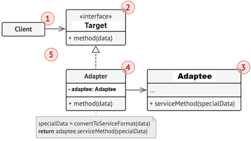
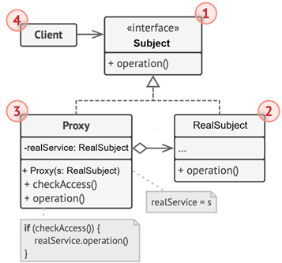

# Patrones estructurales

Los `patrones estructurales` se centran en la composición de clases y objetos para formar estructuras más grandes y
flexibles. Su objetivo es definir `cómo las entidades (clases u objetos) se relacionan entre sí` sin perder simplicidad
ni flexibilidad.

En pocas palabras:` nos ayudan a organizar el “esqueleto” del sistema`.

📌 Ejemplos clásicos: `Adapter`, `Decorator`, `Proxy`, `Facade`, etc.

### Características comunes

- Se enfocan en las relaciones: herencia, composición y delegación.
- Favorecen la reutilización de código, evitando duplicar lógica.
- Permiten abstraer implementaciones y ocultar detalles complejos.
- Promueven la desacoplación entre los componentes.
- Se aplican mucho en proyectos grandes donde hay que `integrar sistemas`, `librerías` o `APIs externas`.

---

## Adapter

El `Adapter` es un `patrón estructural` que `permite que dos clases con interfaces incompatibles trabajen juntas`.
Funciona como un traductor entre dos mundos: convierte la interfaz de una clase en otra interfaz que un cliente espera.

👉 Idea clave: “adaptar lo que ya existe para que encaje sin modificarlo”.

### 📐 Representación UML del patrón Adapter



1. `Client`: contiene la lógica de negocio existente del programa. No conoce directamente al `Adapter` ni al `Adaptee`,
   sino que interactúa a través de la interfaz `Target`.
2. `Target`: define el protocolo que el `Client` espera usar. Es una interfaz que otras clases deben implementar para
   colaborar con el cliente.
3. `Adaptee`: representa una clase útil (normalmente de una biblioteca externa o heredada) cuya interfaz es
   incompatible con `Target`. El cliente no puede utilizarla directamente.
4. `Adapter`: implementa la interfaz `Target` y envuelve una instancia de `Adaptee`. Traduce las llamadas del cliente
   en invocaciones compatibles con `Adaptee`, permitiendo que el cliente use su funcionalidad sin conocer su interfaz
   real.
5. Gracias a que el `Client` depende solo de `Target`, se puede introducir nuevos `Adapter` sin modificar el código
   cliente. Esto es útil cuando cambia la interfaz de `Adaptee` o se reemplaza por otra clase: basta con crear un nuevo
   `Adapter` que implemente `Target`.

### 🎯 Ejemplo 01: Consumir APIs externas de distintos proveedores (climas)

En la mayoría de aplicaciones modernas necesitamos consumir APIs externas para obtener información que no está dentro
de nuestro sistema. Un caso muy común es la integración con proveedores de clima, donde cada servicio ofrece su propia
API con distintos formatos de respuesta y parámetros.

#### Situación

Nuestra aplicación necesita consultar el clima actual de una ciudad, pero queremos que el resto del sistema use una
interfaz unificada, sin importar qué proveedor de clima esté detrás (`OpenWeather`, `WeatherStack`, `AccuWeather`,
etc.).

El problema es que cada API externa:

- Expone endpoints diferentes.
- Requiere parámetros con nombres distintos.
- Devuelve estructuras JSON/XML incompatibles entre sí.

#### Solución con Adapter

Aplicaremos el patrón Adapter para desacoplar nuestra lógica de negocio de la implementación concreta de cada proveedor.

- Definiremos una interfaz común (WeatherService) que la aplicación utilizará.
- Crearemos un Adapter para cada API externa que traduzca las peticiones y respuestas al formato esperado.
- De esta forma, podremos cambiar o agregar proveedores fácilmente sin modificar el resto del sistema.

#### Proveedores de clima a usar

1. `OpenWeatherMap` → https://home.openweathermap.org
    - Devolverá información del clima en un formato JSON propio.
    - Estructura JSON: Campos como `main.temp`, `weather[0].description`, `wind.speed`.
    - Trabajaremos con la estructura `JSON`.


2. `WeatherAPI` → https://www.weatherapi.com
    - También ofrece datos de clima, pero con una estructura de respuesta diferente.
    - Estructura JSON o XML: Campos como `current.temp_c`, `current.condition.text`, `current.wind_kph`.
    - Trabajaremos con la estructura `XML`.

### 🌤️ Patrón Adapter con WeatherAPI (XML)

### Verificando modelo XML del proveedor

En esta primera parte vamos a ver que la API `WeatherAPI` nos retorna la siguiente estructura `XML` con la que
estaremos trabajando:

````xml

<?xml version="1.0" encoding="utf-8"?>
<root>
    <location>
        <name>Lima</name>
        <region>Lima</region>
        <country>Peru</country>
        <lat>-12.05</lat>
        <lon>-77.05</lon>
        <tz_id>America/Lima</tz_id>
        <localtime_epoch>1758498001</localtime_epoch>
        <localtime>2025-09-21 18:40</localtime>
    </location>
    <current>
        <last_updated_epoch>1758497400</last_updated_epoch>
        <last_updated>2025-09-21 18:30</last_updated>
        <temp_c>16.6</temp_c>
        <temp_f>61.8</temp_f>
        <is_day>0</is_day>
        <condition>
            <text>Sunny</text>
            <icon>//cdn.weatherapi.com/weather/64x64/night/113.png</icon>
            <code>1000</code>
        </condition>
        <wind_mph>8.9</wind_mph>
        ...
        <gti>0</gti>
    </current>
</root>
````

A partir de esta estructura, necesitamos extraer solo algunos datos relevantes para nuestro modelo `WeatherInfo`:

- `location.name` → Ciudad.
- `current.temp_c` → Temperatura en Celsius.
- `current.condition.text` → Descripción del clima.

### Justificación del uso de Jackson-XML

Por defecto, `Jackson` trabaja con `JSON`, pero para `XML` necesitamos un módulo adicional: `jackson-dataformat-xml`.

Este módulo provee la clase `XmlMapper`, que nos permite deserializar directamente un `XML` en clases `Java`
intermedias (`WeatherResponse`, `Location`, `Current`, etc.).

Posteriormente, dentro del `Adapter`, convertiremos esas clases intermedias al modelo estándar de nuestra aplicación:
`WeatherInfo`.

### Dependencia necesaria

En nuestro proyecto Maven debemos agregar la siguiente dependencia:

````xml

<dependency>
    <groupId>com.fasterxml.jackson.dataformat</groupId>
    <artifactId>jackson-dataformat-xml</artifactId>
</dependency>
````

### 📘 Modelando la estructura XML del servicio externo en objetos Java

1. `@JsonIgnoreProperties(ignoreUnknown = true)`. Se usa en todas las clases (`Condition`, `Current`, `Location`) para
   ignorar campos del `XML` que no estamos modelando.
   > Esto es útil porque el `XML` de `WeatherAPI` trae muchos datos (latitud, longitud, humedad, presión, etc.),
   > pero en nuestro caso solo nos interesa una parte (ej. ciudad, país, temperatura, descripción del clima).

    - Sin esta anotación, `Jackson` lanzaría un error si encuentra propiedades no mapeadas.
    - Con esta anotación, `Jackson` simplemente las ignora.
    - Ejemplo aplicado en tu Condition:
    ````java
    
    @JsonIgnoreProperties(ignoreUnknown = true)
    public record Condition(String text) {
    }
    ````
   Aquí `Condition` solo mapea `<text>Sunny</text>` y se despreocupa de `<icon>` y `<code>` que también vienen en el
   `XML`.


2. `@JacksonXmlProperty(localName = "temp_c")`. Se utiliza en el record `Current` para indicar que el campo
   `temperature` corresponde al nodo `<temp_c>`.
   > `Jackson` por defecto mapearía temperature con `<temperature>`, pero como en el `XML` el campo es `<temp_c>`,
   > necesitamos especificarlo.
    ````java
    
    @JsonIgnoreProperties(ignoreUnknown = true)
    public record Current(@JacksonXmlProperty(localName = "temp_c") double temperature,
                          Condition condition) {
    }
    ````


3. Otra campo a mapear es el `Location`.
    ````java
    
    @JsonIgnoreProperties(ignoreUnknown = true)
    public record Location(String name,
                           String country) {
    }
    ````


4. `@JacksonXmlRootElement(localName = "root")`. Esta anotación le dice a `Jackson` cuál es el `elemento raíz` del
   `XML`.
    - En nuestro `XML`, todo está envuelto en `<root>...</root>`.
    - Por eso, necesitamos marcar el record `WeatherResponse` como la representación del `documento raíz`:
    ````java
    
    @JacksonXmlRootElement(localName = "root")
    public record WeatherResponse(Location location,
                                  Current current) {
    }
    ````
   Si no la pones, Jackson intentará adivinar el root element y podrías obtener errores al deserializar.

### ⚙️ Implementando el Adaptee WeatherApi

En el patrón Adapter, el `Adaptee` representa el componente externo con el que necesitamos interactuar. En este caso,
es la API de `WeatherAPI`, que nos devuelve información del clima en formato XML.

La clase `WeatherApi` cumple ese rol: se conecta al servicio externo, obtiene el XML y lo convierte a nuestro modelo
intermedio `WeatherResponse`.

````java

@Slf4j
public class WeatherApi {

    private static final String API_KEY = "678b1e8441044e6db3054310252109";
    private static final HttpClient httpClient = HttpClient.newHttpClient();
    private static final XmlMapper xmlMapper = new XmlMapper();

    public Optional<WeatherResponse> fetchWeather(String city) {
        try {
            String url = this.buildUrl(city);
            log.info("Consultando clima en XML: {}", url);

            HttpRequest request = HttpRequest.newBuilder()
                    .uri(URI.create(url))
                    .GET()
                    .build();

            HttpResponse<String> response = httpClient.send(request, HttpResponse.BodyHandlers.ofString());

            if (response.statusCode() != 200) {
                log.warn("Respuesta no exitosa: {}", response.statusCode());
                return Optional.empty();
            }

            String xml = response.body();
            WeatherResponse weather = xmlMapper.readValue(xml.getBytes(StandardCharsets.UTF_8), WeatherResponse.class);
            return Optional.of(weather);

        } catch (InterruptedException e) {
            Thread.currentThread().interrupt(); // ✅ preserva la señal de interrupción
            log.error("Consulta interrumpida para {}: {}", city, e.getMessage(), e);
            return Optional.empty();
        } catch (Exception e) {
            log.error("Error al consultar clima para {}: {}", city, e.getMessage(), e);
            return Optional.empty();
        }
    }

    private String buildUrl(String city) {
        return "http://api.weatherapi.com/v1/current.xml?key=%s&q=%s&aqi=yes".formatted(API_KEY, city);
    }
}
````

1. Uso de `HttpClient`
    - Desde `Java 11`, `HttpClient` es la API estándar para realizar peticiones HTTP.
    - Aquí se configura un cliente básico y reutilizable (patrón singleton con static final).
2. Uso de `XmlMapper` de Jackson
    - Permite deserializar directamente el `XML` en nuestras clases modelo (`WeatherResponse`, `Location`, `Current`,
      `Condition`).
    - Gracias a las anotaciones vistas antes (`@JacksonXmlProperty`, `@JacksonXmlRootElement`, etc.), el mapeo es
      automático.
3. Manejo de errores y logging
    - Si la API responde distinto de 200 OK, se devuelve `Optional.empty()`.
    - Se manejan dos tipos de excepciones:
        - `InterruptedException`: se restaura la interrupción del hilo (`Thread.currentThread().interrupt()`) para no
          perder la señal.
        - Cualquier otra excepción → log de error y `Optional.empty()`.
    - Esto asegura que nuestro Adaptee nunca rompa la aplicación principal, sino que reporte la falla y deje al Adapter
      decidir cómo actuar.

### 🎯 Definiendo la Interfaz Target

En el patrón `Adapter`, el `Target` representa la interfaz que la aplicación cliente conoce y espera usar.
Toda interacción con servicios externos debe adaptarse a este contrato común.

1. Modelo estándar de negocio: `WeatherInfo`

````java
public record WeatherInfo(String city,
                          String country,
                          double temperature,
                          String description) {
}
````

- `Propósito`: encapsular solo los datos relevantes para el negocio.
- Aquí se abstrae toda la complejidad del servicio externo (XML, JSON, nombres de campos distintos).
- Contiene:
    - `city`: nombre de la ciudad.
    - `country`: país de la ciudad.
    - `temperature`: temperatura en Celsius.
    - `description`: descripción breve del clima actual.

Este es el modelo canónico que la aplicación va a usar, independientemente del proveedor de clima.

2. Interfaz Target: `WeatherService`

````java
public interface WeatherService {
    WeatherInfo getWeather(String city);
}
````

- Define el contrato unificado que la aplicación consumirá.
- Cualquier implementación (adapter de `OpenWeatherMap`, adapter de `WeatherAPI`) debe ajustarse a esta firma.
- De esta forma, la lógica de negocio no depende del proveedor de clima, solo de la interfaz común.

### 🔄 Implementando el Adapter: `WeatherApiAdapter`

El `Adapter` es el corazón de este patrón. Su objetivo es traducir la interfaz de un servicio externo (`Adaptee`) al
contrato común que espera la aplicación (`Target`).

En este caso, `WeatherApiAdapter` implementa la interfaz `WeatherService` y se apoya en el `Adaptee` (`WeatherApi`)
para realizar la consulta real al proveedor de clima.

````java

@Slf4j
@RequiredArgsConstructor
public class WeatherApiAdapter implements WeatherService {

    private final WeatherApi api;

    @Override
    public WeatherInfo getWeather(String city) {
        return this.api.fetchWeather(city)
                .map(this::toWeatherInfo)
                .orElseThrow(() -> new RuntimeException("No se pudo obtener el clima para " + city));
    }

    private WeatherInfo toWeatherInfo(WeatherResponse response) {
        return new WeatherInfo(
                response.location().name(),
                response.location().country(),
                response.current().temperature(),
                response.current().condition().text()
        );
    }
}
````

### 🧑‍💻 Implementando el Client

El `Client` es la pieza final del patrón `Adapter`. Representa al código consumidor que necesita trabajar con un
servicio de clima, pero no sabe ni le interesa cómo se conectan los proveedores externos ni en qué formato devuelven
la información.

````java

@Slf4j
public class Client {
    public static void main(String[] args) {
        WeatherService weatherService = new WeatherApiAdapter(new WeatherApi());
        WeatherInfo weatherInfo = weatherService.getWeather("Chimbote");
        log.info("{}", weatherInfo);
    }
}
````

Al ejecutar el main, se obtiene:

````bash
00:36:16.291 [main] INFO dev.magadiflo.patterns.plainjava.structural.adapter.weather.adaptee.WeatherApi -- Consultando clima en XML: http://api.weatherapi.com/v1/current.xml?key=678b1e8441044e6db3054310252109&q=Chimbote&aqi=yes
00:36:17.198 [main] INFO dev.magadiflo.patterns.plainjava.structural.adapter.weather.Client -- WeatherInfo[city=Chimbote, country=Peru, temperature=16.1, description=Patchy rain nearby] 
````

### 🌤️ Patrón Adapter con OpenWeatherMap (JSON)

### Verificando modelo JSON del proveedor

En esta primera parte vamos a ver que la API `OpenWeatherMap` nos retorna la siguiente estructura `JSON` con la que
estaremos trabajando:

````JSON
{
  "coord": {
    "lon": -78.5783,
    "lat": -9.0853
  },
  "weather": [
    {
      "id": 801,
      "main": "Clouds",
      "description": "few clouds",
      "icon": "02n"
    }
  ],
  "base": "stations",
  "main": {
    "temp": 17.66,
    "feels_like": 17.62,
    "temp_min": 17.66,
    "temp_max": 17.66,
    "pressure": 1013,
    "humidity": 82,
    "sea_level": 1013,
    "grnd_level": 1012
  },
  "visibility": 10000,
  "wind": {
    "speed": 3.99,
    "deg": 175,
    "gust": 5.07
  },
  "clouds": {
    "all": 11
  },
  "dt": 1759019096,
  "sys": {
    "country": "PE",
    "sunrise": 1758970840,
    "sunset": 1759014581
  },
  "timezone": -18000,
  "id": 3698304,
  "name": "Chimbote",
  "cod": 200
}
````

A partir de esta estructura, necesitamos extraer solo algunos datos relevantes para nuestro modelo `WeatherInfo`:

- `name` → Ciudad.
- `sys.country` → País.
- `main.temp` → Temperatura en Celsius.
- `weather[0].description` → Descripción del clima.

### 📘 Modelando la estructura JSON del servicio externo en objetos Java

1. `@JsonIgnoreProperties(ignoreUnknown = true)`
    - Se usa en todos los records (`OpenWeatherResponse`, `Main`, `Sys` y `Weather`) para ignorar campos extra en el
      `JSON` que no estamos modelando en nuestras clases.
    - Sin esta anotación, `Jackson` lanzaría una excepción (`UnrecognizedPropertyException`) al encontrar propiedades
      desconocidas.
    - Con esta anotación, `Jackson` simplemente las ignora y solo mapea las que hemos definido.

2. `@JsonProperty("weather")`
    - Se utiliza en el record `OpenWeatherResponse` para mapear el campo `weathers` de la clase al atributo `weather`
      del JSON.
    - Esto es necesario porque el nombre en el JSON es `weather` (singular), mientras que en nuestra clase preferimos
      usar weathers (plural) para reflejar que es una lista.
    - En `XML` usábamos `@JacksonXmlProperty(localName = "...")`. En `JSON` se usa `@JsonProperty("...")`.

````java

@JsonIgnoreProperties(ignoreUnknown = true)
public record OpenWeatherResponse(String name,
                                  Sys sys,
                                  Main main,
                                  @JsonProperty(value = "weather")
                                  List<Weather> weathers) {
}
````

````java

@JsonIgnoreProperties(ignoreUnknown = true)
public record Sys(String country) {
}
````

````java

@JsonIgnoreProperties(ignoreUnknown = true)
public record Main(double temp) {
}
````

````java

@JsonIgnoreProperties(ignoreUnknown = true)
public record Weather(String description) {
}
````

✅ Con esta estructura, Jackson podrá deserializar directamente la respuesta `JSON` de `OpenWeatherMap` y nosotros
tendremos los campos listos para transformarlos en nuestro modelo de negocio (`WeatherInfo`) dentro del `Adapter`.

### ⚙️ Implementando el Adaptee OpenWeatherApi

En el patrón `Adapter`, el `Adaptee` representa el componente externo con el que necesitamos interactuar. En este caso,
es la API de `OpenWeatherMap`, que nos devuelve información del clima en formato `JSON`.

La clase `OpenWeatherApi` cumple ese rol: se conecta al servicio externo, obtiene el JSON y lo convierte a nuestro
modelo intermedio `OpenWeatherResponse`.

````java

@Slf4j
public class OpenWeatherApi {
    private static final String API_KEY = "1e795276e48658194d444a8b37e77bfc";
    private static final HttpClient httpClient = HttpClient.newHttpClient();
    private static final ObjectMapper objectMapper = new ObjectMapper();


    public Optional<OpenWeatherResponse> fetchWeather(String city) {
        try {
            String url = this.buildUrl(city);
            log.info("Consultando clima en JSON: {}", url);

            HttpRequest request = HttpRequest.newBuilder()
                    .uri(URI.create(url))
                    .GET()
                    .build();

            HttpResponse<String> response = httpClient.send(request, HttpResponse.BodyHandlers.ofString());

            if (response.statusCode() != 200) {
                log.warn("Respuesta no exitosa: {}", response.statusCode());
                return Optional.empty();
            }

            String json = response.body();
            OpenWeatherResponse weather = objectMapper.readValue(json, OpenWeatherResponse.class);
            return Optional.of(weather);

        } catch (InterruptedException e) {
            Thread.currentThread().interrupt(); // ✅ preserva la señal de interrupción
            log.error("Consulta interrumpida para {}: {}", city, e.getMessage(), e);
            return Optional.empty();
        } catch (Exception e) {
            log.error("Error al consultar clima para {}: {}", city, e.getMessage(), e);
            return Optional.empty();
        }
    }


    private String buildUrl(String city) {
        return "https://api.openweathermap.org/data/2.5/weather?q=%s&appid=%s&units=metric".formatted(city, API_KEY);
    }
}
````

### 🔑 Diferencias principales con el Adaptee WeatherApi (XML)

- En lugar de `XmlMapper`, ahora usamos `ObjectMapper` porque trabajamos con `JSON`.
- La URL apunta al endpoint `data/2.5/weather` de `OpenWeatherMap`, usando el parámetro `units=metric` para trabajar en
  grados Celsius.
- El modelo intermedio es `OpenWeatherResponse`, mapeado con anotaciones de `Jackson`.

### 🔄 Implementando el Adapter: `OpenWeatherApiAdapter`

El `Adapter` es el corazón de este patrón. Su objetivo es traducir la interfaz de un servicio externo (`Adaptee`) al
contrato común que espera la aplicación (`Target`).

En este caso, `WeatherApiAdapter` implementa la interfaz `WeatherService` y se apoya en el `Adaptee` (`OpenWeatherApi`)
para realizar la consulta real al proveedor de clima.

````java

@Slf4j
@RequiredArgsConstructor
public class OpenWeatherApiAdapter implements WeatherService {

    private final OpenWeatherApi api;

    @Override
    public WeatherInfo getWeather(String city) {
        return this.api.fetchWeather(city)
                .map(this::toWeatherInfo)
                .orElseThrow(() -> new RuntimeException("No se pudo obtener el clima para " + city));
    }

    private WeatherInfo toWeatherInfo(OpenWeatherResponse response) {
        return new WeatherInfo(
                response.name(),
                response.sys().country(),
                response.main().temp(),
                response.weathers().getFirst().description()
        );
    }
}
````

### 🧑‍💻 Implementando el Client

El `Client` representa la parte de la aplicación que necesita consumir información del clima. Gracias al patrón
`Adapter`:

- El `Client` no necesita saber si los datos provienen de `WeatherAPI (XML)` o `OpenWeather (JSON)`.
- Solo interactúa con la interfaz común `WeatherService`.
- El cambio de proveedor es transparente: basta con inyectar un adapter distinto.

📌 Puntos clave

1. Independencia del formato: `JSON` o `XML`, el `Client` nunca lo ve.
2. Polimorfismo real: `WeatherApiAdapter` y `OpenWeatherApiAdapter` implementan la misma interfaz `WeatherService`.
3. Flexibilidad: agregar un nuevo proveedor no afecta el código del `Client`.

````java

@Slf4j
public class Client {
    public static void main(String[] args) {
        WeatherService weatherService = new WeatherApiAdapter(new WeatherApi());
        WeatherInfo weatherInfo = weatherService.getWeather("Chimbote");
        log.info("{}", weatherInfo);

        WeatherService openWeatherService = new OpenWeatherApiAdapter(new OpenWeatherApi());
        WeatherInfo openWeatherInfo = openWeatherService.getWeather("Chimbote");
        log.info("{}", openWeatherInfo);
    }
}
````

✅ Resultado esperado en logs

````bash
20:21:43.300 [main] INFO dev.magadiflo.patterns.plainjava.structural.adapter.weather.adaptee.WeatherApi -- Consultando clima en XML: http://api.weatherapi.com/v1/current.xml?key=678b1e8441044e6db3054310252109&q=Chimbote&aqi=yes
20:21:43.912 [main] INFO dev.magadiflo.patterns.plainjava.structural.adapter.weather.Client -- WeatherInfo[city=Chimbote, country=Peru, temperature=17.2, description=Partly Cloudy]
20:21:43.925 [main] INFO dev.magadiflo.patterns.plainjava.structural.adapter.weather.adaptee.OpenWeatherApi -- Consultando clima en JSON: https://api.openweathermap.org/data/2.5/weather?q=Chimbote&appid=1e795276e48658194d444a8b37e77bfc&units=metric
20:21:44.586 [main] INFO dev.magadiflo.patterns.plainjava.structural.adapter.weather.Client -- WeatherInfo[city=Chimbote, country=PE, temperature=17.35, description=scattered clouds]
````

---

## Proxy

El `patrón Proxy` proporciona un sustituto o intermediario de otro objeto con el fin de controlar el acceso
al objeto original. Actúa como intermediario entre el cliente y el objeto real, permitiendo realizar operaciones
adicionales antes, durante o después de acceder al objeto real.

En otras palabras:

- Tienes un objeto real que hace el trabajo.
- Pones un proxy delante que decide cuándo, cómo o si se llama al objeto real.

Se usa mucho cuando:

- Quieres agregar lógica adicional antes/después de la ejecución.
- Necesitas aplazar (lazy) la creación de objetos pesados.
- Quieres controlar el acceso (seguridad, permisos).
- Necesitas manejar acceso remoto (un proxy local representa un objeto en otro servidor).

### 📐 Representación UML del patrón Proxy



1. `Subject`: Define la interfaz común para el `RealSubject` y `Proxy`.
    - El `Proxy` debe seguir esta interfaz para poder camuflarse como objeto del `RealSubject`.
    - Establece el contrato que tanto el objeto real como el proxy deben cumplir.
    - Es una interfaz o clase abstracta que declara las operaciones que pueden ser realizadas.
2. `RealSubject`: La implementación real del `Subject` que hace el trabajo real.
    - Contiene la lógica de negocio principal y realiza las operaciones reales.
    - Hace el “trabajo pesado” o la acción final.
3. `Proxy`: Mantiene una referencia al `RealSubject` y controla el acceso a él.
    - Implementa la misma interfaz que `RealSubject`.
    - Contiene una referencia al `RealSubject`.
    - Controla el acceso, añade lógica adicional, decide cuándo invocar el real.
    - Crear y eliminar el `RealSubject` cuando sea necesario.
    - Normalmente, los proxies gestionan el ciclo de vida completo de sus objetos `RealSubject`.
4. `Client`: Usa el `Subject` a través del `Proxy`.
    - Trabaja con objetos `Subject` sin saber si está trabajando con el `Proxy` o `RealSubject`.
    - No distingue entre `Proxy` y `RealSubject` ya que ambos implementan la misma interfaz.

### 🎯 Ejemplo 01: Proxy + Cache-Aside para Catálogo de Productos

En un sistema de `e-commerce`, el catálogo de productos es una de las partes más consultadas por los clientes:

- Buscar productos por categoría (ej. “zapatos deportivos”).
- Consultar productos relacionados (ej. “quien compró este producto también vio…”).
- Buscar con filtros avanzados (precio mínimo y máximo, categoría, etc.).

Estas operaciones suelen ser costosas porque:

- Requieren múltiples consultas a la base de datos.
- Pueden involucrar cálculos adicionales (ej. recomendaciones, descuentos, disponibilidad).
- Escalan rápidamente si miles de usuarios hacen búsquedas al mismo tiempo.

Para mejorar la performance y la experiencia del usuario, muchas empresas aplican cachés intermedias (como `Redis` o
`Guava`). En este ejemplo simularemos ese comportamiento implementando el `patrón Proxy` con la estrategia
`Cache-Aside`.

### Modelo de Dominio: `Product`

El record `Product` representa la entidad principal utilizada a lo largo de nuestro ejemplo del `patrón Proxy`.
Simula los datos almacenados en el catálogo de productos y es el tipo de objeto que retornan las consultas del
servicio y que es almacenado en caché por la capa proxy.

El uso de un record en Java permite mantener el modelo inmutable y conciso, evitando código repetitivo
(getters, toString, equals, etc.), pero conservando todos los atributos necesarios para reflejar datos realistas de
un producto en un escenario empresarial.

````java
public record Product(Long id,
                      String name,
                      String category,
                      BigDecimal price,
                      Double rating,
                      String brand,
                      boolean available) {
}
````

En el contexto del `Patrón Proxy` con caché:

- `Product` es la entidad de datos que fluye entre el `RealSubject` (`ProductServiceImpl`), el
  `Proxy` (`ProductServiceCacheProxy`) y el `Client`.
- Mientras el `Proxy` controla el acceso y la estrategia de almacenamiento en caché, el `Product` permanece como un
  contenedor de información simple, sin verse afectado por la lógica de caching.

### Clases Complementarias

Para hacer más realista el ejemplo del `Patrón Proxy` con `caché`, incluimos dos clases auxiliares: una que simula el
origen de datos y otra que representa las entradas en la memoria caché.

### `MockProductDatabase`

Esta clase actúa como una base de datos simulada en memoria, proporcionando un conjunto inicial de productos de
distintas categorías. Su propósito es servir como fuente de información para el `RealSubject` (`ProductServiceImpl`),
evitando dependencias externas a bases de datos reales.

- Está implementada como `@UtilityClass` para exponer un único método estático `initializeDatabase()`.
- Los datos están organizados en categorías (`Electronics`, `Clothing`, `Home`) para permitir consultas más realistas.
- El catálogo de productos incluye información variada (precio, calificación, marca, disponibilidad), lo que facilita
  la simulación de consultas costosas con filtros.

````java

@UtilityClass
public class MockProductDatabase {
    public static List<Product> initializeDatabase() {
        List<Product> products = new ArrayList<>();

        // Electronics
        products.add(new Product(1L, "iPhone 15", "Electronics", new BigDecimal("1200.00"), 4.5, "Apple", true));
        products.add(new Product(2L, "Samsung Galaxy S24", "Electronics", new BigDecimal("1100.00"), 4.3, "Samsung", true));
        products.add(new Product(3L, "MacBook Pro", "Electronics", new BigDecimal("2500.00"), 4.7, "Apple", true));
        products.add(new Product(4L, "Dell XPS 13", "Electronics", new BigDecimal("1800.00"), 4.4, "Dell", true));
        products.add(new Product(5L, "AirPods Pro", "Electronics", new BigDecimal("250.00"), 4.6, "Apple", true));

        // Clothing
        products.add(new Product(6L, "Nike T-Shirt", "Clothing", new BigDecimal("45.00"), 4.2, "Nike", true));
        products.add(new Product(7L, "Levi's Jeans", "Clothing", new BigDecimal("80.00"), 4.4, "Levi's", true));
        products.add(new Product(8L, "Adidas Sneakers", "Clothing", new BigDecimal("120.00"), 4.3, "Adidas", true));
        products.add(new Product(9L, "North Face Jacket", "Clothing", new BigDecimal("200.00"), 4.5, "North Face", true));
        products.add(new Product(10L, "Casio Watch", "Clothing", new BigDecimal("150.00"), 4.1, "Casio", true));

        // Home
        products.add(new Product(11L, "Dyson Vacuum", "Home", new BigDecimal("400.00"), 4.6, "Dyson", true));
        products.add(new Product(12L, "Nespresso Coffee Machine", "Home", new BigDecimal("180.00"), 4.4, "Nespresso", true));
        products.add(new Product(13L, "Ergonomic Chair", "Home", new BigDecimal("300.00"), 4.2, "Herman Miller", true));
        products.add(new Product(14L, "Dining Table", "Home", new BigDecimal("500.00"), 4.3, "IKEA", true));
        products.add(new Product(15L, "LED Lamp", "Home", new BigDecimal("75.00"), 4.0, "Philips", true));

        return products;
    }
}
````

Rol dentro del `Proxy Pattern`:

- Simula el backend real o la base de datos costosa a la que el `RealSubject` accede.
- El `Proxy` cachea los resultados de las consultas a esta base simulada para mejorar tiempos de respuesta.

### `CacheEntry<T>`

Esta clase representa una `entrada en la memoria caché`. Encapsula el dato cacheado (`data`), la fecha de
almacenamiento (`timestamp`) y un TTL (`Time-To-Live`) expresado en minutos.

Responsabilidades:

- Asociar un resultado con su momento de almacenamiento.
- Determinar si el dato cacheado ha expirado mediante el método `isExpired()`.

Detalles técnicos:

- Es genérica (`<T>`), lo que permite reutilizar la lógica de caché para distintos tipos de datos, no solo productos.
- El TTL configurable permite simular escenarios comunes de cache-aside donde los datos deben refrescarse cada cierto
  tiempo.

````java
public class CacheEntry<T> {
    @Getter
    private final T data;
    @Getter
    private final LocalDateTime timestamp;
    private final int ttlMinutes;

    public CacheEntry(T data, int ttlMinutes) {
        this.timestamp = LocalDateTime.now();
        this.data = data;
        this.ttlMinutes = ttlMinutes;
    }

    public boolean isExpired() {
        return LocalDateTime.now().isAfter(this.timestamp.plusMinutes(this.ttlMinutes));
    }

}
````

Rol dentro del Proxy Pattern:

- Es el contenedor intermedio que el Proxy utiliza para decidir si devuelve un dato cacheado (cache hit) o si consulta
  nuevamente al RealSubject (cache miss).

### Subject: `ProductService`

La interfaz `ProductService` define el contrato común que deben implementar tanto el `RealSubject`
(`ProductServiceImpl`) como el `Proxy` (`ProductServiceCacheProxy`). Gracias a este contrato, el cliente puede trabajar
de forma transparente con cualquiera de las implementaciones, sin conocer los detalles internos de acceso a datos ni de
almacenamiento en caché.

````java
public interface ProductService {
    List<Product> findByCategory(String category, int page);

    List<Product> getRelatedProducts(Long productId);

    List<Product> searchWithFilters(String category, BigDecimal minPrice, BigDecimal maxPrice);
}
````

Rol dentro del Patrón Proxy

- Define la interfaz común (`Subject`) entre `cliente`, `Proxy` y `RealSubject`.
- El cliente interactúa únicamente con `ProductService`, sin saber si está hablando con el servicio real o con un proxy.
- Garantiza que el `Proxy` pueda sustituir al `RealSubject` sin alterar el código del cliente (principio de sustitución
  de Liskov).
