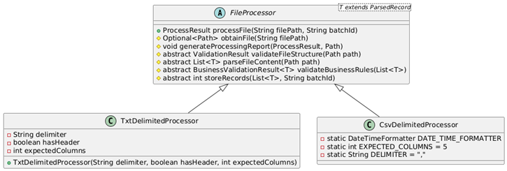
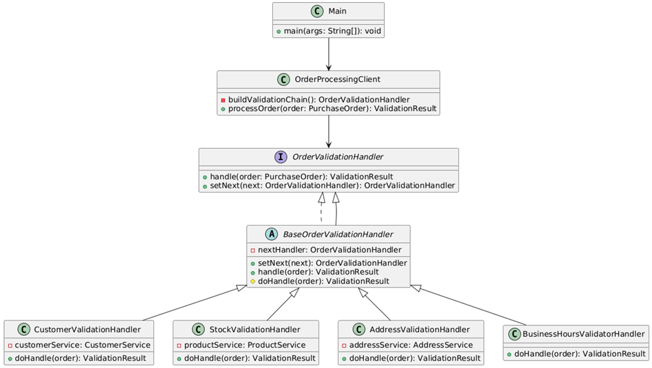

# Patrones de comportamiento

Los patrones de comportamiento se enfocan en `cómo interactúan los objetos entre sí`, es decir, la manera en que se
comunican, delegan responsabilidades o coordinan acciones.

Estos patrones buscan:

- `Separar responsabilidades` claramente.
- Facilitar la extensión o `variación de comportamiento` sin modificar las clases existentes.
- Promover el principio de `abierto/cerrado` (`OCP del SOLID`).

📌 Ejemplos clásicos: `Strategy`, `Template Method`, `Observer`, `Command`, `Chain of Responsibility`, etc.

---

## Strategy

El `patrón Strategy` define una `familia de algoritmos` o `comportamientos`, los encapsula por separado y permite
`intercambiarlos dinámicamente` sin modificar el código del cliente que los utiliza. El objeto que usa el algoritmo no
necesita conocer los detalles de implementación, solo delega la tarea a la estrategia seleccionada.

- Permite que `el comportamiento de una clase cambie en tiempo de ejecución`, delegándolo a una interfaz común que
  agrupa distintas estrategias concretas.
- `Favorece` el principio de `abierto/cerrado` y `la composición` sobre la herencia.
- Su objetivo es separar el qué se hace del cómo se hace, dando flexibilidad.

### 🧩 Casos de uso reales del patrón Strategy

Este patrón es extremadamente común. Algunos casos en el mundo real:

#### 🔧 En aplicaciones Java/Spring:

- Algoritmos de validación de datos (validar distintos tipos de documentos, estrategias de pago, etc.).
- Diferentes formas de envío (email, SMS, push).
- Selección de lógica según el tipo de usuario, tipo de archivo, estado del negocio, etc.
- Estrategias de serialización (JSON, XML, YAML).
- Estrategias de cálculo de precios, descuentos, impuestos.

#### 📦 Ejemplos en librerías/frameworks:

- Spring Security utiliza Strategy para múltiples mecanismos de autenticación.
- Spring usa ConversionService para conversión de tipos basada en estrategias.
- Comparator de Java es una forma simplificada de Strategy.

### 📐 Representación UML del patrón Strategy


1. La clase `contexto` mantiene una referencia a una de las estrategias concretas y se comunica con este objeto
   únicamente a través de la `interfaz estrategia`.
2. La `interfaz estrategia` es común a todas las estrategias concretas. Declara un método que la clase contexto utiliza
   para ejecutar una estrategia.
3. Las `estrategias concretas` implementan distintas variaciones de un algoritmo que la clase contexto utiliza.
4. La `clase contexto` invoca el método de ejecución en el objeto de estrategia vinculado cada vez que necesita ejecutar
   el algoritmo. La `clase contexto` no sabe con qué tipo de estrategia funciona o cómo se ejecuta el algoritmo. La
   `clase contexto` expone un modificador `set()` que permite a los clientes sustituir la estrategia asociada al
   contexto durante el tiempo de ejecución.
5. El `cliente` crea un objeto de estrategia específico y lo pasa a la clase contexto.

### 🎯 Ejemplo 01: Estrategias de pago

`Contexto realista`: Supongamos que queremos aplicar diferentes estrategias de pago: `tarjeta de crédito`, `PayPal` y
`transferencia bancaria`.

Entonces, la implementación de nuestro patrón `Strategy` estará basado en el siguiente diagrama de clases.


### `PaymentStrategy – Interfaz de Estrategia`

Esta interfaz define el contrato común para todas las estrategias de pago. Cada clase que implemente esta interfaz
representará una forma distinta de procesar pagos, encapsulando su propia lógica de autenticación, validación y
ejecución del pago.

**Rol en el patrón Strategy**

En el patrón `Strategy`, esta interfaz representa el `Strategy` (la estrategia en sí misma). Define el conjunto de
operaciones intercambiables que el contexto podrá utilizar dinámicamente sin conocer los detalles internos de cada
implementación concreta.

**Métodos definidos**

- `collectPaymentDetails`
    - Recoge los datos necesarios del usuario según el tipo de pago.
    - Se pasa un BufferedReader externo para mantener un solo recurso compartido desde el cliente (buen manejo de
      recursos).
- `validatePaymentDetails`
    - Valida los datos ingresados.
    - Permite que el flujo de pago continúe solo si se ingresaron datos válidos (por ejemplo, autenticación exitosa,
      campos no vacíos, etc.).
- `pay`
    - Ejecuta el pago según la estrategia seleccionada.
    - Devuelve true si el pago fue exitoso, false en caso contrario.

````java
public interface PaymentStrategy {
    void collectPaymentDetails(BufferedReader reader);

    boolean validatePaymentDetails();

    boolean pay(int amount);
}
````

✅ **Buenas prácticas aplicadas**

- `Principio de Abierto/Cerrado (OCP)`: Podemos agregar nuevas estrategias (como `BitcoinPayment`, `ApplePay`, etc.)
  sin modificar el código existente.
- `Principio de Responsabilidad Única (SRP)`: Cada implementación concreta se encarga únicamente de su lógica de pago.
- `Desacoplamiento`: El cliente y el contexto no necesitan conocer los detalles específicos de cada forma de pago.

### `BankTransferPayment – Estrategia concreta`

Esta clase es una implementación concreta de la interfaz `PaymentStrategy`. Representa la lógica necesaria para realizar
un pago mediante transferencia bancaria, solicitando datos básicos como titular de cuenta, banco y número de cuenta.

**Rol en el patrón Strategy**

En el patrón `Strategy`, esta clase actúa como una `Concrete Strategy`. Define una forma específica de realizar un pago
siguiendo el contrato común de la interfaz `PaymentStrategy`. Puede ser intercambiada fácilmente con otras estrategias
sin que el cliente o el contexto deban conocer su implementación interna.

**Responsabilidades principales**

- Recoger los datos necesarios para realizar una transferencia bancaria.
- Validar que los datos ingresados no estén vacíos.
- Procesar el pago si la validación fue exitosa.

````java

@Slf4j
public class BankTransferPayment implements PaymentStrategy {

    private String accountHolder;
    private String bankName;
    private String accountNumber;
    private boolean detailsProvided;

    @Override
    public void collectPaymentDetails(BufferedReader reader) {
        log.info("=== Pago por Transferencia Bancaria ===");
        try {
            this.accountHolder = this.prompt(reader, "Ingrese nombre del titular de la cuenta:");
            this.bankName = this.prompt(reader, "Ingrese nombre del banco:");
            this.accountNumber = this.prompt(reader, "Ingrese número de cuenta:");
        } catch (IOException exception) {
            log.error("Error al leer datos bancarios: {}", exception.getMessage());
        }
    }

    @Override
    public boolean validatePaymentDetails() {
        this.detailsProvided = this.isValid();
        if (this.detailsProvided) {
            log.info("Detalles bancarios registrados correctamente");
        } else {
            log.error("Faltan datos para procesar la transferencia");
        }
        return this.detailsProvided;
    }

    @Override
    public boolean pay(int paymentAmount) {
        if (this.detailsProvided) {
            log.info("Pagando S/ {} por transferencia bancaria a nombre de {} en {}.", paymentAmount, this.accountHolder, this.bankName);
            return true;
        }
        log.warn("No se proporcionaron los datos necesarios para realizar la transferencia");
        return false;
    }

    private boolean isValid() {
        return !accountHolder.isBlank() &&
               !bankName.isBlank() &&
               !accountNumber.isBlank();
    }

    private String prompt(BufferedReader reader, String message) throws IOException {
        log.info(message);
        return reader.readLine().trim();
    }
}
````

🧩 **Otras estrategias similares**

También se han implementado otras dos estrategias (PayPalPayment y CreditCardPayment), las cuales siguen exactamente el
mismo contrato `PaymentStrategy`, pero adaptan su lógica interna según los requisitos de su tipo de pago (por ejemplo,
validación con email/contraseña en PayPal o datos de tarjeta en CreditCard).

### `PayPalPayment – Estrategia concreta`

````java

@Slf4j
public class PayPalPayment implements PaymentStrategy {

    private static final Map<String, String> DATA_BASE = new HashMap<>();

    private String email;
    private String password;
    private boolean signedIn;

    static {
        DATA_BASE.put("martin@gmail.com", "martin");
        DATA_BASE.put("milagros@gmail.com", "123456");
    }

    @Override
    public void collectPaymentDetails(BufferedReader reader) {
        log.info("=== Autenticación PayPal ===");
        try {
            this.email = this.prompt(reader, "Ingrese su email de usuario:");
            this.password = this.prompt(reader, "Ingrese su contraseña:");
        } catch (IOException exception) {
            log.error("Error al leer entrada del usuario: {}", exception.getMessage());
        }
    }

    @Override
    public boolean validatePaymentDetails() {
        this.signedIn = Objects.equals(this.password, DATA_BASE.get(email));

        if (this.signedIn) {
            log.info("Inicio de sesión exitoso");
        } else {
            log.error("Email o password incorrectos");
        }
        return this.signedIn;
    }

    @Override
    public boolean pay(int paymentAmount) {
        if (this.signedIn) {
            log.info("Pagando S/ {} con PayPal (usuario: {})", paymentAmount, this.email);
            return true;
        }
        log.warn("El usuario no ha iniciado sesión correctamente. No se puede realizar el pago");
        return false;
    }

    private String prompt(BufferedReader reader, String message) throws IOException {
        log.info(message);
        return reader.readLine().trim();
    }
}
````

### `CreditCardPayment – Estrategia concreta`

````java

@ToString
public class CreditCard {
    @Getter
    private final String number;
    @Getter
    private final String expiry;
    @Getter
    private final String cvv;
    @Getter
    @Setter
    private int amount = 100_000; //Simula saldo de la tarjeta

    public CreditCard(String number, String expiry, String cvv) {
        this.number = number;
        this.expiry = expiry;
        this.cvv = cvv;
    }

}
````

````java

@Slf4j
public class CreditCardPayment implements PaymentStrategy {

    private CreditCard creditCard;

    @Override
    public void collectPaymentDetails(BufferedReader reader) {
        log.info("=== Ingreso de datos de tarjeta de crédito ===");
        try {
            String number = this.prompt(reader, "Ingrese número de tarjeta:");
            String expiry = this.prompt(reader, "Ingrese fecha de expiración (mm/yy):");
            String cvv = this.prompt(reader, "Ingrese código cvv:");
            this.creditCard = new CreditCard(number, expiry, cvv);
        } catch (IOException exception) {
            log.error("Error al leer datos de la tarjeta: {}", exception.getMessage());
        }
    }

    @Override
    public boolean validatePaymentDetails() {
        log.info("Validando tarjeta...");
        if (this.validateCard(this.creditCard)) {
            log.info("Tarjeta válida: {}", creditCard);
            return true;
        }

        log.error("Datos de tarjeta inválidos");
        this.creditCard = null;
        return false;
    }

    @Override
    public boolean pay(int paymentAmount) {
        if (!this.cardIsPresent()) {
            log.warn("No hay tarjeta registrada. No se puede procesar el pago");
            return false;
        }

        if (this.creditCard.getAmount() < paymentAmount) {
            log.warn("Fondos insuficientes en la tarjeta. Monto disponible: S/ {}", this.creditCard.getAmount());
            return false;
        }

        this.creditCard.setAmount(this.creditCard.getAmount() - paymentAmount);
        log.info("Pagando S/ {} con tarjeta de crédito (Saldo restante: S/ {})", paymentAmount, this.creditCard.getAmount());
        return true;

    }

    private boolean validateCard(CreditCard card) {
        return !card.getNumber().isBlank() &&
               !card.getExpiry().isBlank() &&
               !card.getCvv().isBlank();
    }

    private boolean cardIsPresent() {
        return Objects.nonNull(this.creditCard);
    }

    private String prompt(BufferedReader reader, String message) throws IOException {
        log.info(message);
        return reader.readLine().trim();
    }
}
````

### `PaymentContext – Contexto del patrón Strategy`

Esta clase representa el `Contexto` en el patrón `Strategy`. Su principal función es mantener una referencia a una
estrategia concreta de pago (`PaymentStrategy`) y delegar en ella la ejecución de las operaciones correspondientes.

````java

@Slf4j
public class PaymentContext {

    private PaymentStrategy paymentStrategy;

    public void setPaymentStrategy(PaymentStrategy paymentStrategy) {
        this.paymentStrategy = paymentStrategy;
    }

    public void collectPaymentDetails(BufferedReader reader) {
        this.validateStrategy();
        this.paymentStrategy.collectPaymentDetails(reader);
    }

    public boolean validatePaymentDetails() {
        this.validateStrategy();
        return this.paymentStrategy.validatePaymentDetails();
    }

    public boolean pay(int amount) {
        this.validateStrategy();
        return this.paymentStrategy.pay(amount);
    }

    private void validateStrategy() {
        if (Objects.isNull(this.paymentStrategy)) {
            throw new IllegalStateException("No se ha definido una estrategia de pago");
        }
    }
}
````

**Rol en el patrón Strategy**

- Actúa como Contexto, que es responsable de usar una estrategia (`PaymentStrategy`) definida dinámicamente en tiempo
  de ejecución.
- No conoce los detalles de implementación de cada estrategia, sólo interactúa a través de la interfaz común.
- Encapsula la variación del algoritmo delegando el comportamiento a una instancia concreta de la estrategia.

**Responsabilidades**

- Recibir la estrategia a utilizar (`setPaymentStrategy(...)`).
- Delegar la ejecución de los métodos `collectPaymentDetails()`, `validatePaymentDetails()` y `pay()` a la estrategia
  asignada.
- Validar que una estrategia haya sido definida antes de delegar cualquier operación.

**Beneficios**

- Cumple con el principio de `abierto/cerrado (OCP)`: se pueden agregar nuevas estrategias sin modificar esta clase.
- Sigue el principio de `inversión de dependencias (DIP)`: el contexto depende de una abstracción (`PaymentStrategy`),
  no de implementaciones concretas.

**Consideraciones**

- El contexto no necesita saber cuál es la lógica de cada estrategia concreta. Puede operar de forma genérica gracias a
  la interfaz.
- Si en un futuro se agregan validaciones adicionales (como logging o auditoría), podrían centralizarse también aquí,
  manteniendo la estrategia limpia.

### `🧑‍💻 Cliente: Main`

Este `cliente (Main`) es el punto de entrada de la aplicación y cumple el rol de coordinador que configura el contexto
del `patrón Strategy`.

Responsabilidades clave:

- ✅ Solicita al usuario que elija el método de pago (PayPal, transferencia o tarjeta).
- ✅ Crea la estrategia concreta correspondiente (PaymentStrategy) y la inyecta al contexto (PaymentContext).
- ✅ Coordina la recolección de datos del usuario, con hasta 3 intentos para validarlos.
- ✅ Solicita el monto a pagar.
- ✅ Ejecuta el método pay de la estrategia activa, a través del contexto.

El cliente no necesita conocer los detalles de implementación de cada tipo de pago. Simplemente, selecciona una
estrategia en tiempo de ejecución y el `PaymentContext` se encarga de delegar las operaciones de manera polimórfica.

````java

@Slf4j
public class Main {
    public static void main(String[] args) throws IOException {
        try (BufferedReader reader = new BufferedReader(new InputStreamReader(System.in))) {
            PaymentContext context = new PaymentContext();

            log.info("=== Sistema de Pagos ===");
            log.info("Elija el método de pago:");
            log.info("1. PayPal");
            log.info("2. Transferencia Bancaria");
            log.info("3. Tarjeta de Crédito");

            String option = reader.readLine().trim();
            switch (option) {
                case "1" -> context.setPaymentStrategy(new PayPalPayment());
                case "2" -> context.setPaymentStrategy(new BankTransferPayment());
                case "3" -> context.setPaymentStrategy(new CreditCardPayment());
                default -> {
                    log.warn("Opción inválida");
                    return;
                }
            }

            final int maxAttempts = 3;
            boolean isValid = false;

            for (int attempts = 1; attempts <= maxAttempts; attempts++) {
                log.info("Intento {}/{}", attempts, maxAttempts);
                context.collectPaymentDetails(reader);

                if (context.validatePaymentDetails()) {
                    isValid = true;
                    break;
                }
            }

            if (!isValid) {
                log.warn("Se consumieron todos los intentos. Inténtelo más tarde.");
                return;
            }

            log.info("Ingrese el monto a pagar:");
            int amount = Integer.parseInt(reader.readLine().trim());

            if (context.pay(amount)) {
                log.info("Pago realizado con éxito");
            } else {
                log.info("El pago no se pudo procesar");
            }
        }
    }
}
````

---

## Template Method

El patrón `Template Method` es un patrón de comportamiento que define la `estructura de un algoritmo` en una
clase base, delegando la `implementación de algunos pasos` a las subclases. Es ideal cuando tienes una lógica que
sigue siempre un mismo flujo general, pero `algunos pasos deben ser personalizados`.

### 🧩 Características clave

- Utiliza una clase abstracta con un método `“plantilla”` (`templateMethod()`), que define los pasos del algoritmo.
- Algunos pasos son implementados directamente en la clase base, mientras que otros se declaran como métodos abstractos
  para que las subclases los definan.
- Fomenta el principio de Hollywood: "Don’t call us, we’ll call you" — es decir, la clase base controla el flujo general

### 🔧 ¿Cuándo usar el patrón Template Method?

Usa este patrón cuando:

- Tienes múltiples clases que comparten una secuencia de pasos, pero cada una implementa los pasos de forma diferente.
- Deseas evitar duplicación de código al mantener la lógica común en una clase base.
- Quieres estandarizar un proceso, pero necesitas que ciertas partes sean personalizables.

### 📌 Ejemplos de la vida real

- `Proceso de carga de archivos`:
    - *Validar archivo → Leer contenido → Procesar datos → Guardar resultado*. Cada tipo de archivo (CSV, XML, JSON)
      implementa su propia lógica de lectura y procesamiento.


- `Juego`:
    - *Inicializar juego → Jugar turno → Mostrar resultados*. Cada juego tiene sus propias reglas, pero la estructura
      general del flujo es la misma.


- `Conexión a una base de datos`:
    - *Abrir conexión → Ejecutar operación → Cerrar conexión*. El paso de `“ejecutar operación”` puede variar (insertar,
      actualizar, consultar).

### ✅ Ventajas

- Reutilización de código: lógica común centralizada.
- Fomenta el principio "Open/Closed": el algoritmo base está cerrado a modificaciones, pero abierto a extensiones.
- Mejora la legibilidad y mantenibilidad.

### ❌ Desventajas

- Aumenta el acoplamiento entre la clase base y las subclases.
- Puede haber rigidez si se necesitan muchos pasos personalizados.

### 📐 Representación UML del patrón Template Method


1. La `Clase Abstracta` declara métodos que actúan como pasos de un algoritmo.
    - Define el método plantilla (`templateMethod`) que contiene el flujo general del algoritmo.
    - Puede incluir métodos:
        - `abstractos` (obligan a la subclase a implementar).
        - `concretos` (implementados en la clase abstracta).
        - `hooks` (métodos opcionales que las subclases pueden sobreescribir si lo desean).
2. Las `Clases Concretas`:
    - Implementan los pasos abstractos definidos por la clase abstracta.
    - Pueden redefinir métodos hook si necesitan cambiar parte del comportamiento.

### Sobre los Hooks

Los `hooks` son efectivamente métodos concretos, pero tienen una característica especial:
`están diseñados específicamente para ser sobrescritos opcionalmente`.
La diferencia clave es la `intención y el diseño`:

- `Métodos concretos normales`
    - Implementan lógica de negocio real
    - No están pensados para ser sobrescritos
    - Si los sobrescribes, pierdes funcionalidad importante

- `Hooks`
    - Tienen implementación vacía o muy básica por defecto
    - Su propósito es ser "puntos de extensión opcionales"
    - Permiten a las subclases "engancharse" en momentos específicos del algoritmo

`Ejemplo práctico`. Los hooks te dan flexibilidad sin forzar a todas las subclases a implementarlos.

````java
public abstract class DataProcessor {

    // Template method
    public final void processData() {
        loadData();
        beforeValidation(); // <- HOOK
        validateData();
        afterValidation();  // <- HOOK
        logProcessingResult(); // <- MÉTODO CONCRETO NORMAL
        saveData();
    }

    // Métodos abstractos (obligatorios)
    protected abstract void loadData();

    protected abstract void validateData();

    protected abstract void saveData();

    // MÉTODOS CONCRETOS NORMALES (no pensados para sobrescribir)
    protected void logProcessingResult() {
        System.out.println("Processing completed at: " + new Date());
    }

    protected boolean isDataValid() {
        // Lógica común de validación básica
        return true;
    }

    // HOOKS (opcionales - implementación vacía/básica por defecto)
    protected void beforeValidation() {
        // Implementación vacía - punto de extensión opcional
    }

    protected void afterValidation() {
        // Implementación vacía - punto de extensión opcional
    }
}
````

En resumen, los métodos:

- `Abstractos`: deben implementarse.
- `Concretos normales`: lógica común, no pensados para sobrescribir.
- `Hooks`: puntos de extensión opcionales.

### 🎯 Ejemplo 01: Sistema de Procesamiento de Archivos Empresarial

📌`Contexto empresarial`

En entornos corporativos, es habitual recibir archivos de entrada con información estructurada para ser procesada e
integrada en sistemas internos. Estos archivos pueden variar ampliamente en cuanto a formato y estructura (por ejemplo,
.txt, .csv, .xml), pero comparten una secuencia de pasos común para su procesamiento:

### 🛠️ Flujo típico de procesamiento

1. `Carga del archivo` desde una fuente (sistema local, red, FTP, etc.).
2. `Validación` del archivo: verificar estructura, encabezados, formato de columnas, etc.
3. `Lectura` del contenido (línea por línea, por nodo, etc.).
4. `Conversión` a estructuras de datos manejables dentro del sistema.
5. `Persistencia` o simulación del guardado en una base de datos.
6. `Notificación` del resultado (éxito, errores, estadísticas).

A pesar de la diversidad de formatos y reglas, el flujo general es invariable. Este escenario encaja perfectamente con
el patrón `Template Method`, ya que:

> 🔁 Permite definir un algoritmo esquelético común en una clase abstracta y delegar en las subclases los pasos
> específicos que pueden variar según el tipo de archivo.

Entonces, la implementación de nuestro patrón `Template Method` estará basado en el siguiente diagrama de clases.



### 📦 Clases de apoyo

````java
public interface ParsedRecord {
}
````

- `Propósito`: interfaz de marcador para representar un registro procesado en memoria.
- `Uso`: cada tipo de archivo tendrá su propia clase que implemente esta interfaz (`TxtRecord`, `CsvRecord`, etc.).

````java
public record ProcessResult(String batchId,
                            boolean success,
                            String errorMessage,
                            int totalRecords,
                            int processedRecords,
                            int invalidRecords) {

    public static ProcessResult success(String batchId, int total, int processed, int invalid) {
        return new ProcessResult(batchId, true, null, total, processed, invalid);
    }

    public static ProcessResult failure(String batchId, String errorMessage) {
        return new ProcessResult(batchId, false, errorMessage, 0, 0, 0);
    }
}
````

- `Propósito`: encapsula el resultado del procesamiento de un lote de archivos.

````java
public record ValidationResult(boolean valid,
                               String errorMessage) {

    public static ValidationResult success() {
        return new ValidationResult(true, null);
    }

    public static ValidationResult failure(String errorMessage) {
        return new ValidationResult(false, errorMessage);
    }
}
````

- `Propósito`: representa el resultado de la validación estructural del archivo.
- `Permite`: distinguir entre archivos válidos e inválidos antes de iniciar el procesamiento detallado.

````java
public record BusinessValidationResult<T extends ParsedRecord>(List<T> validRecords,
                                                               int invalidCount) {
}
````

- `Propósito`: encapsula el resultado de la validación de reglas de negocio aplicadas a los registros.
- Incluye:
    - Registros válidos que se pueden procesar.
    - Conteo de registros inválidos por fallas en reglas internas (por ejemplo, campos obligatorios faltantes).

### 🧱 Clase Abstracta: `FileProcessor<T extends ParsedRecord>`

Esta clase define el algoritmo base para procesar archivos de distintos formatos, representando fielmente el patrón
`Template Method`.

### 🧩 Rol en el patrón Template Method

- `Clase abstracta base (Template)`: Define el esqueleto del algoritmo con un método `final`, `processFile(...)`, que
  orquesta el proceso completo. Se declara como `final` para preservar la integridad del algoritmo, evitando que las
  subclases alteren el flujo principal y asegurando un comportamiento consistente.
- `Subclases concretas`: Deberán implementar únicamente las partes variables (métodos abstractos), manteniendo intacto
  el flujo general.
- `Ventaja`: Evita duplicación de lógica común entre procesadores de archivos distintos, y facilita la extensión
  mediante herencia.

### 🔁 Método plantilla: `processFile(String filePath, String batchId)`

Este es el `template method`. Define la secuencia exacta de pasos a seguir para procesar cualquier archivo. Los pasos
son:

1. Obtener el archivo con `obtainFile(...)` (concreto y reutilizable).
2. Validar la estructura del archivo, mediante `validateFileStructure(...)` (abstracto).
3. Parsear el contenido, línea por línea o según el formato, con `parseFileContent(...)` (abstracto).
4. Aplicar validaciones de negocio a los registros parseados: `validateBusinessRules(...)` (abstracto).
5. Almacenar los registros válidos: `storeRecords(...)` (abstracto).
6. Generar un reporte final del procesamiento: `generateProcessingReport(...)` (concreto).

El método `processFile(...)` también maneja errores, logs y encapsula el resultado en un `ProcessResult`, cumpliendo así
un flujo robusto y controlado.

````java

@Slf4j
public abstract class FileProcessor<T extends ParsedRecord> {

    public final ProcessResult processFile(String filePath, String batchId) {
        try {
            log.info("=== Iniciando procesamiento de archivo ===");
            log.info("Archivo: {} - Batch ID: {}", filePath, batchId);

            // Paso 1: Obtener y validar archivo
            Optional<Path> optionalPath = this.obtainFile(filePath);
            if (optionalPath.isEmpty()) {
                return ProcessResult.failure(batchId, "Archivo no encontrado o inaccesible");
            }

            // Paso 2: Validar estructura del archivo
            Path path = optionalPath.get();
            ValidationResult validation = this.validateFileStructure(path);
            if (!validation.valid()) {
                return ProcessResult.failure(batchId, "Validación fallida: ".concat(validation.errorMessage()));
            }

            // Paso 3: Procesar el contenido línea por línea
            List<T> parsedRecords = this.parseFileContent(path);
            if (parsedRecords.isEmpty()) {
                return ProcessResult.failure(batchId, "El archivo está vacío o no contiene registros procesables");
            }
            int totalRecords = parsedRecords.size();

            // Paso 4: Validar datos de negocio
            BusinessValidationResult<T> businessValidationResult = this.validateBusinessRules(parsedRecords);
            List<T> validRecords = businessValidationResult.validRecords();
            int invalidCount = businessValidationResult.invalidCount();
            int processedRecords = 0;

            // Paso 5: Persistir en base de datos
            ProcessResult result;
            if (!validRecords.isEmpty()) {
                processedRecords = this.storeRecords(validRecords, batchId);
                result = ProcessResult.success(batchId, totalRecords, processedRecords, invalidCount);
            } else {
                result = ProcessResult.failure(batchId, "No se encontraron registros válidos para almacenar.");
            }

            // Paso 6: Generar notificación final
            this.generateProcessingReport(result, path);

            if (result.success()) {
                log.info("Procesamiento finalizado exitosamente. Registros procesados: {}", result.processedRecords());
            } else {
                log.warn("Procesamiento finalizado con errores. Motivo: {}", result.errorMessage());
            }
            return result;
        } catch (Exception e) {
            log.error("Error durante procesamiento: {}", e.getMessage(), e);
            return ProcessResult.failure(batchId, "Error técnico: " + e.getMessage());
        }
    }

    // ============== MÉTODOS CONCRETOS (comunes a todos los tipos) ==============
    protected Optional<Path> obtainFile(String filePath) {
        try {
            Path path = Path.of(filePath);

            if (Files.notExists(path) || !Files.isReadable(path)) {
                log.warn("El archivo no existe o no es legible: {}", filePath);
                return Optional.empty();
            }

            log.info("Archivo obtenido exitosamente. Tamaño: {} bytes", Files.size(path));
            return Optional.of(path);
        } catch (Exception e) {
            log.warn("Error obtenido en archivo: {}", e.getMessage());
            return Optional.empty();
        }
    }

    protected void generateProcessingReport(ProcessResult result, Path path) {
        DateTimeFormatter formatter = DateTimeFormatter.ofPattern("yyyy-MM-dd HH:mm:ss");
        String format = LocalDateTime.now().format(formatter);

        String fileName = path.getFileName().toString();
        int index = fileName.lastIndexOf(".");
        String extension = fileName.substring(index + 1).toUpperCase();

        String state;
        if (!result.success()) {
            state = "Error";
        } else if (result.invalidRecords() > 0) {
            state = "Exitoso con advertencias";
        } else {
            state = "Exitoso";
        }

        StringBuilder sb = new StringBuilder("=== REPORTE DE PROCESAMIENTO %s ===".formatted(extension));
        sb.append("\n");
        sb.append("Archivo: ").append(path.toAbsolutePath()).append("\n");
        sb.append("Batch Id: ").append(result.batchId()).append("\n");
        sb.append("Fecha/Hora: ").append(format).append("\n");
        sb.append("Total registros: ").append(result.totalRecords()).append("\n");
        sb.append("Registros procesados: ").append(result.processedRecords()).append("\n");
        sb.append("Registros inválidos: ").append(result.invalidRecords()).append("\n");
        sb.append("Estado: ").append(state);

        log.info("REPORTE {}:\n{}", extension, sb);
    }

    // ============== MÉTODOS ABSTRACTOS (específicos por tipo de archivo) ==============
    protected abstract ValidationResult validateFileStructure(Path path);

    protected abstract List<T> parseFileContent(Path path) throws IOException;

    protected abstract BusinessValidationResult<T> validateBusinessRules(List<T> parsedRecords);

    protected abstract int storeRecords(List<T> validRecords, String batchId) throws SQLException;
}
````

### 📌 Conclusión

La clase `FileProcessor<T>` aplica correctamente el patrón `Template Method` al:

- Establecer un flujo fijo de procesamiento de archivos.
- Permitir la personalización de pasos específicos mediante métodos abstractos.
- Reutilizar lógica común que no debe duplicarse en cada subclase.

Este diseño garantiza coherencia, extensibilidad y bajo acoplamiento entre las diferentes estrategias de procesamiento
de archivos.

### 🧪 Clase Concreta: `TxtDelimitedProcessor`

### 🧩 Rol en el patrón Template Method

- Esta clase representa una implementación concreta del algoritmo definido en la clase abstracta `FileProcessor<T>`.
- Hereda el flujo de procesamiento general definido por `processFile(...)` y especializa los pasos que dependen del
  formato TXT delimitado.
- Utiliza un DTO propio (`TxtRecord`) que implementa la interfaz común `ParsedRecord`.

````java
public record TxtRecord(String id,
                        String accountNumber,
                        double amount,
                        LocalDateTime transactionDate,
                        String description) implements ParsedRecord {
}
````

- Define la estructura de un registro TXT con 5 campos.
- Sirve como tipo genérico `T` para la clase base `FileProcessor<T>`.
- Los campos son representativos de una transacción financiera, lo cual contextualiza bien su uso empresarial.

### ⚙️ Especialización de pasos en `TxtDelimitedProcessor`

1. `validateFileStructure(Path path)`, este paso permite adaptar el procesamiento a diferentes configuraciones de TXT
   sin modificar el flujo principal.
2. `parseFileContent(Path path)`, este método transforma los datos crudos del archivo en registros estructurados que
   serán validados y persistidos.
3. `validateBusinessRules(List<TxtRecord>)`, este paso demuestra cómo las reglas pueden variar por tipo de archivo o
   dominio, pero seguir encajando en el flujo común.
4. `storeRecords(List<TxtRecord>, String batchId)`, aunque no se persiste en una base de datos real, este paso es útil
   para pruebas y demuestra cómo podría extenderse fácilmente.

````java

@Slf4j
@RequiredArgsConstructor
public class TxtDelimitedProcessor extends FileProcessor<TxtRecord> {

    private static final DateTimeFormatter DATE_TIME_FORMATTER = DateTimeFormatter.ofPattern("yyyy-MM-dd HH:mm:ss");

    private final String delimiter;
    private final boolean hasHeader;
    private final int expectedColumns;

    @Override
    protected ValidationResult validateFileStructure(Path path) {
        try (BufferedReader reader = new BufferedReader(Files.newBufferedReader(path))) {
            String firstLine = reader.readLine();

            if (Objects.isNull(firstLine) || firstLine.isBlank()) {
                return ValidationResult.failure("Archivo vacío");
            }

            // Si el archivo tiene encabezado, validamos que al menos tenga expectedColumns,
            // pero no validamos el contenido de datos aún.
            String[] columns = firstLine.split(Pattern.quote(this.delimiter));
            if (this.hasHeader) {
                if (columns.length < this.expectedColumns) {
                    return ValidationResult.failure("La cabecera debe tener al menos %d columnas separadas por '%s'"
                            .formatted(this.expectedColumns, this.delimiter));
                }
                log.info("Cabecera detectada. Columnas encontradas: {}", columns.length);
            } else {
                // Si no hay cabecera, consideramos que la primera línea ya es un registro
                if (columns.length != this.expectedColumns) {
                    return ValidationResult.failure("La primera línea debe tener exactamente %d columnas separadas por '%s'"
                            .formatted(this.expectedColumns, this.delimiter));
                }
                log.info("No se detectó cabecera. Validando estructura de la primera línea de datos: {} columnas", columns.length);
            }

            return ValidationResult.success();
        } catch (IOException e) {
            return ValidationResult.failure("Error al leer el archivo: %s".formatted(e.getMessage()));
        }
    }

    @Override
    protected List<TxtRecord> parseFileContent(Path path) throws IOException {
        List<TxtRecord> records = new ArrayList<>();

        try (BufferedReader reader = new BufferedReader(Files.newBufferedReader(path))) {
            int lineNumber = 0;

            if (this.hasHeader) {
                String headers = reader.readLine();
                log.info("headers: {}", headers);
                lineNumber++;
            }

            String line;
            while ((line = reader.readLine()) != null) {
                lineNumber++;

                if (line.trim().isEmpty()) {
                    log.warn("Línea {} vacía e ignorada", lineNumber);
                    continue;
                }

                try {
                    String[] fields = line.split(Pattern.quote(this.delimiter));
                    if (fields.length == this.expectedColumns) {
                        TxtRecord txtRecord = new TxtRecord(
                                "TXT_" + lineNumber,
                                fields[0].trim(),
                                Double.parseDouble(fields[1].trim()),
                                LocalDateTime.parse(fields[2].trim(), DATE_TIME_FORMATTER),
                                fields[3].trim()
                        );
                        records.add(txtRecord);
                    } else {
                        log.warn("Línea {} ignorada: se esperaban {} columnas pero se encontraron {}", lineNumber, expectedColumns, fields.length);
                    }
                } catch (Exception e) {
                    log.warn("Error procesando línea {}: {}", lineNumber, e.getMessage());
                }
            }
        }

        log.info("Parsing TXT completado: {} registros extraídos", records.size());
        return records;
    }

    @Override
    protected BusinessValidationResult<TxtRecord> validateBusinessRules(List<TxtRecord> parsedRecords) {
        List<TxtRecord> validRecords = parsedRecords.stream()
                .filter(txtRecord -> {
                    boolean isValid = true;

                    if (txtRecord.accountNumber() == null || txtRecord.accountNumber().isBlank()) {
                        log.warn("Registro inválido {}: accountNumber vacío", txtRecord.id());
                        isValid = false;
                    }

                    if (txtRecord.amount() <= 0) {
                        log.warn("Registro inválido {}: amount debe ser mayor que 0", txtRecord.id());
                        isValid = false;
                    }

                    return isValid;
                })
                .toList();
        int invalidCount = parsedRecords.size() - validRecords.size();
        return new BusinessValidationResult<>(validRecords, invalidCount);
    }

    @Override
    protected int storeRecords(List<TxtRecord> validRecords, String batchId) throws SQLException {
        validRecords.forEach(txtRecord -> {
            String sql = """
                        INSERT INTO transactions_txt (id, account_number, amount, transaction_date, description, batch_id)
                        VALUES ('%s', '%s', %.2f, '%s', '%s', '%s')
                    """.formatted(
                    txtRecord.id(),
                    txtRecord.accountNumber(),
                    txtRecord.amount(),
                    txtRecord.transactionDate(),
                    txtRecord.description(),
                    batchId
            );

            log.info("SQL simulada: {}", sql);
        });


        log.info("Se simularon {} inserciones en la tabla transactions_txt.", validRecords.size());
        return validRecords.size();
    }
}
````

### 🧠 Consideraciones clave

- Esta clase permite procesar archivos `.txt` con estructura delimitada sin modificar el algoritmo principal.
- Los parámetros de configuración (delimiter, hasHeader, expectedColumns) ofrecen flexibilidad sin sacrificar el orden
  del proceso.
- Gracias al patrón `Template Method`, podrías añadir nuevos formatos (como CSV, XML, JSON) simplemente creando nuevas
  subclases como esta.

### 🧪 Clase Concreta: `CsvDelimitedProcessor`

### 🧩 Rol en el patrón Template Method

- Esta clase representa otra implementación concreta de la plantilla `FileProcessor<T>`, especializada en archivos
  `.csv`.
- A diferencia del procesador TXT, aquí se asume que todos los CSV tienen cabecera, lo cual afecta principalmente la
  validación y el parseo.

````java
public record CsvRecord(String id,
                        String firstName,
                        String lastName,
                        String email,
                        LocalDate registrationDate) implements ParsedRecord {
}
````

🔎 Este DTO implementa la interfaz común `ParsedRecord`, asegurando compatibilidad con el algoritmo base en
`FileProcessor<T>`.

### 🛠️ Consideraciones

| Método a implementar         | Comportamiento esperado                                                        |
|------------------------------|--------------------------------------------------------------------------------|
| `validateFileStructure(...)` | Verificar que exista una cabecera con al menos 5 columnas separadas por comas. |
| `parseFileContent(...)`      | Leer el archivo omitiendo la cabecera y mapear cada línea a `CsvRecord`.       |
| `validateBusinessRules(...)` | Validar campos como: email no vacío, fecha válida, nombres no nulos.           |
| `storeRecords(...)`          | Simular la inserción en una tabla `users_csv`, generando SQL de prueba.        |

````java
//Asumimos que todos los .csv que vamos a procesar tienen cabecera

@Slf4j
@RequiredArgsConstructor
public class CsvDelimitedProcessor extends FileProcessor<CsvRecord> {

    private static final DateTimeFormatter DATE_TIME_FORMATTER = DateTimeFormatter.ofPattern("yyyy-MM-dd HH:mm:ss");
    private static final int EXPECTED_COLUMNS = 5;
    private static final String DELIMITER = ",";

    @Override
    protected ValidationResult validateFileStructure(Path path) {
        try (BufferedReader reader = new BufferedReader(Files.newBufferedReader(path))) {
            String firstLine = reader.readLine();

            if (Objects.isNull(firstLine) || firstLine.isBlank()) {
                return ValidationResult.failure("Archivo vacío");
            }

            String[] columns = firstLine.split(Pattern.quote(DELIMITER));
            if (columns.length != EXPECTED_COLUMNS) {
                return ValidationResult.failure("El encabezado debe tener exactamente 5 columnas separadas por coma");
            }

            log.info("Encabezado CSV detectado correctamente: {} columnas", columns.length);
            return ValidationResult.success();
        } catch (IOException e) {
            return ValidationResult.failure("Error al leer el archivo: %s".formatted(e.getMessage()));
        }
    }

    @Override
    protected List<CsvRecord> parseFileContent(Path path) throws IOException {
        List<CsvRecord> records = new ArrayList<>();

        try (BufferedReader reader = new BufferedReader(Files.newBufferedReader(path))) {
            int lineNumber = 0;

            // Saltamos la cabecera
            String headers = reader.readLine();
            log.info("headers: {}", headers);

            String line;
            while ((line = reader.readLine()) != null) {
                lineNumber++;

                if (line.trim().isEmpty()) {
                    log.warn("Línea {} vacía e ignorada", lineNumber);
                    continue;
                }

                try {
                    String[] fields = line.split(Pattern.quote(DELIMITER));
                    if (fields.length == EXPECTED_COLUMNS) {
                        CsvRecord csvRecord = new CsvRecord(
                                fields[0].trim(),
                                fields[1].trim(),
                                fields[2].trim(),
                                fields[3].trim(),
                                LocalDateTime.parse(fields[4].trim(), DATE_TIME_FORMATTER).toLocalDate()
                        );
                        records.add(csvRecord);
                    } else {
                        log.warn("Línea {} ignorada: se esperaban {} columnas pero se encontraron {}", lineNumber, EXPECTED_COLUMNS, fields.length);
                    }
                } catch (Exception e) {
                    log.warn("Error procesando línea {}: {}", lineNumber, e.getMessage());
                }
            }
        }

        log.info("Parsing CSV completado: {} registros extraídos", records.size());
        return records;
    }

    @Override
    protected BusinessValidationResult<CsvRecord> validateBusinessRules(List<CsvRecord> parsedRecords) {
        List<CsvRecord> validRecords = parsedRecords.stream()
                .filter(csvRecord -> {
                    boolean isValid = true;

                    if (Objects.isNull(csvRecord.firstName()) || csvRecord.firstName().isBlank()) {
                        log.warn("Registro inválido ID {}: firstName vacío", csvRecord.id());
                        isValid = false;
                    }

                    if (Objects.isNull(csvRecord.lastName()) || csvRecord.lastName().isBlank()) {
                        log.warn("Registro inválido ID {}: lastName vacío", csvRecord.id());
                        isValid = false;
                    }

                    if (Objects.isNull(csvRecord.email()) || !csvRecord.email().contains("@")) {
                        log.warn("Registro inválido ID {}: email inválido ({})", csvRecord.id(), csvRecord.email());
                        isValid = false;
                    }

                    if (Objects.nonNull(csvRecord.registrationDate()) && csvRecord.registrationDate().isAfter(LocalDate.now())) {
                        log.warn("Registro inválido ID {}: fecha de registro futura ({})", csvRecord.id(), csvRecord.registrationDate());
                        isValid = false;
                    }

                    return isValid;
                })
                .toList();
        int invalidCount = parsedRecords.size() - validRecords.size();
        return new BusinessValidationResult<>(validRecords, invalidCount);
    }

    @Override
    protected int storeRecords(List<CsvRecord> validRecords, String batchId) throws SQLException {
        validRecords.forEach(csvRecord -> {
            String sql = """
                        INSERT INTO users_csv (id, first_name, last_name, email, registration_date, batch_id)
                        VALUES ('%s', '%s', '%s', '%s', '%s', '%s')
                    """.formatted(
                    csvRecord.id(),
                    csvRecord.firstName(),
                    csvRecord.lastName(),
                    csvRecord.email(),
                    csvRecord.registrationDate(),
                    batchId
            );
            log.info("SQL simulada: {}", sql);
        });


        log.info("Se simularon {} inserciones en la tabla users_csv.", validRecords.size());
        return validRecords.size();
    }
}
````

### 🧠 Observaciones

- Al implementar esta clase, se ve claramente cómo el patrón `Template Method` permite adaptar la lógica a un nuevo tipo
  de archivo sin duplicar el flujo principal.
- Cada subclase concreta se encarga de sus detalles de validación, parseo y persistencia, manteniendo cohesión.

### 🚀 Clase Cliente: Main

### 🧩 Rol en el patrón Template Method

- Esta clase es el cliente que utiliza el patrón `Template Method`, delegando el procesamiento de archivos a las
  subclases concretas de `FileProcessor<T>`.
- No necesita conocer el detalle de cómo se procesan internamente los archivos, solo ejecuta el método
  `processFile(...)`, demostrando el principio de inversión de dependencias.

````java

@Slf4j
public class Main {
    public static void main(String[] args) {
        FileProcessor<TxtRecord> txtProcessor = new TxtDelimitedProcessor("|", false, 4);
        String txtFilePath = "src/main/resources/sample-files/sample_transactions.txt";
        String txtBatchId = "BATCH_" + System.currentTimeMillis();
        ProcessResult txtResult = txtProcessor.processFile(txtFilePath, txtBatchId);
        printResult(txtResult);

        log.info("\n\n");

        FileProcessor<CsvRecord> csvProcessor = new CsvDelimitedProcessor();
        String csvFilePath = "src/main/resources/sample-files/sample_users.csv";
        String csvBatchId = "BATCH_" + System.currentTimeMillis();
        ProcessResult csvResult = csvProcessor.processFile(csvFilePath, csvBatchId);
        printResult(csvResult);
    }

    private static void printResult(ProcessResult result) {
        log.info(result.toString());
    }
}
````

### 📌 Conclusión

Esta clase demuestra uno de los beneficios clave del patrón `Template Method`:

> ✅ El cliente puede invocar el mismo método (`processFile(...)`) sin importar las diferencias internas entre formatos
> de archivo.

Además, permite probar fácilmente nuevas subclases (como un futuro `JsonProcessor` o `XmlProcessor`) sin cambiar nada
en el cliente, lo que promueve la extensibilidad y el bajo acoplamiento.

### ✅ Resultado de ejecución: `TxtDelimitedProcessor`

Este resultado muestra la traza completa del procesamiento de un archivo `.txt` con registros de transacciones
financieras, utilizando el flujo definido en la clase abstracta `FileProcessor<T>` y especializado en la subclase
`TxtDelimitedProcessor`.

````bash
17:41:08.681 [main] INFO dev.magadiflo.patterns.plainjava.behavioral.templatemethod.fileprocessor.processor.FileProcessor -- === Iniciando procesamiento de archivo ===
17:41:08.685 [main] INFO dev.magadiflo.patterns.plainjava.behavioral.templatemethod.fileprocessor.processor.FileProcessor -- Archivo: src/main/resources/sample-files/sample_transactions.txt - Batch ID: BATCH_1753310468675
17:41:08.692 [main] INFO dev.magadiflo.patterns.plainjava.behavioral.templatemethod.fileprocessor.processor.FileProcessor -- Archivo obtenido exitosamente. Tamaño: 219 bytes
17:41:08.696 [main] INFO dev.magadiflo.patterns.plainjava.behavioral.templatemethod.fileprocessor.processor.TxtDelimitedProcessor -- No se detectó cabecera. Validando estructura de la primera línea de datos: 4 columnas
17:41:08.708 [main] INFO dev.magadiflo.patterns.plainjava.behavioral.templatemethod.fileprocessor.processor.TxtDelimitedProcessor -- Parsing TXT completado: 4 registros extraídos
17:41:08.712 [main] WARN dev.magadiflo.patterns.plainjava.behavioral.templatemethod.fileprocessor.processor.TxtDelimitedProcessor -- Registro inválido TXT_4: amount debe ser mayor que 0
17:41:08.748 [main] INFO dev.magadiflo.patterns.plainjava.behavioral.templatemethod.fileprocessor.processor.TxtDelimitedProcessor -- SQL simulada:     INSERT INTO transactions_txt (id, account_number, amount, transaction_date, description, batch_id)
    VALUES ('TXT_1', 'ACC001', 150.75, '2024-01-15T10:30', 'Transferencia entrante', 'BATCH_1753310468675')

17:41:08.748 [main] INFO dev.magadiflo.patterns.plainjava.behavioral.templatemethod.fileprocessor.processor.TxtDelimitedProcessor -- SQL simulada:     INSERT INTO transactions_txt (id, account_number, amount, transaction_date, description, batch_id)
    VALUES ('TXT_2', 'ACC002', 89.50, '2024-01-15T11:45', 'Pago servicios', 'BATCH_1753310468675')

17:41:08.748 [main] INFO dev.magadiflo.patterns.plainjava.behavioral.templatemethod.fileprocessor.processor.TxtDelimitedProcessor -- SQL simulada:     INSERT INTO transactions_txt (id, account_number, amount, transaction_date, description, batch_id)
    VALUES ('TXT_3', 'ACC003', 200.00, '2024-01-15T14:20', 'Depósito efectivo', 'BATCH_1753310468675')

17:41:08.748 [main] INFO dev.magadiflo.patterns.plainjava.behavioral.templatemethod.fileprocessor.processor.TxtDelimitedProcessor -- Se simularon 3 inserciones en la tabla transactions_txt.
17:41:08.749 [main] INFO dev.magadiflo.patterns.plainjava.behavioral.templatemethod.fileprocessor.processor.FileProcessor -- REPORTE TXT:
=== REPORTE DE PROCESAMIENTO TXT ===
Archivo: D:\programming\spring\15.martin_diaz\design-patterns\src\main\resources\sample-files\sample_transactions.txt
Batch Id: BATCH_1753310468675
Fecha/Hora: 2025-07-23 17:41:08
Total registros: 4
Registros procesados: 3
Registros inválidos: 1
Estado: Exitoso con advertencias
17:41:08.749 [main] INFO dev.magadiflo.patterns.plainjava.behavioral.templatemethod.fileprocessor.processor.FileProcessor -- Procesamiento finalizado exitosamente. Registros procesados: 3
17:41:08.799 [main] INFO dev.magadiflo.patterns.plainjava.behavioral.templatemethod.fileprocessor.client.Main -- ProcessResult[batchId=BATCH_1753310468675, success=true, errorMessage=null, totalRecords=4, processedRecords=3, invalidRecords=1]
````

---

## Chain of Responsibility

El patrón `Chain of Responsibility` (`Cadena de Responsabilidad`) es un patrón de diseño de comportamiento que permite
pasar una solicitud a lo largo de una cadena de manejadores (`handlers`). Cada manejador decide si procesa la solicitud
o si debe pasarla al siguiente manejador en la cadena.

> 💡 `Propósito`: Evitar el acoplamiento entre el emisor de la solicitud y su receptor, permitiendo que múltiples
> objetos tengan la oportunidad de manejarla.

### ✅ Cuándo usarlo

Este patrón es muy útil cuando:

- Se necesita ejecutar una `serie de validaciones o pasos condicionales`.
- La lógica debe ser `flexible y extensible` (agregar/quitar reglas sin modificar otras).
- Hay múltiples objetos que pueden procesar una solicitud y `no se quiere acoplar` el cliente a uno específico.

### 🧩 Ventajas

- `Abierto/Cerrado`: puedes agregar nuevos manejadores sin modificar los existentes.
- `Desacoplamiento`: el cliente no necesita saber qué objeto manejará la solicitud.
- `Reutilización`: puedes usar los mismos manejadores en otras cadenas.
- `Flexibilidad`: Fácil adición/eliminación de manejadores en tiempo de ejecución.
- `Responsabilidad Única`: Cada manejador tiene una responsabilidad específica.
- `Orden Dinámico`: Se puede cambiar el orden de los manejadores.

### ⚠️ Desventajas

- Puede ser difícil de depurar si la cadena es larga o dinámica.
- Si nadie maneja la solicitud, podría perderse (es buena práctica terminar con un manejador por defecto).

### 📐 Representación UML del patrón Chain of Responsibility


1. `Handler` declara la interfaz común a todos los manejadores concretos. Normalmente, contiene un único
   método para manejar solicitudes `handle(request)` (el nombre puede variar), pero en ocasiones también puede contar
   con otro método `setNext(Handler)` para establecer el siguiente manejador de la cadena.


2. La clase `BaseHandler` es opcional y es donde puedes colocar el código boilerplate (segmentos de código que suelen
   no alterarse) común para todas las clases manejadoras. Normalmente, esta clase define un campo para almacenar una
   referencia al siguiente manejador. Los clientes pueden crear una cadena pasando un manejador al constructor o
   modificador (`setter`) del manejador previo. La clase también puede implementar el comportamiento de gestión por
   defecto: puede pasar la ejecución al siguiente manejador después de comprobar su existencia.


3. Los `ConcreteHandlers` contienen el código para procesar solicitudes. Al recibir una solicitud, cada manejador debe
   decidir si procesarla o si la pasa a la siguiente. Habitualmente, los manejadores son autónomos e
   inmutables, y aceptan toda la información necesaria únicamente a través del constructor.


4. El `Client` puede componer cadenas una sola vez o componerlas dinámicamente, dependiendo de la lógica de la
   aplicación.

## 🧬 Variaciones del patrón Chain of Responsibility

En la práctica, el patrón `Chain of Responsibility` puede aplicarse de diferentes maneras, dependiendo del flujo de
procesamiento deseado. Estas son las principales variantes que pueden encontrarse en proyectos reales:

1. `Cadena Pura (Pure Chain)`
    - Solo un handler procesa la solicitud.
    - Una vez que uno la atiende, la cadena termina.
    - No retorna un valor significativo (`void`).
    - Responsabilidad individual y excluyente.
    - 🧠 Ejemplo típico: “¿Quién resuelve este ticket?” → Lo toma solo el primer handler capaz.


2. `Cadena Impura (Impure Chain)`
    - Todos los handlers procesan la solicitud, uno tras otro.
    - Si uno falla, ya sea lanzando una excepción o retornando un error, la cadena se detiene inmediatamente.
    - No retorna un resultado acumulado (generalmente es `void`), aunque pueden lanzarse excepciones o realizar efectos
      secundarios.
    - La responsabilidad es compartida entre todos los handlers.
    - 🧠 Ejemplo típico: “¿Todos aprueban esta orden?”
        - Cada aprobador (handler) verifica la orden.
        - Si uno la rechaza, se cancela todo el proceso.


3. `Cadena con Retorno (Return-based Chain)`
    - Cada handler devuelve un resultado (puede ser boolean, un objeto de resultado, un enum, etc.).
    - La `decisión de continuar o detener la cadena` se basa `explícitamente en el valor retornado` por cada `handler`.
    - Útil para escenarios con lógica condicional compleja, donde `el flujo se adapta según lo que retorne cada paso`.
    - Puede haber acumulación de resultados o una evaluación secuencial basada en estados intermedios.
    - 🧠 Ejemplo típico: “¿Es válida esta orden?”
        - Cada validador ejecuta su lógica y retorna un resultado parcial.
        - La cadena analiza ese resultado y `decide si continuar con el siguiente handler o detenerse`.

🔎 Diferencia clave:
> Mientras que en la `Cadena Impura` el flujo se detiene solo por fallo (implícitamente), en la `Cadena con Retorno` la
> `lógica de continuidad es explícita` y controlada por el `valor devuelto por cada handler`, lo que permite mayor
> flexibilidad en el control del flujo.

### 🎯 Ejemplo 01: Validar una solicitud de orden antes de procesarla

Supón que tienes una API para crear órdenes de compra. Antes de registrar la orden en base de datos, debes verificar:

1. Que el cliente exista.
2. Que el producto esté en stock.
3. Que la dirección de envío sea válida.
4. Que la orden se procese en un horario válido.

Cada uno de estos pasos es una validación específica, pero todas deben ser aplicadas en orden, y si alguna falla, debe
cortarse el flujo.

> 👉 Este caso se resuelve perfectamente con `Chain of Responsibility`.



### 🧩 Modelos utilizados en la lógica de negocio

Estos modelos representan los datos que fluyen a través de la cadena de responsabilidad. No son parte directa del
patrón (no implementan interfaces del patrón), pero **son esenciales porque son el objeto que será validado o procesado
por los distintos handlers.**

📦 `PurchaseOrder`

````java
public record PurchaseOrder(Long customerId,
                            List<OrderItem> items,
                            ShippingAddress shippingAddress) {

    public double getTotalAmount() {
        return this.items.stream().mapToDouble(OrderItem::getSubTotal).sum();
    }
}
````

- Rol: Representa la orden de compra que se está procesando.
- Importancia en el patrón: Será el objeto central que viajará a través de los handlers de la cadena.
- Contiene una lista de productos (`OrderItem`) y datos de envío (`ShippingAddress`).

📦 `OrderItem`

````java
public record OrderItem(Long productId,
                        int quantity,
                        double unitPrice) {
    public double getSubTotal() {
        return this.quantity * this.unitPrice;
    }
}
````

- Rol: Representa un ítem individual dentro de una orden de compra.
- Puede ser usado por un handler que valide si hay stock suficiente por producto.

📦 `ShippingAddress`

````java
public record ShippingAddress(String street,
                              String city,
                              String postalCode,
                              String country) {
}
````

- Rol: Representa la dirección de envío.
- Un handler puede validar si la dirección está completa o si el país es elegible para envío.

📦 `Product`

````java
public record Product(Long id,
                      String name,
                      double price,
                      int availableStock) {
}
````

- Rol: Representa un producto disponible en el sistema.
- Aunque no será directamente parte del patrón, los handlers de stock o validación de productos pueden requerir esta
  información para validar pedidos.

📦 `Customer`

````java
public record Customer(Long id,
                       String name,
                       String email,
                       boolean active) {
}
````

- Rol: Representa al cliente que está realizando la compra.
- Un handler puede usar esta información para validar si el cliente está activo o habilitado para realizar pedidos.

### ✅ DTO de Resultado de Validación

Este record representa el resultado de una validación dentro del proceso de manejo de la solicitud. Se utiliza como
respuesta estándar para comunicar si un paso de validación fue exitoso o no.

````java
public record ValidationResult(boolean isValid,
                               String errorMessage,
                               String errorCode) {

    public static ValidationResult success() {
        return new ValidationResult(true, null, null);
    }

    public static ValidationResult failure(String errorMessage, String errorCode) {
        return new ValidationResult(false, errorMessage, errorCode);
    }
}
````

🧩 Descripción

- `isValid`: Indica si la validación fue exitosa (true) o fallida (false).
- `errorMessage`: Mensaje descriptivo del error (solo en caso de fallo).
- `errorCode`: Código asociado al tipo de error.

🛠️ Utilidad

- Este DTO será utilizado por los diferentes manejadores (handlers) de la cadena de validación para:
    - Establecer un contrato uniforme en la comunicación de errores o éxitos.
    - Propagar el resultado al componente que inició la solicitud.
    - Detener o continuar el flujo, según corresponda (esto se determinará en la implementación final).

> Más adelante, cuando se concluya el flujo completo, se precisará si este DTO forma parte de una cadena con retorno o
> si cumple únicamente un rol de comunicación.

### 🧰 Servicios simulados

En este ejemplo práctico, simulamos el acceso a una base de datos o a servicios externos mediante clases sencillas que
encapsulan lógica inmutable. Estos servicios proporcionan los datos necesarios para que los validadores (handlers de la
cadena) puedan realizar sus verificaciones sobre una orden de compra (`PurchaseOrder`).

> ⚠️ Nota importante: Aunque estos servicios no forman parte directa del patrón `Chain of Responsibility`, son
> dependencias necesarias para que cada handler pueda ejecutar su lógica de validación. En una aplicación real,
> estarían implementados como servicios inyectables (`@Service`) o repositorios (`@Repository`) con acceso a base de
> datos.

📦 `ProductService`

````java
// Simula acceso a base de datos
public class ProductService {
    private static final Map<Long, Product> products = Map.of(
            101L, new Product(101L, "Dell Laptop", 1200.00, 5),
            102L, new Product(102L, "Wireless Mouse", 25.50, 0), // No hay stock (agotado)
            103L, new Product(103L, "Mechanical Keyboard", 89.99, 10)
    );

    public Product findById(Long id) {
        return products.get(id);
    }
}
````

- Simula una tabla de productos con ID, nombre, precio y stock disponible.
- Proporciona un método de consulta por ID (findById), que retorna el producto correspondiente o null si no existe.
- Se utilizará para validar si los productos solicitados existen y tienen stock suficiente.

👤 `CustomerService`

````java
// Simula acceso a base de datos
public class CustomerService {

    private static final Map<Long, Customer> customers = Map.of(
            1L, new Customer(1L, "John Doe", "john@email.com", true),
            2L, new Customer(2L, "Jane Smith", "jane@email.com", false),
            3L, new Customer(3L, "Mike Johnson", "mike@email.com", true)
    );

    public Customer findById(Long id) {
        return customers.get(id);
    }
}
````

- Simula una tabla de clientes registrados, con su información básica y un campo active que indica si el cliente está
  habilitado.
- Se utilizará para validar si el cliente que realiza la orden existe y está activo.

🏠 `AddressService`

````java
// Simula acceso a base de datos
public class AddressService {
    private static final Set<String> validCountries = Set.of("USA", "CANADA", "MEXICO", "PERU", "COLOMBIA");

    public boolean isValidAddress(ShippingAddress address) {
        return Objects.nonNull(address.street()) && !address.street().isBlank() &&
               Objects.nonNull(address.city()) && !address.city().isBlank() &&
               Objects.nonNull(address.postalCode()) && !address.postalCode().isBlank() &&
               validCountries.contains(address.country().toUpperCase());
    }
}
````

- Simula una validación básica de direcciones de envío.
- Verifica que los campos de dirección estén completos y que el país esté en la lista de países admitidos.
- Se usará para validar la dirección proporcionada en la orden.

Cuando implementemos los handlers concretos, verás cómo cada uno utiliza uno de estos servicios para aplicar una
validación específica. Esto ejemplifica cómo cada eslabón de la cadena puede tener su propia responsabilidad, con
dependencias encapsuladas.

### 🔗 Componentes del patrón Chain of Responsibility: Handler y BaseHandler

En el patrón `Chain of Responsibility`, cada objeto en la cadena (conocido como `handler`) tiene la capacidad de
manejar una solicitud o delegarla al siguiente objeto de la cadena. Esta sección define:

- Una `interfaz base` que representa el contrato común para todos los validadores.
- Una `clase abstracta` que implementa la lógica de encadenamiento y delegación.

🧩 `OrderValidationHandler (Interfaz)`

````java
public interface OrderValidationHandler {
    // Method para establecer el siguiente handler en la cadena
    OrderValidationHandler setNext(OrderValidationHandler handler);

    // Method principal para manejar solicitudes
    ValidationResult handle(PurchaseOrder order);
}
````

- `setNext(...)`: establece el siguiente `handler` en la cadena. Permite construir la cadena de forma fluida con
  encadenamiento: `handler1.setNext(handler2).setNext(handler3);`.
- `handle(...)`: método principal que procesa la solicitud (`PurchaseOrder`). La implementación concreta definirá cómo
  manejarla o si debe delegarla.

🧱 `BaseOrderValidationHandler (Clase abstracta)`

````java

public abstract class BaseOrderValidationHandler implements OrderValidationHandler {

    protected OrderValidationHandler nextHandler;

    @Override
    public OrderValidationHandler setNext(OrderValidationHandler handler) {
        this.nextHandler = handler;
        return handler; // Permite el encadenamiento: handler1.setNext(handler2).setNext(handler3)
    }

    @Override
    public final ValidationResult handle(PurchaseOrder order) {
        // Ejecuta la validación específica del ConcreteHandler
        ValidationResult result = this.doHandle(order);

        // Terminación anticipada: si falla, cortar la cadena inmediatamente
        if (!result.isValid()) {
            return result;
        }

        // Si hay un siguiente handler y la validación actual fue exitosa, continúe la cadena
        if (Objects.nonNull(this.nextHandler)) {
            return this.nextHandler.handle(order);
        }

        // Si no hay más handlers y llegamos hasta aquí, everything es válido
        return ValidationResult.success();
    }

    /**
     * Method abstracto que los ConcreteHandlers deben implementar
     * Aquí es donde se aplica la lógica específica de cada validación
     */
    protected abstract ValidationResult doHandle(PurchaseOrder order);
}
````

Esta clase ofrece una implementación común reutilizable para la mayoría de los handlers. Destacamos su comportamiento:

🔄 Flujo de ejecución del método `handle(...)`

1. `Validación local`: llama al método `doHandle(order)` (`abstracto`), que debe ser implementado por cada handler
   concreto.
2. `Corte anticipado`: si la validación falla, se retorna inmediatamente el `ValidationResult` y la cadena se detiene.
3. `Delegación`: si todo va bien y hay otro handler en la cadena, delega la validación al siguiente.
4. `Finalización exitosa`: si no hay más handlers y nadie ha fallado, se retorna una validación exitosa.

⚙️ Método `doHandle(...)`

````bash
protected abstract ValidationResult doHandle(PurchaseOrder order);
````

- Método abstracto que define la lógica específica de validación que debe implementar cada subclase concreta.
- Aquí es donde cada handler hace su trabajo especializado (por ejemplo, validar cliente, stock, dirección, etc.).

Esta estructura permite construir cadenas dinámicas, desacoplar responsabilidades y extender fácilmente nuevas
validaciones sin modificar las existentes.

> 🧠 `Patrón aplicado`: Este diseño es un ejemplo claro de `Cadena con Retorno (Return-based Chain)`.
> Cada handler devuelve un resultado (`ValidationResult`) que permite decidir si continuar o interrumpir la cadena.
>
> No se trata de una `cadena impura`, ya que no se lanza ninguna excepción para cortar el flujo;
> tampoco es una `cadena pura`, porque el resultado sí influye directamente en la continuidad del procesamiento.

### 🧱 Handlers concretos de validación (ConcreteHandlers)

Estos son los validadores individuales que extienden la clase base `BaseOrderValidationHandler`.
Cada uno encapsula una regla de negocio específica del proceso de validación de pedidos, como:

- Validación de cliente (existencia y estado activo).
- Verificación de stock disponible para los productos.
- Validación de dirección de envío.
- Restricciones por horario de operación.

Cada handler puede cortar la cadena si su validación falla, retornando un `ValidationResult` con un código de error
y un mensaje descriptivo.

````java

@Slf4j
@RequiredArgsConstructor
public class CustomerValidationHandler extends BaseOrderValidationHandler {

    private final CustomerService customerService;

    @Override
    protected ValidationResult doHandle(PurchaseOrder order) {
        log.info("[Validador de clientes] Verificando cliente con ID: {}", order.customerId());

        Customer customer = this.customerService.findById(order.customerId());

        if (Objects.isNull(customer)) {
            return ValidationResult.failure(
                    "Cliente no encontrado con ID: " + order.customerId(),
                    "CUSTOMER_NOT_FOUND"
            );
        }

        if (!customer.active()) {
            return ValidationResult.failure("Cliente inactivo", "CUSTOMER_INACTIVE");
        }

        log.info("Cliente válido: {}", customer.name());
        return ValidationResult.success();
    }
}
````

````java

@Slf4j
@RequiredArgsConstructor
public class StockValidationHandler extends BaseOrderValidationHandler {

    private final ProductService productService;

    @Override
    protected ValidationResult doHandle(PurchaseOrder order) {
        log.info("[Validador de stock] Verificando disponibilidad de producto");

        for (OrderItem orderItem : order.items()) {
            Product product = this.productService.findById(orderItem.productId());

            if (Objects.isNull(product)) {
                return ValidationResult.failure("Producto no encontrado con id: " + orderItem.productId(), "PRODUCT_NOT_FOUND");
            }

            if (orderItem.quantity() > product.availableStock()) {
                return ValidationResult.failure(
                        "Stock insuficiente para %s. Disponible: %d, Solicitado: %d"
                                .formatted(product.name(), product.availableStock(), orderItem.quantity()),
                        "INSUFFICIENT_STOCK");
            }
            log.info("Stock OK para {} (Disponible {}, solicitado {})", product.name(), product.availableStock(), orderItem.quantity());
        }

        return ValidationResult.success();
    }
}
````

````java

@Slf4j
@RequiredArgsConstructor
public class AddressValidationHandler extends BaseOrderValidationHandler {

    private final AddressService addressService;

    @Override
    protected ValidationResult doHandle(PurchaseOrder order) {
        ShippingAddress address = order.shippingAddress();
        log.info("[Validador de dirección] verificando: {}, {}", address.city(), address.country());

        if (!this.addressService.isValidAddress(address)) {
            return ValidationResult.failure(
                    "Dirección de envío no válida. Verifique el formato de los campos y el país de destino.",
                    "INVALID_ADDRESS");
        }
        log.info("Dirección válido para el envío");
        return ValidationResult.success();
    }
}
````

````java

@Slf4j
@RequiredArgsConstructor
public class BusinessHoursValidatorHandler extends BaseOrderValidationHandler {
    @Override
    protected ValidationResult doHandle(PurchaseOrder order) {
        log.info("[Validador de horario comercial] Verificando horario de procesamiento...");
        int hour = LocalTime.now().getHour();

        // Bloqueamos pedidos entre la 1:00 AM (inclusive) y 7:00 AM (exclusive)
        if (hour < 7 && hour >= 1) {
            return ValidationResult.failure(
                    "Sistema en mantenimiento. No se procesan pedidos desde la 1:00 am hasta las 06:59 am",
                    "SYSTEM_MAINTENANCE");
        }

        log.info("Horario válido para el procesamiento");
        return ValidationResult.success();
    }
}
````

### 🧩 Conclusión:

Esta implementación demuestra cómo el patrón `Chain of Responsibility` permite encapsular y desacoplar validaciones
individuales, facilitando la extensibilidad y el mantenimiento del proceso de validación de pedidos.

### 📍 Componente del patrón Chain of Responsibility: Cliente

El `cliente` es el `punto de entrada para procesar las órdenes`. Su rol principal es `iniciar la cadena de validación`
al construir y disparar la secuencia de handlers.

````java

@Slf4j
public class OrderProcessingClient {

    // Method principal que inicia el procesamiento del pedido
    public ValidationResult processOrder(PurchaseOrder order) {
        log.info("==== Procesando orden ====");
        log.info("Customer ID: {}", order.customerId());
        log.info("Items: {}", order.items().size());
        log.info("Total amount: S/ {}", String.format("%.2f", order.getTotalAmount()));
        log.info("Destination: {}", order.shippingAddress().city());
        log.info("===========================");

        // Construcción e invocación de la cadena
        OrderValidationHandler handlerChain = this.buildValidationChain();
        ValidationResult result = handlerChain.handle(order);

        if (result.isValid()) {
            log.info("Orden procesada correctamente.");
            log.info("El pedido ha sido registrado y está listo para su preparación.");
            //Aquí iría la lógica para persistir en BD, enviar notificaciones, etc.
        } else {
            log.error("Error procesando la orden.");
            log.error("Código de error: {}", result.errorCode());
            log.error("Detalle: {}", result.errorMessage());
            //Aquí irían los registros, métricas, notificaciones de errores, etc.
        }
        return result;
    }

    /**
     * Configura la cadena de validación: Aquí es donde el cliente construye la cadena de validación
     * Nota: El orden es fundamental en las validaciones empresariales.
     */
    private OrderValidationHandler buildValidationChain() {
        // Instancia de handlers concretos
        OrderValidationHandler customerValidator = new CustomerValidationHandler(new CustomerService());
        OrderValidationHandler stockValidator = new StockValidationHandler(new ProductService());
        OrderValidationHandler addressValidator = new AddressValidationHandler(new AddressService());
        OrderValidationHandler hoursValidator = new BusinessHoursValidatorHandler();

        // Encadenamiento de responsabilidades
        customerValidator
                .setNext(stockValidator)
                .setNext(addressValidator)
                .setNext(hoursValidator);

        return customerValidator; // Primer eslabón de la cadena
    }

}
````

- Responsabilidad: Inicia el proceso de validación construyendo la cadena y pasando la orden.
- Encapsula el orden de validación, lo que permite centralizar la lógica de flujo y facilita su modificación futura.
- No conoce la lógica interna de cada handler, cumpliendo con el principio de bajo acoplamiento.

### 🚀 Clase Main: punto de entrada

Esta clase simula el envío de una orden de compra y ejecuta la validación a través de la cadena de responsabilidades
previamente configurada.

````java

@Slf4j
public class Main {
    public static void main(String[] args) {
        // CASO 1: Pedido completamente válido
        // Creación de elementos de la orden
        List<OrderItem> items = List.of(new OrderItem(101L, 1, 1200.00), new OrderItem(103L, 1, 89.90));
        ShippingAddress address = new ShippingAddress("Av. universitaria", "Nuevo Chimbote", "10001", "USA");
        PurchaseOrder order = new PurchaseOrder(1L, items, address);

        // Cliente que inicia la validación
        OrderProcessingClient client = new OrderProcessingClient();
        ValidationResult result = client.processOrder(order);

        // Resultado global de la validación
        log.info("Resultado final: {}", result.isValid());
    }
}
````

- Representa el entry point de la aplicación.
- Construye una orden con datos de prueba y la envía al cliente (OrderProcessingClient).
- Muestra el resultado final de la validación.

### Ejecución exitosa

Todos los validadores ejecutaron su lógica sin interrupciones. El sistema determinó que la orden es válida y puede ser
procesada. Esto refleja una cadena de responsabilidad exitosa, donde cada handler se encarga de una validación
específica y permite continuar solo si no encuentra errores.

````bash
chainofresponsibility.ordervalidation.client.OrderProcessingClient -- ==== Procesando orden ====
chainofresponsibility.ordervalidation.client.OrderProcessingClient -- Customer ID: 1
chainofresponsibility.ordervalidation.client.OrderProcessingClient -- Items: 2
chainofresponsibility.ordervalidation.client.OrderProcessingClient -- Total amount: S/ 1289.90
chainofresponsibility.ordervalidation.client.OrderProcessingClient -- Destination: Nuevo Chimbote
chainofresponsibility.ordervalidation.client.OrderProcessingClient -- ===========================
chainofresponsibility.ordervalidation.validation.impl.CustomerValidationHandler -- [Validador de clientes] Verificando cliente con ID: 1
chainofresponsibility.ordervalidation.validation.impl.CustomerValidationHandler -- Cliente válido: John Doe
chainofresponsibility.ordervalidation.validation.impl.StockValidationHandler -- [Validador de stock] Verificando disponibilidad de producto
chainofresponsibility.ordervalidation.validation.impl.StockValidationHandler -- Stock OK para Dell Laptop (Disponible 5, solicitado 1)
chainofresponsibility.ordervalidation.validation.impl.StockValidationHandler -- Stock OK para Mechanical Keyboard (Disponible 10, solicitado 1)
chainofresponsibility.ordervalidation.validation.impl.AddressValidationHandler -- [Validador de dirección] verificando: Nuevo Chimbote, USA
chainofresponsibility.ordervalidation.validation.impl.AddressValidationHandler -- Dirección válido para el envío
chainofresponsibility.ordervalidation.validation.impl.BusinessHoursValidatorHandler -- [Validador de horario comercial] Verificando horario de procesamiento...
chainofresponsibility.ordervalidation.validation.impl.BusinessHoursValidatorHandler -- Horario válido para el procesamiento
chainofresponsibility.ordervalidation.client.OrderProcessingClient -- Orden procesada correctamente.
chainofresponsibility.ordervalidation.client.OrderProcessingClient -- El pedido ha sido registrado y está listo para su preparación.
chainofresponsibility.ordervalidation.Main -- Resultado final: true 
````

### Ejecución con fallo

Para realizar esta ejecución, agregaremos un nuevo caso a nuestra clase Main.

````java

@Slf4j
public class Main {
    public static void main(String[] args) {
        // CASO 2: Stock insuficiente (falla en la segunda validación)
        List<OrderItem> items2 = List.of(new OrderItem(102L, 5, 25.50));
        ShippingAddress address2 = new ShippingAddress("Av. universitaria", "Nuevo Chimbote", "10001", "USA");
        PurchaseOrder order2 = new PurchaseOrder(1L, items2, address2);
        OrderProcessingClient client2 = new OrderProcessingClient();
        ValidationResult result2 = client2.processOrder(order2);
        log.info("Resultado final 2: {}", result2.isValid());
    }
}

````

La ejecución demuestra cómo el patrón `Chain of Responsibility` interrumpe el flujo en cuanto uno de los validadores
(en este caso, el de stock) encuentra un problema. Las validaciones posteriores (dirección, horario comercial) no se
ejecutan, ya que no tiene sentido continuar si la orden no puede ser completada.

````bash
.chainofresponsibility.ordervalidation.client.OrderProcessingClient -- ==== Procesando orden ====
.chainofresponsibility.ordervalidation.client.OrderProcessingClient -- Customer ID: 1
.chainofresponsibility.ordervalidation.client.OrderProcessingClient -- Items: 1
.chainofresponsibility.ordervalidation.client.OrderProcessingClient -- Total amount: S/ 127.50
.chainofresponsibility.ordervalidation.client.OrderProcessingClient -- Destination: Nuevo Chimbote
.chainofresponsibility.ordervalidation.client.OrderProcessingClient -- ===========================
.chainofresponsibility.ordervalidation.validation.impl.CustomerValidationHandler -- [Validador de clientes] Verificando cliente con ID: 1
.chainofresponsibility.ordervalidation.validation.impl.CustomerValidationHandler -- Cliente válido: John Doe
.chainofresponsibility.ordervalidation.validation.impl.StockValidationHandler -- [Validador de stock] Verificando disponibilidad de producto
.chainofresponsibility.ordervalidation.client.OrderProcessingClient -- Error procesando la orden.
.chainofresponsibility.ordervalidation.client.OrderProcessingClient -- Código de error: INSUFFICIENT_STOCK
.chainofresponsibility.ordervalidation.client.OrderProcessingClient -- Detalle: Stock insuficiente para Wireless Mouse. Disponible: 0, Solicitado: 5
.chainofresponsibility.ordervalidation.Main -- Resultado final 2: false 
````

### ⚡ Flujo de ejecución del patrón

El procesamiento de la orden sigue una cadena de validadores, donde cada uno ejecuta su lógica y decide si delega al
siguiente:

1. `customerValidator.handle(order)` ejecuta su validación.
2. Si es válida → delega a `stockValidator.handle(order)`
3. `stockValidator.handle(order)` ejecuta su validación.
4. Si es válida → delega a `addressValidator.handle(order)`
5. Y así sucesivamente con los demás validadores...

La clave del patrón está en esta línea:

````bash
if (Objects.nonNull(this.nextHandler)) {
    return this.nextHandler.handle(order); // <- delegación condicional
}
````

Esto implementa la delegación progresiva, donde cada handler decide si la cadena continúa o se detiene, sin que el
cliente conozca la lógica completa del flujo.

### 🎯 Ejemplo 02: Soporte técnico con escalamiento jerárquico

Este ejemplo ilustra la implementación del patrón `Chain of Responsibility` en un escenario realista de atención de
solicitudes en un sistema de `soporte técnico escalonado por niveles`. El objetivo es mostrar cómo una solicitud
(como un problema de contraseña, red o hardware) puede ser pasada a través de una cadena de handlers, donde cada uno
decide si puede procesarla o la delega al siguiente.

La cadena está compuesta por distintos niveles de soporte:

- `Nivel 1`: Problemas básicos como contraseñas.
- `Nivel 2`: Problemas intermedios como conectividad de red.
- `Nivel 3`: Problemas más complejos como hardware.
- `Handler por defecto`: Captura todo lo que no pudo ser resuelto en la cadena y lanza una excepción controlada.

Cada handler implementa su propia lógica de validación mediante el método `canProcess(...)`, lo que permite aplicar la
regla de responsabilidad única y delegación progresiva.

Este enfoque promueve el principio de `abierto/cerrado` al permitir agregar nuevos niveles de soporte sin modificar los
existentes, y refleja el espíritu del patrón: desacoplar el emisor de una solicitud de su receptor.

### Variación del Chain of Responsibility: Pure Chain (Cadena Pura)

Esta implementación es una variación del patrón `Chain of Responsibility` del tipo `Pure Chain`, donde
`la solicitud es procesada por un único handler` en toda la cadena. Una vez que un handler determina que puede
procesar la solicitud (`canProcess()` retorna `true`), se ejecuta la lógica de procesamiento y la cadena termina
inmediatamente, sin pasar la solicitud a los siguientes handlers.

Características clave:

- `Exclusividad`: Solo un handler procesa la solicitud.
- `Terminación temprana`: La cadena se detiene tan pronto como encuentra el handler apropiado
- `Eficiencia`: No hay procesamiento redundante.
- `Responsabilidad única`: Cada handler tiene una responsabilidad específica y bien definida.

`Flujo`:

- Si `canProcess()` es `true` → `Procesa` y termina.
- Si es `false` → Pasa al siguiente handler.

Esta variación es ideal para sistemas donde existe una jerarquía clara de responsabilidades y solo un handler debe
manejar cada tipo de solicitud específica.

### 🧩 Modelos utilizados en la lógica de negocio

Antes de construir la cadena de responsabilidades, definimos los modelos que encapsulan la información del problema a
resolver:

#### 📌 IssueType (enumeración)

Representa los distintos tipos de problemas que pueden presentarse en una mesa de soporte técnico.

````java
public enum IssueType {
    PASSWORD,
    NETWORK,
    HARDWARE,
    SOFTWARE,
}
````

#### 📌 SupportRequest (record)

Modela una solicitud de soporte realizada por un empleado. Incluye su nombre, el tipo de problema y una breve
descripción.

````java

public record SupportRequest(String employeeName,
                             IssueType issueType,
                             String description) {
}
````

Estos modelos serán utilizados por los distintos niveles de soporte (handlers) para decidir si pueden o no manejar la
solicitud.

### 🧩 Handler base — SupportHandler

Esta clase abstracta define la estructura común de todos los manejadores de soporte (niveles de atención), actuando
como base para implementar el patrón `Chain of Responsibility`.

````java
public abstract class SupportHandler {

    protected SupportHandler nextHandler;

    public SupportHandler setNextHandler(SupportHandler nextHandler) {
        this.nextHandler = nextHandler;
        return nextHandler;
    }

    public void handle(SupportRequest request) {
        if (!this.canProcess(request) && Objects.nonNull(this.nextHandler)) {
            this.nextHandler.handle(request);
        }
    }

    protected abstract boolean canProcess(SupportRequest request);
}
````

- `nextHandler`. Guarda una referencia al siguiente manejador en la cadena. Si el actual no puede procesar la solicitud,
  se delega al siguiente.
- `setNextHandler(...)`. Método encadenable que permite construir la cadena de responsabilidades de forma fluida.
- `handle(...)`. Define la lógica para manejar la solicitud:
    - Si el handler actual no puede procesarla (`!canProcess(...)`) y hay un siguiente `handler`, delega la solicitud.
    - Si no hay un siguiente handler, simplemente termina la ejecución sin hacer nada (esto se complementará con un
      manejador por defecto más adelante).
- `canProcess(...)`. Método abstracto que cada subclase concreta debe implementar para decidir si puede o no manejar el
  tipo de solicitud.

### 🧱 Handlers concretos

Cada clase concreta extiende la clase base `SupportHandler` y se encarga de procesar un tipo específico de solicitud.
Si no puede manejarla, delega al siguiente handler en la cadena.

`Nivel 1 — Level1SupportHandler`

````java

@Slf4j
public class Level1SupportHandler extends SupportHandler {
    @Override
    protected boolean canProcess(SupportRequest request) {
        if (IssueType.PASSWORD.equals(request.issueType())) {
            log.info("Nivel 1 resolvió el problema de contraseña para: {}", request.employeeName());
            return true;
        }
        return false;
    }
}
````

- Procesa solicitudes relacionadas con reseteo o recuperación de contraseña (`IssueType.PASSWORD`).
- Si no puede manejar la solicitud, la pasa al siguiente handler.

`Nivel 2 — Level2SupportHandler`

````java

@Slf4j
public class Level2SupportHandler extends SupportHandler {
    @Override
    protected boolean canProcess(SupportRequest request) {
        if (IssueType.NETWORK.equals(request.issueType())) {
            log.info("Nivel 2 resolvió el problema de red para: {}", request.employeeName());
            return true;
        }
        return false;
    }
}
````

- Se encarga de resolver problemas de conectividad o red (`IssueType.NETWORK`).
- Si no corresponde, la solicitud continúa por la cadena.

`Nivel 3 — Level3SupportHandler`

````java

@Slf4j
public class Level3SupportHandler extends SupportHandler {
    @Override
    protected boolean canProcess(SupportRequest request) {
        if (IssueType.HARDWARE.equals(request.issueType())) {
            log.info("Nivel 3 resolvió el problema de hardware para: {}", request.employeeName());
            return true;
        }
        return false;
    }
}
````

- Maneja solicitudes de tipo hardware (equipos, periféricos, etc.).
- Si tampoco puede resolverlo, se delega al siguiente handler (que podría ser un default).

### 🚨 Handler por defecto — Terminal de la cadena

En esta implementación, definimos una clase base `TerminalSupportHandler` cuya única responsabilidad es ejecutar una
acción final cuando ningún otro manejador puede procesar la solicitud. Para ello, delega el comportamiento a un método
abstracto `handleUnsupported(...)`, que deberá ser implementado por la subclase concreta.

Además, anulamos el método `canProcess(...)` y lo marcamos como final para impedir que sea sobrescrito, ya que este
método no tiene ninguna función útil en este punto de la cadena y nunca será invocado. De esta forma, evitamos ruido
visual y aseguramos que la semántica del handler por defecto sea clara e inequívoca: no procesa, solo responde como
último recurso.

Esta solución es útil cuando deseas tener un manejador terminal (el último de la cadena) que nunca delega, sino que
`siempre lanza una excepción` cuando ninguna otra instancia pudo manejar la solicitud.

`Clase base terminal — TerminalSupportHandler`

````java
public abstract class TerminalSupportHandler extends SupportHandler {

    @Override
    public void handle(SupportRequest request) {
        // Nunca delega, solo ejecuta lógica definida por la subclase
        this.handleUnsupported(request);
    }

    @Override
    protected final boolean canProcess(SupportRequest request) {
        // Nunca se llama. Lo hacemos final para bloquear la sobre-escritura
        return false;
    }

    protected abstract void handleUnsupported(SupportRequest request);
}
````

- Esta clase anula por completo la lógica de delegación heredada de `SupportHandler`.
- El método `handle(...)` ejecuta directamente el método `handleUnsupported(...)`, definido por la subclase concreta.
- El método `canProcess(...)` es `marcado como final` para evitar confusión y garantizar que nunca se sobreescriba.

> 💡 Esta clase existe para aislar claramente la intención de que este handler es terminal y no delegará.
> Así, el `DefaultSupportHandler` no parecerá que puede participar como los demás en la lógica de decisión con
> `canProcess(...)`.

`Handler concreto — DefaultSupportHandler`

````java

@Slf4j
public class DefaultSupportHandler extends TerminalSupportHandler {
    @Override
    protected void handleUnsupported(SupportRequest request) {
        log.warn("No hay soporte para el tipo de problema [{}] de [{}]", request.issueType(), request.employeeName());
        throw new UnsupportedOperationException("Solicitud de %s con tipo de problema [%s] no puede ser procesada".formatted(request.employeeName(), request.issueType()));
    }
}
````

- Este handler lanza una excepción cuando ninguno de los niveles anteriores pudo resolver la solicitud.
- Sirve como mecanismo de `fallback` controlado, evitando que solicitudes no reconocidas se pierdan silenciosamente.
- Deja un log de advertencia antes de fallar, lo que ayuda a identificar qué solicitudes no están siendo cubiertas.

### 👤 Cliente

La clase `SupportClient` actúa como el cliente que inicia el procesamiento de solicitudes de soporte.
Aquí es donde se construye la cadena de responsabilidad encadenando los diferentes `SupportHandler` concretos según su
nivel de atención.

El último eslabón de la cadena debe ser siempre el `DefaultSupportHandler`, que representa el manejador terminal que
lanza una excepción si ninguno de los niveles anteriores pudo procesar la solicitud.

````java
public class SupportClient {

    private final SupportHandler firstHandler;

    public SupportClient() {
        SupportHandler level1 = new Level1SupportHandler();
        SupportHandler level2 = new Level2SupportHandler();
        SupportHandler level3 = new Level3SupportHandler();
        SupportHandler byDefault = new DefaultSupportHandler(); // Terminal handler

        level1.setNextHandler(level2)
                .setNextHandler(level3)
                .setNextHandler(byDefault);

        this.firstHandler = level1;
    }

    public void processRequest(SupportRequest request) {
        this.firstHandler.handle(request);
    }
}
````

🧠 Importante:

- El orden de encadenamiento define la prioridad de evaluación. En este ejemplo:
    - `Nivel 1` intenta resolver problemas de tipo PASSWORD.
    - `Nivel 2`, problemas de tipo NETWORK.
    - `Nivel 3`, problemas de tipo HARDWARE.
    - Por defecto, se lanza una excepción para tipos no soportados como `SOFTWARE`.
- Si se desea extender la cadena con nuevos tipos de problemas, basta con crear un nuevo `SupportHandler` y añadirlo en
  la posición deseada.

### 🚀 Clase principal (Main)

En esta clase se crean instancias de `SupportRequest` representando diferentes tipos de problemas reportados por
empleados.

Luego, se instancia el cliente `SupportClient`, el cual contiene la cadena de soporte, y se procesan las solicitudes
una a una.

````java
public class Main {
    public static void main(String[] args) {
        SupportRequest req1 = new SupportRequest("Carlos", IssueType.PASSWORD, "No puedo acceder al sistema");
        SupportRequest req2 = new SupportRequest("Luisa", IssueType.NETWORK, "Internet lento");
        SupportRequest req3 = new SupportRequest("Andrés", IssueType.HARDWARE, "Mi laptop no enciende");
        // Aplicará el DefaultSupportHandler, ya que ninguno de los definidos en la cadena la podrá procesar
        SupportRequest req4 = new SupportRequest("Milagros", IssueType.SOFTWARE, "Caducó la licencia de Office");

        SupportClient client = new SupportClient();
        client.processRequest(req1);
        client.processRequest(req2);
        client.processRequest(req3);
        client.processRequest(req4);
    }
}
````

🧪 Comportamiento esperado en consola (logs):

- Para req1, req2 y req3, se imprimirán mensajes indicando qué nivel resolvió el problema.
- Para req4, se imprimirá una advertencia (WARN) y se lanzará una excepción `UnsupportedOperationException`, ya que el
  tipo `SOFTWARE` no es soportado por ningún handler de la cadena.

````bash
17:11:35.680 [main] INFO dev.magadiflo.patterns.plainjava.behavioral.chainofresponsibility.support.handler.Level1SupportHandler -- Nivel 1 resolvió el problema de contraseña para: Carlos
17:11:35.688 [main] INFO dev.magadiflo.patterns.plainjava.behavioral.chainofresponsibility.support.handler.Level2SupportHandler -- Nivel 2 resolvió el problema de red para: Luisa
17:11:35.689 [main] INFO dev.magadiflo.patterns.plainjava.behavioral.chainofresponsibility.support.handler.Level3SupportHandler -- Nivel 3 resolvió el problema de hardware para: Andrés
17:11:35.689 [main] WARN dev.magadiflo.patterns.plainjava.behavioral.chainofresponsibility.support.handler.DefaultSupportHandler -- No hay soporte para el tipo de problema [SOFTWARE] de [Milagros]
Exception in thread "main" java.lang.UnsupportedOperationException: Solicitud de Milagros con tipo de problema [SOFTWARE] no puede ser procesada
	at dev.magadiflo.patterns.plainjava.behavioral.chainofresponsibility.support.handler.DefaultSupportHandler.handleUnsupported(DefaultSupportHandler.java:11)
````
