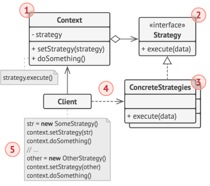
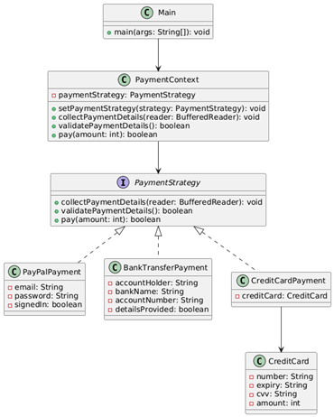

# Patrones de comportamiento

Los patrones de comportamiento se enfocan en `cómo interactúan los objetos entre sí`, es decir, la manera en que se
comunican, delegan responsabilidades o coordinan acciones.

Estos patrones buscan:

- `Separar responsabilidades` claramente.
- Facilitar la extensión o `variación de comportamiento` sin modificar las clases existentes.
- Promover el principio de `abierto/cerrado` (`OCP del SOLID`).

📌 Ejemplos clásicos: `Strategy`, `Template Method`, `Observer`, `Command`, `Chain of Responsibility`, etc.

---

## Strategy

El `patrón Strategy` define una `familia de algoritmos` o `comportamientos`, los encapsula por separado y permite
`intercambiarlos dinámicamente` sin modificar el código del cliente que los utiliza. El objeto que usa el algoritmo no
necesita conocer los detalles de implementación, solo delega la tarea a la estrategia seleccionada.

- Permite que `el comportamiento de una clase cambie en tiempo de ejecución`, delegándolo a una interfaz común que
  agrupa distintas estrategias concretas.
- `Favorece` el principio de `abierto/cerrado` y `la composición` sobre la herencia.
- Su objetivo es separar el qué se hace del cómo se hace, dando flexibilidad.

### 🧩 Casos de uso reales del patrón Strategy

Este patrón es extremadamente común. Algunos casos en el mundo real:

#### 🔧 En aplicaciones Java/Spring:

- Algoritmos de validación de datos (validar distintos tipos de documentos, estrategias de pago, etc.).
- Diferentes formas de envío (email, SMS, push).
- Selección de lógica según el tipo de usuario, tipo de archivo, estado del negocio, etc.
- Estrategias de serialización (JSON, XML, YAML).
- Estrategias de cálculo de precios, descuentos, impuestos.

#### 📦 Ejemplos en librerías/frameworks:

- Spring Security utiliza Strategy para múltiples mecanismos de autenticación.
- Spring usa ConversionService para conversión de tipos basada en estrategias.
- Comparator de Java es una forma simplificada de Strategy.

### 📐 Representación UML del patrón Strategy



1. La clase `contexto` mantiene una referencia a una de las estrategias concretas y se comunica con este objeto
   únicamente a través de la `interfaz estrategia`.
2. La `interfaz estrategia` es común a todas las estrategias concretas. Declara un método que la clase contexto utiliza
   para ejecutar una estrategia.
3. Las `estrategias concretas` implementan distintas variaciones de un algoritmo que la clase contexto utiliza.
4. La `clase contexto` invoca el método de ejecución en el objeto de estrategia vinculado cada vez que necesita ejecutar
   el algoritmo. La `clase contexto` no sabe con qué tipo de estrategia funciona o cómo se ejecuta el algoritmo. La
   `clase contexto` expone un modificador `set()` que permite a los clientes sustituir la estrategia asociada al
   contexto durante el tiempo de ejecución.
5. El `cliente` crea un objeto de estrategia específico y lo pasa a la clase contexto.

### 🎯 Ejemplo 01: Estrategias de pago

`Contexto realista`: Supongamos que queremos aplicar diferentes estrategias de pago: `tarjeta de crédito`, `PayPal` y
`transferencia bancaria`.

Entonces, la implementación de nuestro patrón `Strategy` estará basado en el siguiente diagrama de clases.



### `PaymentStrategy – Interfaz de Estrategia`

Esta interfaz define el contrato común para todas las estrategias de pago. Cada clase que implemente esta interfaz
representará una forma distinta de procesar pagos, encapsulando su propia lógica de autenticación, validación y
ejecución del pago.

**Rol en el patrón Strategy**

En el patrón `Strategy`, esta interfaz representa el `Strategy` (la estrategia en sí misma). Define el conjunto de
operaciones intercambiables que el contexto podrá utilizar dinámicamente sin conocer los detalles internos de cada
implementación concreta.

**Métodos definidos**

- `collectPaymentDetails`
    - Recoge los datos necesarios del usuario según el tipo de pago.
    - Se pasa un BufferedReader externo para mantener un solo recurso compartido desde el cliente (buen manejo de
      recursos).
- `validatePaymentDetails`
    - Valida los datos ingresados.
    - Permite que el flujo de pago continúe solo si se ingresaron datos válidos (por ejemplo, autenticación exitosa,
      campos no vacíos, etc.).
- `pay`
    - Ejecuta el pago según la estrategia seleccionada.
    - Devuelve true si el pago fue exitoso, false en caso contrario.

````java
public interface PaymentStrategy {
    void collectPaymentDetails(BufferedReader reader);

    boolean validatePaymentDetails();

    boolean pay(int amount);
}
````

✅ **Buenas prácticas aplicadas**

- `Principio de Abierto/Cerrado (OCP)`: Podemos agregar nuevas estrategias (como `BitcoinPayment`, `ApplePay`, etc.)
  sin modificar el código existente.
- `Principio de Responsabilidad Única (SRP)`: Cada implementación concreta se encarga únicamente de su lógica de pago.
- `Desacoplamiento`: El cliente y el contexto no necesitan conocer los detalles específicos de cada forma de pago.

### `BankTransferPayment – Estrategia concreta`

Esta clase es una implementación concreta de la interfaz `PaymentStrategy`. Representa la lógica necesaria para realizar
un pago mediante transferencia bancaria, solicitando datos básicos como titular de cuenta, banco y número de cuenta.

**Rol en el patrón Strategy**

En el patrón `Strategy`, esta clase actúa como una `Concrete Strategy`. Define una forma específica de realizar un pago
siguiendo el contrato común de la interfaz `PaymentStrategy`. Puede ser intercambiada fácilmente con otras estrategias
sin que el cliente o el contexto deban conocer su implementación interna.

**Responsabilidades principales**

- Recoger los datos necesarios para realizar una transferencia bancaria.
- Validar que los datos ingresados no estén vacíos.
- Procesar el pago si la validación fue exitosa.

````java

@Slf4j
public class BankTransferPayment implements PaymentStrategy {

    private String accountHolder;
    private String bankName;
    private String accountNumber;
    private boolean detailsProvided;

    @Override
    public void collectPaymentDetails(BufferedReader reader) {
        log.info("=== Pago por Transferencia Bancaria ===");
        try {
            this.accountHolder = this.prompt(reader, "Ingrese nombre del titular de la cuenta:");
            this.bankName = this.prompt(reader, "Ingrese nombre del banco:");
            this.accountNumber = this.prompt(reader, "Ingrese número de cuenta:");
        } catch (IOException exception) {
            log.error("Error al leer datos bancarios: {}", exception.getMessage());
        }
    }

    @Override
    public boolean validatePaymentDetails() {
        this.detailsProvided = this.isValid();
        if (this.detailsProvided) {
            log.info("Detalles bancarios registrados correctamente");
        } else {
            log.error("Faltan datos para procesar la transferencia");
        }
        return this.detailsProvided;
    }

    @Override
    public boolean pay(int paymentAmount) {
        if (this.detailsProvided) {
            log.info("Pagando S/ {} por transferencia bancaria a nombre de {} en {}.", paymentAmount, this.accountHolder, this.bankName);
            return true;
        }
        log.warn("No se proporcionaron los datos necesarios para realizar la transferencia");
        return false;
    }

    private boolean isValid() {
        return !accountHolder.isBlank() &&
               !bankName.isBlank() &&
               !accountNumber.isBlank();
    }

    private String prompt(BufferedReader reader, String message) throws IOException {
        log.info(message);
        return reader.readLine().trim();
    }
}
````

🧩 **Otras estrategias similares**

También se han implementado otras dos estrategias (PayPalPayment y CreditCardPayment), las cuales siguen exactamente el
mismo contrato `PaymentStrategy`, pero adaptan su lógica interna según los requisitos de su tipo de pago (por ejemplo,
validación con email/contraseña en PayPal o datos de tarjeta en CreditCard).

### `PayPalPayment – Estrategia concreta`

````java

@Slf4j
public class PayPalPayment implements PaymentStrategy {

    private static final Map<String, String> DATA_BASE = new HashMap<>();

    private String email;
    private String password;
    private boolean signedIn;

    static {
        DATA_BASE.put("martin@gmail.com", "martin");
        DATA_BASE.put("milagros@gmail.com", "123456");
    }

    @Override
    public void collectPaymentDetails(BufferedReader reader) {
        log.info("=== Autenticación PayPal ===");
        try {
            this.email = this.prompt(reader, "Ingrese su email de usuario:");
            this.password = this.prompt(reader, "Ingrese su contraseña:");
        } catch (IOException exception) {
            log.error("Error al leer entrada del usuario: {}", exception.getMessage());
        }
    }

    @Override
    public boolean validatePaymentDetails() {
        this.signedIn = Objects.equals(this.password, DATA_BASE.get(email));

        if (this.signedIn) {
            log.info("Inicio de sesión exitoso");
        } else {
            log.error("Email o password incorrectos");
        }
        return this.signedIn;
    }

    @Override
    public boolean pay(int paymentAmount) {
        if (this.signedIn) {
            log.info("Pagando S/ {} con PayPal (usuario: {})", paymentAmount, this.email);
            return true;
        }
        log.warn("El usuario no ha iniciado sesión correctamente. No se puede realizar el pago");
        return false;
    }

    private String prompt(BufferedReader reader, String message) throws IOException {
        log.info(message);
        return reader.readLine().trim();
    }
}
````

### `CreditCardPayment – Estrategia concreta`

````java

@ToString
public class CreditCard {
    @Getter
    private final String number;
    @Getter
    private final String expiry;
    @Getter
    private final String cvv;
    @Getter
    @Setter
    private int amount = 100_000; //Simula saldo de la tarjeta

    public CreditCard(String number, String expiry, String cvv) {
        this.number = number;
        this.expiry = expiry;
        this.cvv = cvv;
    }

}
````

````java

@Slf4j
public class CreditCardPayment implements PaymentStrategy {

    private CreditCard creditCard;

    @Override
    public void collectPaymentDetails(BufferedReader reader) {
        log.info("=== Ingreso de datos de tarjeta de crédito ===");
        try {
            String number = this.prompt(reader, "Ingrese número de tarjeta:");
            String expiry = this.prompt(reader, "Ingrese fecha de expiración (mm/yy):");
            String cvv = this.prompt(reader, "Ingrese código cvv:");
            this.creditCard = new CreditCard(number, expiry, cvv);
        } catch (IOException exception) {
            log.error("Error al leer datos de la tarjeta: {}", exception.getMessage());
        }
    }

    @Override
    public boolean validatePaymentDetails() {
        log.info("Validando tarjeta...");
        if (this.validateCard(this.creditCard)) {
            log.info("Tarjeta válida: {}", creditCard);
            return true;
        }

        log.error("Datos de tarjeta inválidos");
        this.creditCard = null;
        return false;
    }

    @Override
    public boolean pay(int paymentAmount) {
        if (!this.cardIsPresent()) {
            log.warn("No hay tarjeta registrada. No se puede procesar el pago");
            return false;
        }

        if (this.creditCard.getAmount() < paymentAmount) {
            log.warn("Fondos insuficientes en la tarjeta. Monto disponible: S/ {}", this.creditCard.getAmount());
            return false;
        }

        this.creditCard.setAmount(this.creditCard.getAmount() - paymentAmount);
        log.info("Pagando S/ {} con tarjeta de crédito (Saldo restante: S/ {})", paymentAmount, this.creditCard.getAmount());
        return true;

    }

    private boolean validateCard(CreditCard card) {
        return !card.getNumber().isBlank() &&
               !card.getExpiry().isBlank() &&
               !card.getCvv().isBlank();
    }

    private boolean cardIsPresent() {
        return Objects.nonNull(this.creditCard);
    }

    private String prompt(BufferedReader reader, String message) throws IOException {
        log.info(message);
        return reader.readLine().trim();
    }
}
````

### `PaymentContext – Contexto del patrón Strategy`

Esta clase representa el `Contexto` en el patrón `Strategy`. Su principal función es mantener una referencia a una
estrategia concreta de pago (`PaymentStrategy`) y delegar en ella la ejecución de las operaciones correspondientes.

````java

@Slf4j
public class PaymentContext {

    private PaymentStrategy paymentStrategy;

    public void setPaymentStrategy(PaymentStrategy paymentStrategy) {
        this.paymentStrategy = paymentStrategy;
    }

    public void collectPaymentDetails(BufferedReader reader) {
        this.validateStrategy();
        this.paymentStrategy.collectPaymentDetails(reader);
    }

    public boolean validatePaymentDetails() {
        this.validateStrategy();
        return this.paymentStrategy.validatePaymentDetails();
    }

    public boolean pay(int amount) {
        this.validateStrategy();
        return this.paymentStrategy.pay(amount);
    }

    private void validateStrategy() {
        if (Objects.isNull(this.paymentStrategy)) {
            throw new IllegalStateException("No se ha definido una estrategia de pago");
        }
    }
}
````

**Rol en el patrón Strategy**

- Actúa como Contexto, que es responsable de usar una estrategia (`PaymentStrategy`) definida dinámicamente en tiempo
  de ejecución.
- No conoce los detalles de implementación de cada estrategia, sólo interactúa a través de la interfaz común.
- Encapsula la variación del algoritmo delegando el comportamiento a una instancia concreta de la estrategia.

**Responsabilidades**

- Recibir la estrategia a utilizar (`setPaymentStrategy(...)`).
- Delegar la ejecución de los métodos `collectPaymentDetails()`, `validatePaymentDetails()` y `pay()` a la estrategia
  asignada.
- Validar que una estrategia haya sido definida antes de delegar cualquier operación.

**Beneficios**

- Cumple con el principio de `abierto/cerrado (OCP)`: se pueden agregar nuevas estrategias sin modificar esta clase.
- Sigue el principio de `inversión de dependencias (DIP)`: el contexto depende de una abstracción (`PaymentStrategy`),
  no de implementaciones concretas.

**Consideraciones**

- El contexto no necesita saber cuál es la lógica de cada estrategia concreta. Puede operar de forma genérica gracias a
  la interfaz.
- Si en un futuro se agregan validaciones adicionales (como logging o auditoría), podrían centralizarse también aquí,
  manteniendo la estrategia limpia.

### `🧑‍💻 Cliente: Main`

Este `cliente (Main`) es el punto de entrada de la aplicación y cumple el rol de coordinador que configura el contexto
del `patrón Strategy`.

Responsabilidades clave:

- ✅ Solicita al usuario que elija el método de pago (PayPal, transferencia o tarjeta).
- ✅ Crea la estrategia concreta correspondiente (PaymentStrategy) y la inyecta al contexto (PaymentContext).
- ✅ Coordina la recolección de datos del usuario, con hasta 3 intentos para validarlos.
- ✅ Solicita el monto a pagar.
- ✅ Ejecuta el método pay de la estrategia activa, a través del contexto.

El cliente no necesita conocer los detalles de implementación de cada tipo de pago. Simplemente, selecciona una
estrategia en tiempo de ejecución y el `PaymentContext` se encarga de delegar las operaciones de manera polimórfica.

````java

@Slf4j
public class Main {
    public static void main(String[] args) throws IOException {
        try (BufferedReader reader = new BufferedReader(new InputStreamReader(System.in))) {
            PaymentContext context = new PaymentContext();

            log.info("=== Sistema de Pagos ===");
            log.info("Elija el método de pago:");
            log.info("1. PayPal");
            log.info("2. Transferencia Bancaria");
            log.info("3. Tarjeta de Crédito");

            String option = reader.readLine().trim();
            switch (option) {
                case "1" -> context.setPaymentStrategy(new PayPalPayment());
                case "2" -> context.setPaymentStrategy(new BankTransferPayment());
                case "3" -> context.setPaymentStrategy(new CreditCardPayment());
                default -> {
                    log.warn("Opción inválida");
                    return;
                }
            }

            final int maxAttempts = 3;
            boolean isValid = false;

            for (int attempts = 1; attempts <= maxAttempts; attempts++) {
                log.info("Intento {}/{}", attempts, maxAttempts);
                context.collectPaymentDetails(reader);

                if (context.validatePaymentDetails()) {
                    isValid = true;
                    break;
                }
            }

            if (!isValid) {
                log.warn("Se consumieron todos los intentos. Inténtelo más tarde.");
                return;
            }

            log.info("Ingrese el monto a pagar:");
            int amount = Integer.parseInt(reader.readLine().trim());

            if (context.pay(amount)) {
                log.info("Pago realizado con éxito");
            } else {
                log.info("El pago no se pudo procesar");
            }
        }
    }
}
````

---

## Template Method

El patrón `Template Method` es un patrón de comportamiento que define la `estructura de un algoritmo` en una
clase base, delegando la `implementación de algunos pasos` a las subclases. Es ideal cuando tienes una lógica que
sigue siempre un mismo flujo general, pero `algunos pasos deben ser personalizados`.

### 🧩 Características clave

- Utiliza una clase abstracta con un método `“plantilla”` (`templateMethod()`), que define los pasos del algoritmo.
- Algunos pasos son implementados directamente en la clase base, mientras que otros se declaran como métodos abstractos
  para que las subclases los definan.
- Fomenta el principio de Hollywood: "Don’t call us, we’ll call you" — es decir, la clase base controla el flujo general

### 🔧 ¿Cuándo usar el patrón Template Method?

Usa este patrón cuando:

- Tienes múltiples clases que comparten una secuencia de pasos, pero cada una implementa los pasos de forma diferente.
- Deseas evitar duplicación de código al mantener la lógica común en una clase base.
- Quieres estandarizar un proceso, pero necesitas que ciertas partes sean personalizables.

### 📌 Ejemplos de la vida real

- `Proceso de carga de archivos`:
    - *Validar archivo → Leer contenido → Procesar datos → Guardar resultado*. Cada tipo de archivo (CSV, XML, JSON)
      implementa su propia lógica de lectura y procesamiento.


- `Juego`:
    - *Inicializar juego → Jugar turno → Mostrar resultados*. Cada juego tiene sus propias reglas, pero la estructura
      general del flujo es la misma.


- `Conexión a una base de datos`:
    - *Abrir conexión → Ejecutar operación → Cerrar conexión*. El paso de `“ejecutar operación”` puede variar (insertar,
      actualizar, consultar).

### ✅ Ventajas

- Reutilización de código: lógica común centralizada.
- Fomenta el principio "Open/Closed": el algoritmo base está cerrado a modificaciones, pero abierto a extensiones.
- Mejora la legibilidad y mantenibilidad.

### ❌ Desventajas

- Aumenta el acoplamiento entre la clase base y las subclases.
- Puede haber rigidez si se necesitan muchos pasos personalizados.

### 📐 Representación UML del patrón Template Method


1. La `Clase Abstracta` declara métodos que actúan como pasos de un algoritmo, así como el propio método de plantilla
   que invoca estos métodos en un orden específico. Los pasos pueden declararse `abstractos` o contar con una
   implementación por defecto.
2. Las `Clases Concretas` pueden sobreescribir todos los pasos, pero no el propio método plantilla.
