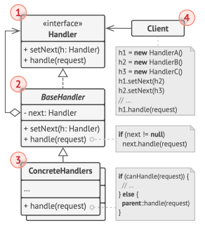

# Patrones de comportamiento

Los patrones de comportamiento se enfocan en `cómo interactúan los objetos entre sí`, es decir, la manera en que se
comunican, delegan responsabilidades o coordinan acciones.

Estos patrones buscan:

- `Separar responsabilidades` claramente.
- Facilitar la extensión o `variación de comportamiento` sin modificar las clases existentes.
- Promover el principio de `abierto/cerrado` (`OCP del SOLID`).

📌 Ejemplos clásicos: `Strategy`, `Template Method`, `Observer`, `Command`, `Chain of Responsibility`, etc.

---

## Strategy

El `patrón Strategy` define una `familia de algoritmos` o `comportamientos`, los encapsula por separado y permite
`intercambiarlos dinámicamente` sin modificar el código del cliente que los utiliza. El objeto que usa el algoritmo no
necesita conocer los detalles de implementación, solo delega la tarea a la estrategia seleccionada.

- Permite que `el comportamiento de una clase cambie en tiempo de ejecución`, delegándolo a una interfaz común que
  agrupa distintas estrategias concretas.
- `Favorece` el principio de `abierto/cerrado` y `la composición` sobre la herencia.
- Su objetivo es separar el qué se hace del cómo se hace, dando flexibilidad.

### 🧩 Casos de uso reales del patrón Strategy

Este patrón es extremadamente común. Algunos casos en el mundo real:

#### 🔧 En aplicaciones Java/Spring:

- Algoritmos de validación de datos (validar distintos tipos de documentos, estrategias de pago, etc.).
- Diferentes formas de envío (email, SMS, push).
- Selección de lógica según el tipo de usuario, tipo de archivo, estado del negocio, etc.
- Estrategias de serialización (JSON, XML, YAML).
- Estrategias de cálculo de precios, descuentos, impuestos.

#### 📦 Ejemplos en librerías/frameworks:

- Spring Security utiliza Strategy para múltiples mecanismos de autenticación.
- Spring usa ConversionService para conversión de tipos basada en estrategias.
- Comparator de Java es una forma simplificada de Strategy.

### 📐 Representación UML del patrón Strategy


1. La clase `contexto` mantiene una referencia a una de las estrategias concretas y se comunica con este objeto
   únicamente a través de la `interfaz estrategia`.
2. La `interfaz estrategia` es común a todas las estrategias concretas. Declara un método que la clase contexto utiliza
   para ejecutar una estrategia.
3. Las `estrategias concretas` implementan distintas variaciones de un algoritmo que la clase contexto utiliza.
4. La `clase contexto` invoca el método de ejecución en el objeto de estrategia vinculado cada vez que necesita ejecutar
   el algoritmo. La `clase contexto` no sabe con qué tipo de estrategia funciona o cómo se ejecuta el algoritmo. La
   `clase contexto` expone un modificador `set()` que permite a los clientes sustituir la estrategia asociada al
   contexto durante el tiempo de ejecución.
5. El `cliente` crea un objeto de estrategia específico y lo pasa a la clase contexto.

### 🎯 Ejemplo 01: Estrategias de pago

`Contexto realista`: Supongamos que queremos aplicar diferentes estrategias de pago: `tarjeta de crédito`, `PayPal` y
`transferencia bancaria`.

Entonces, la implementación de nuestro patrón `Strategy` estará basado en el siguiente diagrama de clases.


### `PaymentStrategy – Interfaz de Estrategia`

Esta interfaz define el contrato común para todas las estrategias de pago. Cada clase que implemente esta interfaz
representará una forma distinta de procesar pagos, encapsulando su propia lógica de autenticación, validación y
ejecución del pago.

**Rol en el patrón Strategy**

En el patrón `Strategy`, esta interfaz representa el `Strategy` (la estrategia en sí misma). Define el conjunto de
operaciones intercambiables que el contexto podrá utilizar dinámicamente sin conocer los detalles internos de cada
implementación concreta.

**Métodos definidos**

- `collectPaymentDetails`
    - Recoge los datos necesarios del usuario según el tipo de pago.
    - Se pasa un BufferedReader externo para mantener un solo recurso compartido desde el cliente (buen manejo de
      recursos).
- `validatePaymentDetails`
    - Valida los datos ingresados.
    - Permite que el flujo de pago continúe solo si se ingresaron datos válidos (por ejemplo, autenticación exitosa,
      campos no vacíos, etc.).
- `pay`
    - Ejecuta el pago según la estrategia seleccionada.
    - Devuelve true si el pago fue exitoso, false en caso contrario.

````java
public interface PaymentStrategy {
    void collectPaymentDetails(BufferedReader reader);

    boolean validatePaymentDetails();

    boolean pay(int amount);
}
````

✅ **Buenas prácticas aplicadas**

- `Principio de Abierto/Cerrado (OCP)`: Podemos agregar nuevas estrategias (como `BitcoinPayment`, `ApplePay`, etc.)
  sin modificar el código existente.
- `Principio de Responsabilidad Única (SRP)`: Cada implementación concreta se encarga únicamente de su lógica de pago.
- `Desacoplamiento`: El cliente y el contexto no necesitan conocer los detalles específicos de cada forma de pago.

### `BankTransferPayment – Estrategia concreta`

Esta clase es una implementación concreta de la interfaz `PaymentStrategy`. Representa la lógica necesaria para realizar
un pago mediante transferencia bancaria, solicitando datos básicos como titular de cuenta, banco y número de cuenta.

**Rol en el patrón Strategy**

En el patrón `Strategy`, esta clase actúa como una `Concrete Strategy`. Define una forma específica de realizar un pago
siguiendo el contrato común de la interfaz `PaymentStrategy`. Puede ser intercambiada fácilmente con otras estrategias
sin que el cliente o el contexto deban conocer su implementación interna.

**Responsabilidades principales**

- Recoger los datos necesarios para realizar una transferencia bancaria.
- Validar que los datos ingresados no estén vacíos.
- Procesar el pago si la validación fue exitosa.

````java

@Slf4j
public class BankTransferPayment implements PaymentStrategy {

    private String accountHolder;
    private String bankName;
    private String accountNumber;
    private boolean detailsProvided;

    @Override
    public void collectPaymentDetails(BufferedReader reader) {
        log.info("=== Pago por Transferencia Bancaria ===");
        try {
            this.accountHolder = this.prompt(reader, "Ingrese nombre del titular de la cuenta:");
            this.bankName = this.prompt(reader, "Ingrese nombre del banco:");
            this.accountNumber = this.prompt(reader, "Ingrese número de cuenta:");
        } catch (IOException exception) {
            log.error("Error al leer datos bancarios: {}", exception.getMessage());
        }
    }

    @Override
    public boolean validatePaymentDetails() {
        this.detailsProvided = this.isValid();
        if (this.detailsProvided) {
            log.info("Detalles bancarios registrados correctamente");
        } else {
            log.error("Faltan datos para procesar la transferencia");
        }
        return this.detailsProvided;
    }

    @Override
    public boolean pay(int paymentAmount) {
        if (this.detailsProvided) {
            log.info("Pagando S/ {} por transferencia bancaria a nombre de {} en {}.", paymentAmount, this.accountHolder, this.bankName);
            return true;
        }
        log.warn("No se proporcionaron los datos necesarios para realizar la transferencia");
        return false;
    }

    private boolean isValid() {
        return !accountHolder.isBlank() &&
               !bankName.isBlank() &&
               !accountNumber.isBlank();
    }

    private String prompt(BufferedReader reader, String message) throws IOException {
        log.info(message);
        return reader.readLine().trim();
    }
}
````

🧩 **Otras estrategias similares**

También se han implementado otras dos estrategias (PayPalPayment y CreditCardPayment), las cuales siguen exactamente el
mismo contrato `PaymentStrategy`, pero adaptan su lógica interna según los requisitos de su tipo de pago (por ejemplo,
validación con email/contraseña en PayPal o datos de tarjeta en CreditCard).

### `PayPalPayment – Estrategia concreta`

````java

@Slf4j
public class PayPalPayment implements PaymentStrategy {

    private static final Map<String, String> DATA_BASE = new HashMap<>();

    private String email;
    private String password;
    private boolean signedIn;

    static {
        DATA_BASE.put("martin@gmail.com", "martin");
        DATA_BASE.put("milagros@gmail.com", "123456");
    }

    @Override
    public void collectPaymentDetails(BufferedReader reader) {
        log.info("=== Autenticación PayPal ===");
        try {
            this.email = this.prompt(reader, "Ingrese su email de usuario:");
            this.password = this.prompt(reader, "Ingrese su contraseña:");
        } catch (IOException exception) {
            log.error("Error al leer entrada del usuario: {}", exception.getMessage());
        }
    }

    @Override
    public boolean validatePaymentDetails() {
        this.signedIn = Objects.equals(this.password, DATA_BASE.get(email));

        if (this.signedIn) {
            log.info("Inicio de sesión exitoso");
        } else {
            log.error("Email o password incorrectos");
        }
        return this.signedIn;
    }

    @Override
    public boolean pay(int paymentAmount) {
        if (this.signedIn) {
            log.info("Pagando S/ {} con PayPal (usuario: {})", paymentAmount, this.email);
            return true;
        }
        log.warn("El usuario no ha iniciado sesión correctamente. No se puede realizar el pago");
        return false;
    }

    private String prompt(BufferedReader reader, String message) throws IOException {
        log.info(message);
        return reader.readLine().trim();
    }
}
````

### `CreditCardPayment – Estrategia concreta`

````java

@ToString
public class CreditCard {
    @Getter
    private final String number;
    @Getter
    private final String expiry;
    @Getter
    private final String cvv;
    @Getter
    @Setter
    private int amount = 100_000; //Simula saldo de la tarjeta

    public CreditCard(String number, String expiry, String cvv) {
        this.number = number;
        this.expiry = expiry;
        this.cvv = cvv;
    }

}
````

````java

@Slf4j
public class CreditCardPayment implements PaymentStrategy {

    private CreditCard creditCard;

    @Override
    public void collectPaymentDetails(BufferedReader reader) {
        log.info("=== Ingreso de datos de tarjeta de crédito ===");
        try {
            String number = this.prompt(reader, "Ingrese número de tarjeta:");
            String expiry = this.prompt(reader, "Ingrese fecha de expiración (mm/yy):");
            String cvv = this.prompt(reader, "Ingrese código cvv:");
            this.creditCard = new CreditCard(number, expiry, cvv);
        } catch (IOException exception) {
            log.error("Error al leer datos de la tarjeta: {}", exception.getMessage());
        }
    }

    @Override
    public boolean validatePaymentDetails() {
        log.info("Validando tarjeta...");
        if (this.validateCard(this.creditCard)) {
            log.info("Tarjeta válida: {}", creditCard);
            return true;
        }

        log.error("Datos de tarjeta inválidos");
        this.creditCard = null;
        return false;
    }

    @Override
    public boolean pay(int paymentAmount) {
        if (!this.cardIsPresent()) {
            log.warn("No hay tarjeta registrada. No se puede procesar el pago");
            return false;
        }

        if (this.creditCard.getAmount() < paymentAmount) {
            log.warn("Fondos insuficientes en la tarjeta. Monto disponible: S/ {}", this.creditCard.getAmount());
            return false;
        }

        this.creditCard.setAmount(this.creditCard.getAmount() - paymentAmount);
        log.info("Pagando S/ {} con tarjeta de crédito (Saldo restante: S/ {})", paymentAmount, this.creditCard.getAmount());
        return true;

    }

    private boolean validateCard(CreditCard card) {
        return !card.getNumber().isBlank() &&
               !card.getExpiry().isBlank() &&
               !card.getCvv().isBlank();
    }

    private boolean cardIsPresent() {
        return Objects.nonNull(this.creditCard);
    }

    private String prompt(BufferedReader reader, String message) throws IOException {
        log.info(message);
        return reader.readLine().trim();
    }
}
````

### `PaymentContext – Contexto del patrón Strategy`

Esta clase representa el `Contexto` en el patrón `Strategy`. Su principal función es mantener una referencia a una
estrategia concreta de pago (`PaymentStrategy`) y delegar en ella la ejecución de las operaciones correspondientes.

````java

@Slf4j
public class PaymentContext {

    private PaymentStrategy paymentStrategy;

    public void setPaymentStrategy(PaymentStrategy paymentStrategy) {
        this.paymentStrategy = paymentStrategy;
    }

    public void collectPaymentDetails(BufferedReader reader) {
        this.validateStrategy();
        this.paymentStrategy.collectPaymentDetails(reader);
    }

    public boolean validatePaymentDetails() {
        this.validateStrategy();
        return this.paymentStrategy.validatePaymentDetails();
    }

    public boolean pay(int amount) {
        this.validateStrategy();
        return this.paymentStrategy.pay(amount);
    }

    private void validateStrategy() {
        if (Objects.isNull(this.paymentStrategy)) {
            throw new IllegalStateException("No se ha definido una estrategia de pago");
        }
    }
}
````

**Rol en el patrón Strategy**

- Actúa como Contexto, que es responsable de usar una estrategia (`PaymentStrategy`) definida dinámicamente en tiempo
  de ejecución.
- No conoce los detalles de implementación de cada estrategia, sólo interactúa a través de la interfaz común.
- Encapsula la variación del algoritmo delegando el comportamiento a una instancia concreta de la estrategia.

**Responsabilidades**

- Recibir la estrategia a utilizar (`setPaymentStrategy(...)`).
- Delegar la ejecución de los métodos `collectPaymentDetails()`, `validatePaymentDetails()` y `pay()` a la estrategia
  asignada.
- Validar que una estrategia haya sido definida antes de delegar cualquier operación.

**Beneficios**

- Cumple con el principio de `abierto/cerrado (OCP)`: se pueden agregar nuevas estrategias sin modificar esta clase.
- Sigue el principio de `inversión de dependencias (DIP)`: el contexto depende de una abstracción (`PaymentStrategy`),
  no de implementaciones concretas.

**Consideraciones**

- El contexto no necesita saber cuál es la lógica de cada estrategia concreta. Puede operar de forma genérica gracias a
  la interfaz.
- Si en un futuro se agregan validaciones adicionales (como logging o auditoría), podrían centralizarse también aquí,
  manteniendo la estrategia limpia.

### `🧑‍💻 Cliente: Main`

Este `cliente (Main`) es el punto de entrada de la aplicación y cumple el rol de coordinador que configura el contexto
del `patrón Strategy`.

Responsabilidades clave:

- ✅ Solicita al usuario que elija el método de pago (PayPal, transferencia o tarjeta).
- ✅ Crea la estrategia concreta correspondiente (PaymentStrategy) y la inyecta al contexto (PaymentContext).
- ✅ Coordina la recolección de datos del usuario, con hasta 3 intentos para validarlos.
- ✅ Solicita el monto a pagar.
- ✅ Ejecuta el método pay de la estrategia activa, a través del contexto.

El cliente no necesita conocer los detalles de implementación de cada tipo de pago. Simplemente, selecciona una
estrategia en tiempo de ejecución y el `PaymentContext` se encarga de delegar las operaciones de manera polimórfica.

````java

@Slf4j
public class Main {
    public static void main(String[] args) throws IOException {
        try (BufferedReader reader = new BufferedReader(new InputStreamReader(System.in))) {
            PaymentContext context = new PaymentContext();

            log.info("=== Sistema de Pagos ===");
            log.info("Elija el método de pago:");
            log.info("1. PayPal");
            log.info("2. Transferencia Bancaria");
            log.info("3. Tarjeta de Crédito");

            String option = reader.readLine().trim();
            switch (option) {
                case "1" -> context.setPaymentStrategy(new PayPalPayment());
                case "2" -> context.setPaymentStrategy(new BankTransferPayment());
                case "3" -> context.setPaymentStrategy(new CreditCardPayment());
                default -> {
                    log.warn("Opción inválida");
                    return;
                }
            }

            final int maxAttempts = 3;
            boolean isValid = false;

            for (int attempts = 1; attempts <= maxAttempts; attempts++) {
                log.info("Intento {}/{}", attempts, maxAttempts);
                context.collectPaymentDetails(reader);

                if (context.validatePaymentDetails()) {
                    isValid = true;
                    break;
                }
            }

            if (!isValid) {
                log.warn("Se consumieron todos los intentos. Inténtelo más tarde.");
                return;
            }

            log.info("Ingrese el monto a pagar:");
            int amount = Integer.parseInt(reader.readLine().trim());

            if (context.pay(amount)) {
                log.info("Pago realizado con éxito");
            } else {
                log.info("El pago no se pudo procesar");
            }
        }
    }
}
````

---

## Template Method

El patrón `Template Method` es un patrón de comportamiento que define la `estructura de un algoritmo` en una
clase base, delegando la `implementación de algunos pasos` a las subclases. Es ideal cuando tienes una lógica que
sigue siempre un mismo flujo general, pero `algunos pasos deben ser personalizados`.

### 🧩 Características clave

- Utiliza una clase abstracta con un método `“plantilla”` (`templateMethod()`), que define los pasos del algoritmo.
- Algunos pasos son implementados directamente en la clase base, mientras que otros se declaran como métodos abstractos
  para que las subclases los definan.
- Fomenta el principio de Hollywood: "Don’t call us, we’ll call you" — es decir, la clase base controla el flujo general

### 🔧 ¿Cuándo usar el patrón Template Method?

Usa este patrón cuando:

- Tienes múltiples clases que comparten una secuencia de pasos, pero cada una implementa los pasos de forma diferente.
- Deseas evitar duplicación de código al mantener la lógica común en una clase base.
- Quieres estandarizar un proceso, pero necesitas que ciertas partes sean personalizables.

### 📌 Ejemplos de la vida real

- `Proceso de carga de archivos`:
    - *Validar archivo → Leer contenido → Procesar datos → Guardar resultado*. Cada tipo de archivo (CSV, XML, JSON)
      implementa su propia lógica de lectura y procesamiento.


- `Juego`:
    - *Inicializar juego → Jugar turno → Mostrar resultados*. Cada juego tiene sus propias reglas, pero la estructura
      general del flujo es la misma.


- `Conexión a una base de datos`:
    - *Abrir conexión → Ejecutar operación → Cerrar conexión*. El paso de `“ejecutar operación”` puede variar (insertar,
      actualizar, consultar).

### ✅ Ventajas

- Reutilización de código: lógica común centralizada.
- Fomenta el principio "Open/Closed": el algoritmo base está cerrado a modificaciones, pero abierto a extensiones.
- Mejora la legibilidad y mantenibilidad.

### ❌ Desventajas

- Aumenta el acoplamiento entre la clase base y las subclases.
- Puede haber rigidez si se necesitan muchos pasos personalizados.

### 📐 Representación UML del patrón Template Method


1. La `Clase Abstracta` declara métodos que actúan como pasos de un algoritmo.
    - Define el método plantilla (`templateMethod`) que contiene el flujo general del algoritmo.
    - Puede incluir métodos:
        - `abstractos` (obligan a la subclase a implementar).
        - `concretos` (implementados en la clase abstracta).
        - `hooks` (métodos opcionales que las subclases pueden sobreescribir si lo desean).
2. Las `Clases Concretas`:
    - Implementan los pasos abstractos definidos por la clase abstracta.
    - Pueden redefinir métodos hook si necesitan cambiar parte del comportamiento.

### Sobre los Hooks

Los `hooks` son efectivamente métodos concretos, pero tienen una característica especial:
`están diseñados específicamente para ser sobrescritos opcionalmente`.
La diferencia clave es la `intención y el diseño`:

- `Métodos concretos normales`
    - Implementan lógica de negocio real
    - No están pensados para ser sobrescritos
    - Si los sobrescribes, pierdes funcionalidad importante

- `Hooks`
    - Tienen implementación vacía o muy básica por defecto
    - Su propósito es ser "puntos de extensión opcionales"
    - Permiten a las subclases "engancharse" en momentos específicos del algoritmo

`Ejemplo práctico`. Los hooks te dan flexibilidad sin forzar a todas las subclases a implementarlos.

````java
public abstract class DataProcessor {

    // Template method
    public final void processData() {
        loadData();
        beforeValidation(); // <- HOOK
        validateData();
        afterValidation();  // <- HOOK
        logProcessingResult(); // <- MÉTODO CONCRETO NORMAL
        saveData();
    }

    // Métodos abstractos (obligatorios)
    protected abstract void loadData();

    protected abstract void validateData();

    protected abstract void saveData();

    // MÉTODOS CONCRETOS NORMALES (no pensados para sobrescribir)
    protected void logProcessingResult() {
        System.out.println("Processing completed at: " + new Date());
    }

    protected boolean isDataValid() {
        // Lógica común de validación básica
        return true;
    }

    // HOOKS (opcionales - implementación vacía/básica por defecto)
    protected void beforeValidation() {
        // Implementación vacía - punto de extensión opcional
    }

    protected void afterValidation() {
        // Implementación vacía - punto de extensión opcional
    }
}
````

En resumen, los métodos:

- `Abstractos`: deben implementarse.
- `Concretos normales`: lógica común, no pensados para sobrescribir.
- `Hooks`: puntos de extensión opcionales.

### 🎯 Ejemplo 01: Sistema de Procesamiento de Archivos Empresarial

📌`Contexto empresarial`

En entornos corporativos, es habitual recibir archivos de entrada con información estructurada para ser procesada e
integrada en sistemas internos. Estos archivos pueden variar ampliamente en cuanto a formato y estructura (por ejemplo,
.txt, .csv, .xml), pero comparten una secuencia de pasos común para su procesamiento:

### 🛠️ Flujo típico de procesamiento

1. `Carga del archivo` desde una fuente (sistema local, red, FTP, etc.).
2. `Validación` del archivo: verificar estructura, encabezados, formato de columnas, etc.
3. `Lectura` del contenido (línea por línea, por nodo, etc.).
4. `Conversión` a estructuras de datos manejables dentro del sistema.
5. `Persistencia` o simulación del guardado en una base de datos.
6. `Notificación` del resultado (éxito, errores, estadísticas).

A pesar de la diversidad de formatos y reglas, el flujo general es invariable. Este escenario encaja perfectamente con
el patrón `Template Method`, ya que:

> 🔁 Permite definir un algoritmo esquelético común en una clase abstracta y delegar en las subclases los pasos
> específicos que pueden variar según el tipo de archivo.

Entonces, la implementación de nuestro patrón `Template Method` estará basado en el siguiente diagrama de clases.


### 📦 Clases de apoyo

````java
public interface ParsedRecord {
}
````

- `Propósito`: interfaz de marcador para representar un registro procesado en memoria.
- `Uso`: cada tipo de archivo tendrá su propia clase que implemente esta interfaz (`TxtRecord`, `CsvRecord`, etc.).

````java
public record ProcessResult(String batchId,
                            boolean success,
                            String errorMessage,
                            int totalRecords,
                            int processedRecords,
                            int invalidRecords) {

    public static ProcessResult success(String batchId, int total, int processed, int invalid) {
        return new ProcessResult(batchId, true, null, total, processed, invalid);
    }

    public static ProcessResult failure(String batchId, String errorMessage) {
        return new ProcessResult(batchId, false, errorMessage, 0, 0, 0);
    }
}
````

- `Propósito`: encapsula el resultado del procesamiento de un lote de archivos.

````java
public record ValidationResult(boolean valid,
                               String errorMessage) {

    public static ValidationResult success() {
        return new ValidationResult(true, null);
    }

    public static ValidationResult failure(String errorMessage) {
        return new ValidationResult(false, errorMessage);
    }
}
````

- `Propósito`: representa el resultado de la validación estructural del archivo.
- `Permite`: distinguir entre archivos válidos e inválidos antes de iniciar el procesamiento detallado.

````java
public record BusinessValidationResult<T extends ParsedRecord>(List<T> validRecords,
                                                               int invalidCount) {
}
````

- `Propósito`: encapsula el resultado de la validación de reglas de negocio aplicadas a los registros.
- Incluye:
    - Registros válidos que se pueden procesar.
    - Conteo de registros inválidos por fallas en reglas internas (por ejemplo, campos obligatorios faltantes).

### 🧱 Clase Abstracta: `FileProcessor<T extends ParsedRecord>`

Esta clase define el algoritmo base para procesar archivos de distintos formatos, representando fielmente el patrón
`Template Method`.

### 🧩 Rol en el patrón Template Method

- `Clase abstracta base (Template)`: Define el esqueleto del algoritmo con un método `final`, `processFile(...)`, que
  orquesta el proceso completo. Se declara como `final` para preservar la integridad del algoritmo, evitando que las
  subclases alteren el flujo principal y asegurando un comportamiento consistente.
- `Subclases concretas`: Deberán implementar únicamente las partes variables (métodos abstractos), manteniendo intacto
  el flujo general.
- `Ventaja`: Evita duplicación de lógica común entre procesadores de archivos distintos, y facilita la extensión
  mediante herencia.

### 🔁 Método plantilla: `processFile(String filePath, String batchId)`

Este es el `template method`. Define la secuencia exacta de pasos a seguir para procesar cualquier archivo. Los pasos
son:

1. Obtener el archivo con `obtainFile(...)` (concreto y reutilizable).
2. Validar la estructura del archivo, mediante `validateFileStructure(...)` (abstracto).
3. Parsear el contenido, línea por línea o según el formato, con `parseFileContent(...)` (abstracto).
4. Aplicar validaciones de negocio a los registros parseados: `validateBusinessRules(...)` (abstracto).
5. Almacenar los registros válidos: `storeRecords(...)` (abstracto).
6. Generar un reporte final del procesamiento: `generateProcessingReport(...)` (concreto).

El método `processFile(...)` también maneja errores, logs y encapsula el resultado en un `ProcessResult`, cumpliendo así
un flujo robusto y controlado.

````java

@Slf4j
public abstract class FileProcessor<T extends ParsedRecord> {

    public final ProcessResult processFile(String filePath, String batchId) {
        try {
            log.info("=== Iniciando procesamiento de archivo ===");
            log.info("Archivo: {} - Batch ID: {}", filePath, batchId);

            // Paso 1: Obtener y validar archivo
            Optional<Path> optionalPath = this.obtainFile(filePath);
            if (optionalPath.isEmpty()) {
                return ProcessResult.failure(batchId, "Archivo no encontrado o inaccesible");
            }

            // Paso 2: Validar estructura del archivo
            Path path = optionalPath.get();
            ValidationResult validation = this.validateFileStructure(path);
            if (!validation.valid()) {
                return ProcessResult.failure(batchId, "Validación fallida: ".concat(validation.errorMessage()));
            }

            // Paso 3: Procesar el contenido línea por línea
            List<T> parsedRecords = this.parseFileContent(path);
            if (parsedRecords.isEmpty()) {
                return ProcessResult.failure(batchId, "El archivo está vacío o no contiene registros procesables");
            }
            int totalRecords = parsedRecords.size();

            // Paso 4: Validar datos de negocio
            BusinessValidationResult<T> businessValidationResult = this.validateBusinessRules(parsedRecords);
            List<T> validRecords = businessValidationResult.validRecords();
            int invalidCount = businessValidationResult.invalidCount();
            int processedRecords = 0;

            // Paso 5: Persistir en base de datos
            ProcessResult result;
            if (!validRecords.isEmpty()) {
                processedRecords = this.storeRecords(validRecords, batchId);
                result = ProcessResult.success(batchId, totalRecords, processedRecords, invalidCount);
            } else {
                result = ProcessResult.failure(batchId, "No se encontraron registros válidos para almacenar.");
            }

            // Paso 6: Generar notificación final
            this.generateProcessingReport(result, path);

            if (result.success()) {
                log.info("Procesamiento finalizado exitosamente. Registros procesados: {}", result.processedRecords());
            } else {
                log.warn("Procesamiento finalizado con errores. Motivo: {}", result.errorMessage());
            }
            return result;
        } catch (Exception e) {
            log.error("Error durante procesamiento: {}", e.getMessage(), e);
            return ProcessResult.failure(batchId, "Error técnico: " + e.getMessage());
        }
    }

    // ============== MÉTODOS CONCRETOS (comunes a todos los tipos) ==============
    protected Optional<Path> obtainFile(String filePath) {
        try {
            Path path = Path.of(filePath);

            if (Files.notExists(path) || !Files.isReadable(path)) {
                log.warn("El archivo no existe o no es legible: {}", filePath);
                return Optional.empty();
            }

            log.info("Archivo obtenido exitosamente. Tamaño: {} bytes", Files.size(path));
            return Optional.of(path);
        } catch (Exception e) {
            log.warn("Error obtenido en archivo: {}", e.getMessage());
            return Optional.empty();
        }
    }

    protected void generateProcessingReport(ProcessResult result, Path path) {
        DateTimeFormatter formatter = DateTimeFormatter.ofPattern("yyyy-MM-dd HH:mm:ss");
        String format = LocalDateTime.now().format(formatter);

        String fileName = path.getFileName().toString();
        int index = fileName.lastIndexOf(".");
        String extension = fileName.substring(index + 1).toUpperCase();

        String state;
        if (!result.success()) {
            state = "Error";
        } else if (result.invalidRecords() > 0) {
            state = "Exitoso con advertencias";
        } else {
            state = "Exitoso";
        }

        StringBuilder sb = new StringBuilder("=== REPORTE DE PROCESAMIENTO %s ===".formatted(extension));
        sb.append("\n");
        sb.append("Archivo: ").append(path.toAbsolutePath()).append("\n");
        sb.append("Batch Id: ").append(result.batchId()).append("\n");
        sb.append("Fecha/Hora: ").append(format).append("\n");
        sb.append("Total registros: ").append(result.totalRecords()).append("\n");
        sb.append("Registros procesados: ").append(result.processedRecords()).append("\n");
        sb.append("Registros inválidos: ").append(result.invalidRecords()).append("\n");
        sb.append("Estado: ").append(state);

        log.info("REPORTE {}:\n{}", extension, sb);
    }

    // ============== MÉTODOS ABSTRACTOS (específicos por tipo de archivo) ==============
    protected abstract ValidationResult validateFileStructure(Path path);

    protected abstract List<T> parseFileContent(Path path) throws IOException;

    protected abstract BusinessValidationResult<T> validateBusinessRules(List<T> parsedRecords);

    protected abstract int storeRecords(List<T> validRecords, String batchId) throws SQLException;
}
````

### 📌 Conclusión

La clase `FileProcessor<T>` aplica correctamente el patrón `Template Method` al:

- Establecer un flujo fijo de procesamiento de archivos.
- Permitir la personalización de pasos específicos mediante métodos abstractos.
- Reutilizar lógica común que no debe duplicarse en cada subclase.

Este diseño garantiza coherencia, extensibilidad y bajo acoplamiento entre las diferentes estrategias de procesamiento
de archivos.

### 🧪 Clase Concreta: `TxtDelimitedProcessor`

### 🧩 Rol en el patrón Template Method

- Esta clase representa una implementación concreta del algoritmo definido en la clase abstracta `FileProcessor<T>`.
- Hereda el flujo de procesamiento general definido por `processFile(...)` y especializa los pasos que dependen del
  formato TXT delimitado.
- Utiliza un DTO propio (`TxtRecord`) que implementa la interfaz común `ParsedRecord`.

````java
public record TxtRecord(String id,
                        String accountNumber,
                        double amount,
                        LocalDateTime transactionDate,
                        String description) implements ParsedRecord {
}
````

- Define la estructura de un registro TXT con 5 campos.
- Sirve como tipo genérico `T` para la clase base `FileProcessor<T>`.
- Los campos son representativos de una transacción financiera, lo cual contextualiza bien su uso empresarial.

### ⚙️ Especialización de pasos en `TxtDelimitedProcessor`

1. `validateFileStructure(Path path)`, este paso permite adaptar el procesamiento a diferentes configuraciones de TXT
   sin modificar el flujo principal.
2. `parseFileContent(Path path)`, este método transforma los datos crudos del archivo en registros estructurados que
   serán validados y persistidos.
3. `validateBusinessRules(List<TxtRecord>)`, este paso demuestra cómo las reglas pueden variar por tipo de archivo o
   dominio, pero seguir encajando en el flujo común.
4. `storeRecords(List<TxtRecord>, String batchId)`, aunque no se persiste en una base de datos real, este paso es útil
   para pruebas y demuestra cómo podría extenderse fácilmente.

````java

@Slf4j
@RequiredArgsConstructor
public class TxtDelimitedProcessor extends FileProcessor<TxtRecord> {

    private static final DateTimeFormatter DATE_TIME_FORMATTER = DateTimeFormatter.ofPattern("yyyy-MM-dd HH:mm:ss");

    private final String delimiter;
    private final boolean hasHeader;
    private final int expectedColumns;

    @Override
    protected ValidationResult validateFileStructure(Path path) {
        try (BufferedReader reader = new BufferedReader(Files.newBufferedReader(path))) {
            String firstLine = reader.readLine();

            if (Objects.isNull(firstLine) || firstLine.isBlank()) {
                return ValidationResult.failure("Archivo vacío");
            }

            // Si el archivo tiene encabezado, validamos que al menos tenga expectedColumns,
            // pero no validamos el contenido de datos aún.
            String[] columns = firstLine.split(Pattern.quote(this.delimiter));
            if (this.hasHeader) {
                if (columns.length < this.expectedColumns) {
                    return ValidationResult.failure("La cabecera debe tener al menos %d columnas separadas por '%s'"
                            .formatted(this.expectedColumns, this.delimiter));
                }
                log.info("Cabecera detectada. Columnas encontradas: {}", columns.length);
            } else {
                // Si no hay cabecera, consideramos que la primera línea ya es un registro
                if (columns.length != this.expectedColumns) {
                    return ValidationResult.failure("La primera línea debe tener exactamente %d columnas separadas por '%s'"
                            .formatted(this.expectedColumns, this.delimiter));
                }
                log.info("No se detectó cabecera. Validando estructura de la primera línea de datos: {} columnas", columns.length);
            }

            return ValidationResult.success();
        } catch (IOException e) {
            return ValidationResult.failure("Error al leer el archivo: %s".formatted(e.getMessage()));
        }
    }

    @Override
    protected List<TxtRecord> parseFileContent(Path path) throws IOException {
        List<TxtRecord> records = new ArrayList<>();

        try (BufferedReader reader = new BufferedReader(Files.newBufferedReader(path))) {
            int lineNumber = 0;

            if (this.hasHeader) {
                String headers = reader.readLine();
                log.info("headers: {}", headers);
                lineNumber++;
            }

            String line;
            while ((line = reader.readLine()) != null) {
                lineNumber++;

                if (line.trim().isEmpty()) {
                    log.warn("Línea {} vacía e ignorada", lineNumber);
                    continue;
                }

                try {
                    String[] fields = line.split(Pattern.quote(this.delimiter));
                    if (fields.length == this.expectedColumns) {
                        TxtRecord txtRecord = new TxtRecord(
                                "TXT_" + lineNumber,
                                fields[0].trim(),
                                Double.parseDouble(fields[1].trim()),
                                LocalDateTime.parse(fields[2].trim(), DATE_TIME_FORMATTER),
                                fields[3].trim()
                        );
                        records.add(txtRecord);
                    } else {
                        log.warn("Línea {} ignorada: se esperaban {} columnas pero se encontraron {}", lineNumber, expectedColumns, fields.length);
                    }
                } catch (Exception e) {
                    log.warn("Error procesando línea {}: {}", lineNumber, e.getMessage());
                }
            }
        }

        log.info("Parsing TXT completado: {} registros extraídos", records.size());
        return records;
    }

    @Override
    protected BusinessValidationResult<TxtRecord> validateBusinessRules(List<TxtRecord> parsedRecords) {
        List<TxtRecord> validRecords = parsedRecords.stream()
                .filter(txtRecord -> {
                    boolean isValid = true;

                    if (txtRecord.accountNumber() == null || txtRecord.accountNumber().isBlank()) {
                        log.warn("Registro inválido {}: accountNumber vacío", txtRecord.id());
                        isValid = false;
                    }

                    if (txtRecord.amount() <= 0) {
                        log.warn("Registro inválido {}: amount debe ser mayor que 0", txtRecord.id());
                        isValid = false;
                    }

                    return isValid;
                })
                .toList();
        int invalidCount = parsedRecords.size() - validRecords.size();
        return new BusinessValidationResult<>(validRecords, invalidCount);
    }

    @Override
    protected int storeRecords(List<TxtRecord> validRecords, String batchId) throws SQLException {
        validRecords.forEach(txtRecord -> {
            String sql = """
                        INSERT INTO transactions_txt (id, account_number, amount, transaction_date, description, batch_id)
                        VALUES ('%s', '%s', %.2f, '%s', '%s', '%s')
                    """.formatted(
                    txtRecord.id(),
                    txtRecord.accountNumber(),
                    txtRecord.amount(),
                    txtRecord.transactionDate(),
                    txtRecord.description(),
                    batchId
            );

            log.info("SQL simulada: {}", sql);
        });


        log.info("Se simularon {} inserciones en la tabla transactions_txt.", validRecords.size());
        return validRecords.size();
    }
}
````

### 🧠 Consideraciones clave

- Esta clase permite procesar archivos `.txt` con estructura delimitada sin modificar el algoritmo principal.
- Los parámetros de configuración (delimiter, hasHeader, expectedColumns) ofrecen flexibilidad sin sacrificar el orden
  del proceso.
- Gracias al patrón `Template Method`, podrías añadir nuevos formatos (como CSV, XML, JSON) simplemente creando nuevas
  subclases como esta.

### 🧪 Clase Concreta: `CsvDelimitedProcessor`

### 🧩 Rol en el patrón Template Method

- Esta clase representa otra implementación concreta de la plantilla `FileProcessor<T>`, especializada en archivos
  `.csv`.
- A diferencia del procesador TXT, aquí se asume que todos los CSV tienen cabecera, lo cual afecta principalmente la
  validación y el parseo.

````java
public record CsvRecord(String id,
                        String firstName,
                        String lastName,
                        String email,
                        LocalDate registrationDate) implements ParsedRecord {
}
````

🔎 Este DTO implementa la interfaz común `ParsedRecord`, asegurando compatibilidad con el algoritmo base en
`FileProcessor<T>`.

### 🛠️ Consideraciones

| Método a implementar         | Comportamiento esperado                                                        |
|------------------------------|--------------------------------------------------------------------------------|
| `validateFileStructure(...)` | Verificar que exista una cabecera con al menos 5 columnas separadas por comas. |
| `parseFileContent(...)`      | Leer el archivo omitiendo la cabecera y mapear cada línea a `CsvRecord`.       |
| `validateBusinessRules(...)` | Validar campos como: email no vacío, fecha válida, nombres no nulos.           |
| `storeRecords(...)`          | Simular la inserción en una tabla `users_csv`, generando SQL de prueba.        |

````java
//Asumimos que todos los .csv que vamos a procesar tienen cabecera

@Slf4j
@RequiredArgsConstructor
public class CsvDelimitedProcessor extends FileProcessor<CsvRecord> {

    private static final DateTimeFormatter DATE_TIME_FORMATTER = DateTimeFormatter.ofPattern("yyyy-MM-dd HH:mm:ss");
    private static final int EXPECTED_COLUMNS = 5;
    private static final String DELIMITER = ",";

    @Override
    protected ValidationResult validateFileStructure(Path path) {
        try (BufferedReader reader = new BufferedReader(Files.newBufferedReader(path))) {
            String firstLine = reader.readLine();

            if (Objects.isNull(firstLine) || firstLine.isBlank()) {
                return ValidationResult.failure("Archivo vacío");
            }

            String[] columns = firstLine.split(Pattern.quote(DELIMITER));
            if (columns.length != EXPECTED_COLUMNS) {
                return ValidationResult.failure("El encabezado debe tener exactamente 5 columnas separadas por coma");
            }

            log.info("Encabezado CSV detectado correctamente: {} columnas", columns.length);
            return ValidationResult.success();
        } catch (IOException e) {
            return ValidationResult.failure("Error al leer el archivo: %s".formatted(e.getMessage()));
        }
    }

    @Override
    protected List<CsvRecord> parseFileContent(Path path) throws IOException {
        List<CsvRecord> records = new ArrayList<>();

        try (BufferedReader reader = new BufferedReader(Files.newBufferedReader(path))) {
            int lineNumber = 0;

            // Saltamos la cabecera
            String headers = reader.readLine();
            log.info("headers: {}", headers);

            String line;
            while ((line = reader.readLine()) != null) {
                lineNumber++;

                if (line.trim().isEmpty()) {
                    log.warn("Línea {} vacía e ignorada", lineNumber);
                    continue;
                }

                try {
                    String[] fields = line.split(Pattern.quote(DELIMITER));
                    if (fields.length == EXPECTED_COLUMNS) {
                        CsvRecord csvRecord = new CsvRecord(
                                fields[0].trim(),
                                fields[1].trim(),
                                fields[2].trim(),
                                fields[3].trim(),
                                LocalDateTime.parse(fields[4].trim(), DATE_TIME_FORMATTER).toLocalDate()
                        );
                        records.add(csvRecord);
                    } else {
                        log.warn("Línea {} ignorada: se esperaban {} columnas pero se encontraron {}", lineNumber, EXPECTED_COLUMNS, fields.length);
                    }
                } catch (Exception e) {
                    log.warn("Error procesando línea {}: {}", lineNumber, e.getMessage());
                }
            }
        }

        log.info("Parsing CSV completado: {} registros extraídos", records.size());
        return records;
    }

    @Override
    protected BusinessValidationResult<CsvRecord> validateBusinessRules(List<CsvRecord> parsedRecords) {
        List<CsvRecord> validRecords = parsedRecords.stream()
                .filter(csvRecord -> {
                    boolean isValid = true;

                    if (Objects.isNull(csvRecord.firstName()) || csvRecord.firstName().isBlank()) {
                        log.warn("Registro inválido ID {}: firstName vacío", csvRecord.id());
                        isValid = false;
                    }

                    if (Objects.isNull(csvRecord.lastName()) || csvRecord.lastName().isBlank()) {
                        log.warn("Registro inválido ID {}: lastName vacío", csvRecord.id());
                        isValid = false;
                    }

                    if (Objects.isNull(csvRecord.email()) || !csvRecord.email().contains("@")) {
                        log.warn("Registro inválido ID {}: email inválido ({})", csvRecord.id(), csvRecord.email());
                        isValid = false;
                    }

                    if (Objects.nonNull(csvRecord.registrationDate()) && csvRecord.registrationDate().isAfter(LocalDate.now())) {
                        log.warn("Registro inválido ID {}: fecha de registro futura ({})", csvRecord.id(), csvRecord.registrationDate());
                        isValid = false;
                    }

                    return isValid;
                })
                .toList();
        int invalidCount = parsedRecords.size() - validRecords.size();
        return new BusinessValidationResult<>(validRecords, invalidCount);
    }

    @Override
    protected int storeRecords(List<CsvRecord> validRecords, String batchId) throws SQLException {
        validRecords.forEach(csvRecord -> {
            String sql = """
                        INSERT INTO users_csv (id, first_name, last_name, email, registration_date, batch_id)
                        VALUES ('%s', '%s', '%s', '%s', '%s', '%s')
                    """.formatted(
                    csvRecord.id(),
                    csvRecord.firstName(),
                    csvRecord.lastName(),
                    csvRecord.email(),
                    csvRecord.registrationDate(),
                    batchId
            );
            log.info("SQL simulada: {}", sql);
        });


        log.info("Se simularon {} inserciones en la tabla users_csv.", validRecords.size());
        return validRecords.size();
    }
}
````

### 🧠 Observaciones

- Al implementar esta clase, se ve claramente cómo el patrón `Template Method` permite adaptar la lógica a un nuevo tipo
  de archivo sin duplicar el flujo principal.
- Cada subclase concreta se encarga de sus detalles de validación, parseo y persistencia, manteniendo cohesión.

### 🚀 Clase Cliente: Main

### 🧩 Rol en el patrón Template Method

- Esta clase es el cliente que utiliza el patrón `Template Method`, delegando el procesamiento de archivos a las
  subclases concretas de `FileProcessor<T>`.
- No necesita conocer el detalle de cómo se procesan internamente los archivos, solo ejecuta el método
  `processFile(...)`, demostrando el principio de inversión de dependencias.

````java

@Slf4j
public class Main {
    public static void main(String[] args) {
        FileProcessor<TxtRecord> txtProcessor = new TxtDelimitedProcessor("|", false, 4);
        String txtFilePath = "src/main/resources/sample-files/sample_transactions.txt";
        String txtBatchId = "BATCH_" + System.currentTimeMillis();
        ProcessResult txtResult = txtProcessor.processFile(txtFilePath, txtBatchId);
        printResult(txtResult);

        log.info("\n\n");

        FileProcessor<CsvRecord> csvProcessor = new CsvDelimitedProcessor();
        String csvFilePath = "src/main/resources/sample-files/sample_users.csv";
        String csvBatchId = "BATCH_" + System.currentTimeMillis();
        ProcessResult csvResult = csvProcessor.processFile(csvFilePath, csvBatchId);
        printResult(csvResult);
    }

    private static void printResult(ProcessResult result) {
        log.info(result.toString());
    }
}
````

### 📌 Conclusión

Esta clase demuestra uno de los beneficios clave del patrón `Template Method`:

> ✅ El cliente puede invocar el mismo método (`processFile(...)`) sin importar las diferencias internas entre formatos
> de archivo.

Además, permite probar fácilmente nuevas subclases (como un futuro `JsonProcessor` o `XmlProcessor`) sin cambiar nada
en el cliente, lo que promueve la extensibilidad y el bajo acoplamiento.

### ✅ Resultado de ejecución: `TxtDelimitedProcessor`

Este resultado muestra la traza completa del procesamiento de un archivo `.txt` con registros de transacciones
financieras, utilizando el flujo definido en la clase abstracta `FileProcessor<T>` y especializado en la subclase
`TxtDelimitedProcessor`.

````bash
17:41:08.681 [main] INFO dev.magadiflo.patterns.plainjava.behavioral.templatemethod.fileprocessor.processor.FileProcessor -- === Iniciando procesamiento de archivo ===
17:41:08.685 [main] INFO dev.magadiflo.patterns.plainjava.behavioral.templatemethod.fileprocessor.processor.FileProcessor -- Archivo: src/main/resources/sample-files/sample_transactions.txt - Batch ID: BATCH_1753310468675
17:41:08.692 [main] INFO dev.magadiflo.patterns.plainjava.behavioral.templatemethod.fileprocessor.processor.FileProcessor -- Archivo obtenido exitosamente. Tamaño: 219 bytes
17:41:08.696 [main] INFO dev.magadiflo.patterns.plainjava.behavioral.templatemethod.fileprocessor.processor.TxtDelimitedProcessor -- No se detectó cabecera. Validando estructura de la primera línea de datos: 4 columnas
17:41:08.708 [main] INFO dev.magadiflo.patterns.plainjava.behavioral.templatemethod.fileprocessor.processor.TxtDelimitedProcessor -- Parsing TXT completado: 4 registros extraídos
17:41:08.712 [main] WARN dev.magadiflo.patterns.plainjava.behavioral.templatemethod.fileprocessor.processor.TxtDelimitedProcessor -- Registro inválido TXT_4: amount debe ser mayor que 0
17:41:08.748 [main] INFO dev.magadiflo.patterns.plainjava.behavioral.templatemethod.fileprocessor.processor.TxtDelimitedProcessor -- SQL simulada:     INSERT INTO transactions_txt (id, account_number, amount, transaction_date, description, batch_id)
    VALUES ('TXT_1', 'ACC001', 150.75, '2024-01-15T10:30', 'Transferencia entrante', 'BATCH_1753310468675')

17:41:08.748 [main] INFO dev.magadiflo.patterns.plainjava.behavioral.templatemethod.fileprocessor.processor.TxtDelimitedProcessor -- SQL simulada:     INSERT INTO transactions_txt (id, account_number, amount, transaction_date, description, batch_id)
    VALUES ('TXT_2', 'ACC002', 89.50, '2024-01-15T11:45', 'Pago servicios', 'BATCH_1753310468675')

17:41:08.748 [main] INFO dev.magadiflo.patterns.plainjava.behavioral.templatemethod.fileprocessor.processor.TxtDelimitedProcessor -- SQL simulada:     INSERT INTO transactions_txt (id, account_number, amount, transaction_date, description, batch_id)
    VALUES ('TXT_3', 'ACC003', 200.00, '2024-01-15T14:20', 'Depósito efectivo', 'BATCH_1753310468675')

17:41:08.748 [main] INFO dev.magadiflo.patterns.plainjava.behavioral.templatemethod.fileprocessor.processor.TxtDelimitedProcessor -- Se simularon 3 inserciones en la tabla transactions_txt.
17:41:08.749 [main] INFO dev.magadiflo.patterns.plainjava.behavioral.templatemethod.fileprocessor.processor.FileProcessor -- REPORTE TXT:
=== REPORTE DE PROCESAMIENTO TXT ===
Archivo: D:\programming\spring\15.martin_diaz\design-patterns\src\main\resources\sample-files\sample_transactions.txt
Batch Id: BATCH_1753310468675
Fecha/Hora: 2025-07-23 17:41:08
Total registros: 4
Registros procesados: 3
Registros inválidos: 1
Estado: Exitoso con advertencias
17:41:08.749 [main] INFO dev.magadiflo.patterns.plainjava.behavioral.templatemethod.fileprocessor.processor.FileProcessor -- Procesamiento finalizado exitosamente. Registros procesados: 3
17:41:08.799 [main] INFO dev.magadiflo.patterns.plainjava.behavioral.templatemethod.fileprocessor.client.Main -- ProcessResult[batchId=BATCH_1753310468675, success=true, errorMessage=null, totalRecords=4, processedRecords=3, invalidRecords=1]
````

---

## Chain of Responsibility

El patrón `Chain of Responsibility` (`Cadena de Responsabilidad`) es un patrón de diseño de comportamiento que permite
pasar una solicitud a lo largo de una cadena de manejadores (`handlers`). Cada manejador decide si procesa la solicitud
o si debe pasarla al siguiente manejador en la cadena.

> 💡 `Propósito`: Evitar el acoplamiento entre el emisor de la solicitud y su receptor, permitiendo que múltiples
> objetos tengan la oportunidad de manejarla.

### ✅ Cuándo usarlo

Este patrón es muy útil cuando:

- Se necesita ejecutar una `serie de validaciones o pasos condicionales`.
- La lógica debe ser `flexible y extensible` (agregar/quitar reglas sin modificar otras).
- Hay múltiples objetos que pueden procesar una solicitud y `no se quiere acoplar` el cliente a uno específico.

### 🧩 Ventajas

- `Abierto/Cerrado`: puedes agregar nuevos manejadores sin modificar los existentes.
- `Desacoplamiento`: el cliente no necesita saber qué objeto manejará la solicitud.
- `Reutilización`: puedes usar los mismos manejadores en otras cadenas.
- `Flexibilidad`: Fácil adición/eliminación de manejadores en tiempo de ejecución.
- `Responsabilidad Única`: Cada manejador tiene una responsabilidad específica.
- `Orden Dinámico`: Se puede cambiar el orden de los manejadores.

### ⚠️ Desventajas

- Puede ser difícil de depurar si la cadena es larga o dinámica.
- Si nadie maneja la solicitud, podría perderse (es buena práctica terminar con un manejador por defecto).

### 📐 Representación UML del patrón Chain of Responsibility



1. `Handler` declara la interfaz común a todos los manejadores concretos. Normalmente, contiene un único
   método para manejar solicitudes `handle(request)` (el nombre puede variar), pero en ocasiones también puede contar
   con otro método `setNext(Handler)` para establecer el siguiente manejador de la cadena.


2. La clase `BaseHandler` es opcional y es donde puedes colocar el código boilerplate (segmentos de código que suelen
   no alterarse) común para todas las clases manejadoras. Normalmente, esta clase define un campo para almacenar una
   referencia al siguiente manejador. Los clientes pueden crear una cadena pasando un manejador al constructor o
   modificador (`setter`) del manejador previo. La clase también puede implementar el comportamiento de gestión por
   defecto: puede pasar la ejecución al siguiente manejador después de comprobar su existencia.


3. Los `ConcreteHandlers` contienen el código para procesar solicitudes. Al recibir una solicitud, cada manejador debe
   decidir si procesarla o si la pasa a la siguiente. Habitualmente, los manejadores son autónomos e
   inmutables, y aceptan toda la información necesaria únicamente a través del constructor.


4. El `Client` puede componer cadenas una sola vez o componerlas dinámicamente, dependiendo de la lógica de la
   aplicación.

## 🧬 Variaciones del patrón Chain of Responsibility

En la práctica, el patrón `Chain of Responsibility` puede aplicarse de diferentes maneras, dependiendo del flujo de
procesamiento deseado. Estas son las principales variantes que pueden encontrarse en proyectos reales:

1. `Cadena Pura (Pure Chain)`
    - Solo un handler procesa la solicitud.
    - Una vez que uno la atiende, la cadena termina.
    - No retorna un valor significativo (void).
    - Responsabilidad individual y excluyente.
    - 🧠 Ejemplo típico: “¿Quién resuelve este ticket?” → Lo toma solo el primer handler capaz.


2. `Cadena Impura (Impure Chain)`
    - Todos los handlers procesan la solicitud.
    - Si uno falla (lanza excepción, retorna error, etc.), se corta la cadena.
    - No retorna resultado (void), pero podría lanzar excepciones.
    - Responsabilidad compartida.
    - 🧠 Ejemplo típico: “¿Todos aprueban esta orden?” → Cada aprobador verifica, uno tras otro.


3. `Cadena con Retorno (Return-based Chain)`
    - Cada handler devuelve un resultado (booleano, objeto, enum, etc.).
    - La cadena puede continuar o detenerse según el valor retornado.
    - Útil para escenarios con decisiones complejas o acumulación de estados.
    - 🧠 Ejemplo típico: “¿Es válida esta orden?” → Cada validador retorna un resultado parcial, y la cadena decide si
      continuar.

### 🎯 Ejemplo 01: Validar una solicitud de orden antes de procesarla

Supón que tienes una API para crear órdenes de compra. Antes de registrar la orden en base de datos, debes verificar:

1. Que el cliente exista.
2. Que el producto esté en stock.
3. Que la dirección de envío sea válida.
4. Que la orden se procese en un horario válido.

Cada uno de estos pasos es una validación específica, pero todas deben ser aplicadas en orden, y si alguna falla, debe
cortarse el flujo.

> 👉 Este caso se resuelve perfectamente con `Chain of Responsibility`.

Diagrama del ejemplo
